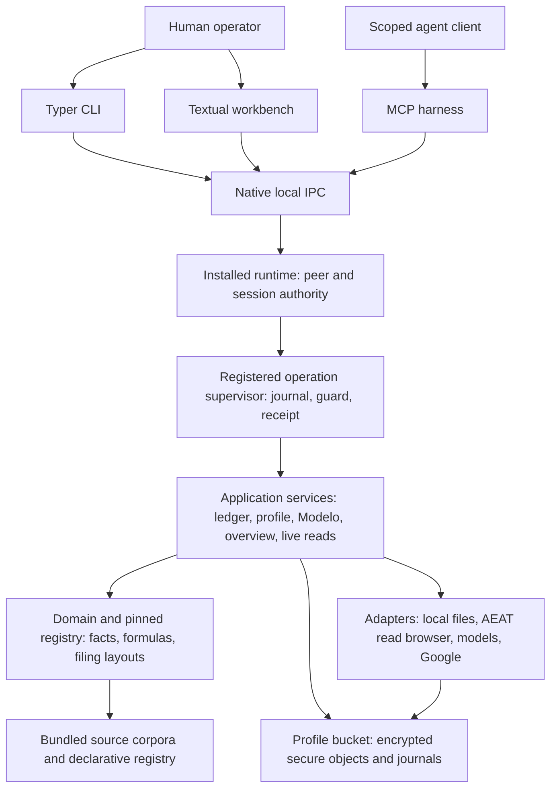

# Cadrumo start

If you are starting or working on this kind of project, context, efficiency, and limiting the actual session context are absolutely critical.

Read these files if the actual task is relevant to you.

Use the reference index to select the files relevant to the actual task. Do not preload the entire collection. Follow code-source links only when needed to resolve the task's ownership, implementation or verification questions. Scoped findings describe static inspection and require checking against current code before treating them as current defects.

All rules must be respected when working. Selective reading limits session context; it does not exempt work from applicable rules.

## Architecture

## Working rules

The [architecture rule](references/00-architecture.md) uses:

- Import linting: `just check-import-boundaries`.
- Ruff lint and formatting checks: `just check-style` and `just check-format`.
- Type checking: `ty` across `src`, through `just check-types`.
- Strict type checking: `pyrefly` and `basedpyright` over the configured production subset, through the same type runner.
- Relative imports within the actual module/package boundaries, from defining modules, respecting the configured dependency contracts.

Use the repository's configured check scopes. The current commands and checker configuration live in [justfile](../../../justfile) and [pyproject.toml](../../../pyproject.toml).

## Task-relevant references

The numbered references mirror the project rules in [the canonical rules folder](../../rules). When changing a numbered rule, update its matching reference and preserve working source links. These copies are packaged for discovery; they do not create a second rule authority.

| Actual task | Reference |
|---|---|
| Layer placement, cross-layer data flow, authority and code discipline | [00-architecture](references/00-architecture.md) |
| CLI command composition, envelopes and operator-facing policy | [01-operator-interfaces-part-1](references/01-operator-interfaces-part-1.md) |
| CLI-to-worker requests, settlement, secrets and profile edits | [01-operator-interfaces-part-2](references/01-operator-interfaces-part-2.md) |
| Installed runtime, TUI workbench or MCP agent harness | [02-runtime-tui-and-agent-harness](references/02-runtime-tui-and-agent-harness.md) |
| PDF, e-invoice, receipt and financial-file imports | [03-document-and-financial-imports](references/03-document-and-financial-imports.md) |
| Native IPC, AEAT browser, Google or model adapters | [04-external-integrations-and-local-runtime](references/04-external-integrations-and-local-runtime.md) |
| Encrypted persistence, custody, journals and recovery | [05-persistence-and-secure-storage](references/05-persistence-and-secure-storage.md) |
| Application state, diagnostics, provisioning and evidence bundles | [06-application-orchestration-and-diagnostics](references/06-application-orchestration-and-diagnostics.md) |
| Financial aggregation, source resolution and cross-period calculations | [07-aggregation-and-calculation-services](references/07-aggregation-and-calculation-services.md) |
| Authentication sessions, certificates and storage management | [08-authentication-and-storage-management](references/08-authentication-and-storage-management.md) |
| Local filing exports, live capture and receipt promotion | [09-filing-and-live-state](references/09-filing-and-live-state.md) |
| Ledger, invoices, evidence confirmation and prorrata registers | [10-ledger-invoices-and-registers](references/10-ledger-invoices-and-registers.md) |
| Modelo calculation, edits, revisions, export and reconciliation | [11-modelo-work-and-revision-lifecycle-part-1](references/11-modelo-work-and-revision-lifecycle-part-1.md) |
| Modelo addressing, verification, workbench and workspace currentness | [11-modelo-work-and-revision-lifecycle-part-2](references/11-modelo-work-and-revision-lifecycle-part-2.md) |
| Operation supervisor, profiles, read projections and workflows | [12-operations-profiles-and-workflows](references/12-operations-profiles-and-workflows.md) |
| Shared contracts, configuration, provenance, errors and telemetry | [13-core-authority-and-shared-controls](references/13-core-authority-and-shared-controls.md) |
| Tax registry snapshots, facts, bindings, formulas and layouts | [14-tax-calculation-domain](references/14-tax-calculation-domain.md) |
| Taxpayer, family, business and financial domain records | [15-business-and-taxpayer-domain](references/15-business-and-taxpayer-domain.md) |
| Bundled knowledge, registry data and localization | [16-bundled-knowledge-and-localization](references/16-bundled-knowledge-and-localization.md) |
