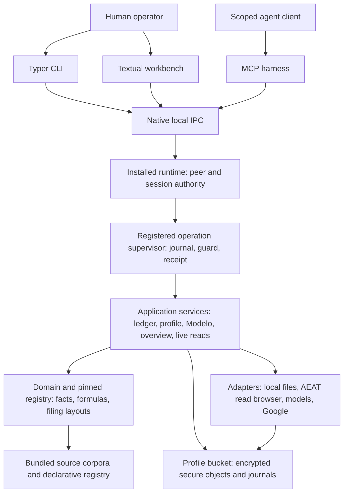

# Cadrumo architecture

## Ownership and dependency boundaries

Cadrumo is organized around a local profile and a pinned tax-authority generation. Keep interfaces responsible for presentation and typed requests, the installed runtime responsible for authenticated admission and operation hosting, application services responsible for orchestration and lifecycle decisions, domain and registry code responsible for typed facts and calculations, and adapters responsible for external effects and persistence. Domain code must remain independent of adapters. Development registry compilation and authoring belong under `dev/registry/`; runtime consumers use the published authority and must not import the development compiler.

The diagram shows execution and data relationships, not permission to import across layer boundaries.

## Authority and execution

CLI, TUI and MCP submit through registered operations. Command declarations, UI state and agent prompts cannot grant authority. Native peer/login evidence anchors admission; client-supplied IDs alone do not. Bind boot, frontend, native client, exact profile, session/lease and authority generation, and recheck current authority at private submission, effects, interaction responses and disclosure.

The supervisor journals execution, guards irreversible effects and correlates review and terminal receipts. Keep response scope, interaction bearers and commit permits distinct. Preserve `UNKNOWN` or `SETTLING` when effects are ambiguous; timeout is not proof that retrying a mutation is safe. Cleanup and worker containment remain owned through settlement.

## Financial sources and filing state

Preserve the flow from imported observations and reviewed evidence to canonical profile, ledger and invoice facts, then typed aggregation, registry-pinned calculation, verification and local export. Keep incomplete inputs unresolved. Model extraction/classification is a proposal; deterministic registry logic owns regulated arithmetic, and grounding and human review have separate roles.

Do not mix authority generations within an operation. Keep local calculation, verification, exported bytes, pending local filing, authenticated remote observation and confirmed receipt as distinct states. A local `PRESENTADO` revision can still have AEAT status pending. Receipt promotion requires digest, CSV, model/period, taxpayer and current-filing-chain checks. The outbound AEAT submission gate refuses live submission; local export and registry-authority publication do not submit a taxpayer return.

Overview, calendar, review and search consume admitted local projections. Preserve unavailable, stale, unknown and genuinely empty states. Read-model access does not authorize remote acquisition, and missing observations do not prove that no obligation exists.

## Storage and external effects

Private state belongs to exact-profile secure storage. Preserve namespace, identity, schema, provenance and revision checks at the write boundary. SQL co-commits, operation journals, atomic filesystem publication and multi-store recovery are distinct durability mechanisms. Claim atomicity only where the actual repository guarantees it; a completed method or journal entry cannot prove every dependent store committed. SQLite WAL with `synchronous=NORMAL` can lose the latest transaction on power failure.

Keep integration authority and evidentiary grade separate: AEAT browser reads capture observations; Google Sheets performs authorized remote workbook writes; local exports write files; hosted-model extraction requires consent bound to the source bytes. Bundled sources, generated layouts and translations are versioned inputs, not proof of current law or publisher authenticity. Trace each guarantee through its callers and adapters before presenting a local control as an end-to-end guarantee.

## Code discipline

This rule uses import linting, Ruff lint and formatting checks, type checking, and strict type checking. Use `just check-import-boundaries`, `just check-style`, `just check-format` and `just check-types` for their configured scopes. The type runner uses `ty` across `src` and `pyrefly`/`basedpyright` for the configured strict production subset; do not weaken those scopes to make a change pass.

Use relative imports within the actual module/package boundaries, importing from the defining module. Relative syntax must not escape configured package roots or bypass dependency contracts. All rules must be respected when working.

## Implementation and verification invariants

- Public symbols have one canonical defining module. Keep package `__init__.py` files inert; do not add re-exports, facade modules, forwarding aliases or cross-package imports from private modules. Put tests under the narrowest owning `tests/` directory. Use canonical Spanish tax terms and semantic module names.
- Move definitions and all consumers atomically. Do not retain displaced internal APIs merely to satisfy old callers. Released compatibility requires an explicit supported window and migration/removal policy; historical registry baselines and evidence are not obsolete APIs.
- Verify behavior through the real owning parser, resolver or serializer. Cover success, refusal and material boundaries; use independent expected results where available. A mocked replacement for the behavior under test is not acceptance evidence. Protective gates must detect representative defects in isolated fixtures.
- Derive completeness and packaging inventories from the current filesystem plus the owning inclusion policy, not Git's tracked-file list. Round trips compare typed meaning, provenance and contract-defined ordering. Report new regressions separately from evidenced pre-existing failures.

## Shared work and governance

- Use the owning worktree and project environment. Preserve unrelated edits, re-read shared files before patching, and coordinate overlapping writers. Do not stash, reset, clean or overwrite concurrent work to obtain a clean baseline. Verify exact resolved paths before destructive filesystem operations.
- Run focused checks before broader gates; obtain final exit status and confirm the intended tests ran. A tool wait timeout is not process failure. Isolate shared outputs when running checks concurrently, and keep source and compiler inputs stable when proving transformations.
- Author governance in `.vaultspec/rules` and `.vaultspec/skills`; provider copies are generated. Preserve installation-owned builtins. Keep rules concise and stable, optional procedures in skill references, and agent workflow metadata out of product code and user documentation. Describe scoped inspection findings as observations requiring current-code verification, not accepted exceptions to an invariant.
