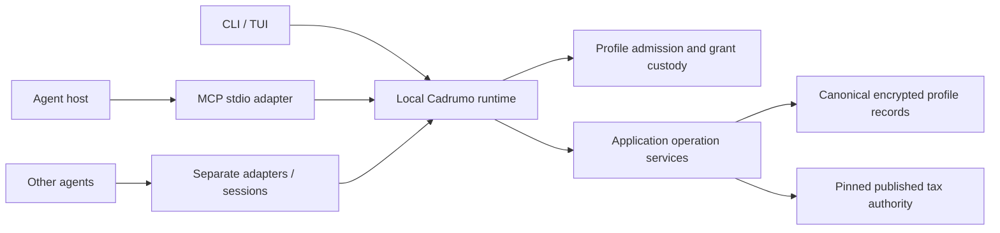

---
tags:
  - '#adr'
  - '#mcp-purpose-authentication'
date: '2026-09-26'
modified: '2026-09-26'
body_schema: 'body-v2'
body_hash: 'sha256:622789ab75337b125bfce692461b06f73790cb81551aff1440c411522d19e237'
related:
  - "[[2026-09-26-mcp-purpose-authentication-reference]]"
  - "[[2026-09-26-mcp-purpose-authentication-research]]"
  - "[[2026-08-13-profile-password-custody-rollup-adr]]"
  - "[[2026-08-13-profile-session-lifecycle-successor-adr]]"
  - "[[2026-09-14-registry-authority-artifact-boundary-indexed-storage-adr]]"
  - "[[2026-07-08-mcp-identity-linked-operation-adr]]"
  - "[[2026-07-17-mcp-call-latency-adr]]"
  - "[[2026-07-02-agent-harness-refoundation-adr]]"
  - '[[2026-09-26-mcp-purpose-authentication-profile-access-adr]]'
  - '[[2026-08-11-tui-architecture-adr]]'
---

# `mcp-purpose-authentication` adr: local runtime ownership and replacement MCP harness | (**status:** `accepted`)

## Problem Statement

Make MCP the agent entrypoint for Cadrumo's application operations and published tax authority, with enforceable profile binding, concurrent clients and durable work independent of a conversation.

This record owns purpose, runtime/process topology and execution boundaries. API keys, custody, session state and CLI/TUI authentication parity have their single home in 2026-09-26-mcp-purpose-authentication-profile-access-adr. The existing simplistic MCP is replaced without compatibility shims.

## Considerations

The operator confirmed local installation and multiple agents under one user's authorization, with independently tracked sessions. Work may span months or years. On 2026-09-26 the operator requested ADRs and a plan, initially stopping after persistence, then instructed continuation after that handoff.

2026-09-26-mcp-purpose-authentication-reference records the actual implementation and the existing application operation supervisor. 2026-09-26-mcp-purpose-authentication-research evaluates local transport, authentication and process-containment boundaries.

## Considered options

- Independent privileged CLI subprocess wrappers: rejected as the target because profile/session admission and revocation lack one local owner.
- Put shared authority in each MCP adapter: rejected because one conversation's lifetime cannot own unrelated sessions and durable work.
- Host an OAuth service remotely: rejected for the confirmed local installation and private-storage boundary.
- One local Cadrumo runtime with client-owned stdio adapters: selected. Application services own access and execution; each host retains a standard MCP connection lifecycle.

## Constraints

Reuse 2026-08-11-tui-architecture-adr for the application-owned operation registry, supervisor, journal, response authority, settlement and public projections. This feature hosts and integrates those services; it does not create another operation platform or duplicate its unfinished canonical roll-up plan. New admission hooks are bounded extensions. Any missing prerequisite from that platform returns to its owning plan.

Reuse 2026-09-14-registry-authority-artifact-boundary-indexed-storage-adr for published authority and pinned operations. Private taxpayer persistence is separate from public tax-authority storage.

The following predecessor clauses are replaced through focused accepted amendments:

| Predecessor | Displaced clause | Preserved authority |
| --- | --- | --- |
| 2026-07-08-mcp-identity-linked-operation-adr | Identity-read observation as an operation admission gate | Explicit identity context and truthful status |
| 2026-07-17-mcp-call-latency-adr | MCP-owned warm execution/process model | Relevant latency measurements and bounded operation behavior where consistent with current authority |
| 2026-07-02-agent-harness-refoundation-adr | CLI-subprocess-only application execution | Applicable data-disclosure and domain/filing boundaries |

Do not supersede these multi-decision records wholesale. The focused amendments preserve unrelated accepted decisions; older process code and naming are not target requirements.

The runtime cannot certify currently unvalidated durable-backend, calculation or filing edges. Ordinary automation does not gain live filing authority. No system-wide daemon, remote network service, pre-OS-login execution or bundled LLM scheduler is in scope.

## Implementation

### Purpose and ownership

The MCP lets an agent discover supported operations, query the published authority, inspect authorized persisted work, perform authorized application operations, and obtain results with their provenance. Agents provide reasoning and orchestration. Cadrumo owns deterministic behavior, admission, persistence, domain policy and evidence.

A local runtime is the authority for profile-session admission, grant invalidation, isolated execution and process ownership. It composes the existing application operation services for submission, observation, responses, cancellation, detach and reconciliation. CLI, TUI and MCP use that shared boundary; JSON command envelopes remain frontend projections rather than the internal dispatcher.

The runtime is application hosting and local resource management, not a second supervisor. Domain executors retain effect policy and authoritative commit receipts. The operation supervisor retains lifecycle, owner leases, reconciliation and terminal settlement. Authentication access leases and operation ownership leases are different authorities; neither can substitute for the other.

No MCP tool exposes arbitrary shell execution, SQL, raw secure references, DEKs or unregistered executor calls. Recovery-action identity remains with the existing action catalogue; operation-definition identity remains with the operation registry.

### Deployment and startup

One runtime instance owns each OS user and canonical Cadrumo storage root. OS login-session provenance is distinct from application-session identity; multiple login contexts may belong to the same runtime owner. Multiple profiles may be served, with independent bindings and no implicit cross-profile authority. Separate OS users run separate instances and credential stores.

An MCP host starts a small local stdio adapter. The adapter locates or starts the installed runtime through one idempotent launch door. CLI/TUI use the same owner-controlled startup. The runtime starts without profiles unlocked. The API-key ADR governs subsequent credential proof and storage access.

Local IPC uses private named pipes on Windows and local-domain sockets on macOS/Linux. Endpoint ACLs, owner verification, peer authentication and endpoint-substitution protection must be proven. Runtime identity and application credentials are both checked; a PID file, process name or listening endpoint is insufficient.

Startup races converge on one owner using an OS-held ownership primitive. Readiness requires an authenticated handshake and compatible current runtime/contract versions. An adapter must not attach to a stale or impersonated endpoint, steal a live lock, or kill a process by name to repair startup. Unknown state returns a typed refusal and non-secret recovery action.

No TCP listener is required. Local stdio does not acquire OAuth semantics from the MCP session ID. A future remote service would need a separate transport and custody decision.

### Local transport and platform contract

Use an OS-protected local byte protocol, not a remote HTTP server or a custom cryptographic handshake. The runtime is authenticated as the current OS owner behind an owner-controlled installed launch and endpoint; application password/API proof separately establishes profile authority. There is no claim of process isolation from arbitrary hostile code under that same OS account.

Windows pipes require an explicit owner-only DACL, local-only rejection of network clients, narrowly selected pipe rights and first-instance ownership. Verify both peer process handles/tokens rather than trusting a reported PID. POSIX sockets reside in an owner-only runtime directory and validate peer credentials with the supported native API; refuse symlinks, foreign owners and ambiguous stale endpoint state. A boot identifier and bounded protocol-version handshake bind subsequent sessions to this runtime instance but are not authentication secrets.

Frames are length-bounded, strict and versioned. Reject unknown fields/types, duplicate JSON keys, oversized frames and unsupported versions before dispatch. Use explicit byte transport, never pickle/object deserialization. Authentication and one-shot secret frames have separate non-recording handling; they cannot be copied into requests, logs, errors or protocol tracing. OS peer validation completes before any password or API secret is transmitted. The local owner boundary permits password login when the optional OS secret store is unavailable; adding a permanent runtime key as a password-login prerequisite is prohibited.

Windows background startup uses a per-user Task Scheduler logon task with the interactive token, with no stored Windows password or highest-privilege elevation. macOS uses a user LaunchAgent. Linux uses a user systemd service when that capability and the user credential session are available, with no lingering or pre-login promise. Interactive launches on systems without the supported background manager expose background mode as unavailable. All three bind the installed absolute executable and canonical storage root, restrict inherited environment/handles, and retain the established worker-containment requirement. User enable/disable and installed lifecycle tests own readiness; merely writing service metadata does not establish it.

### Human, agent and swarm contexts

The human hot profile belongs to its frontend session. Every operation captures its exact target before execution. Switching a human context never retargets a running agent or background operation.

One agent and a swarm use the same session contract. Multiple connections can share a profile while retaining separate session identities. An LLM host chooses its own worker topology; Cadrumo does not require a vendor, model or agent framework. Distinct authorization principals must have distinguishable credentials or authenticated child-session delegation, not merely names in tool arguments.

Profile execution is isolated. A worker never changes process-global active-profile state while serving another request. While current storage requires process-local custody, workers are profile-bound for their lifetime; a future context-based implementation must prove equivalent isolation before replacing that boundary. Keys stay inside trusted runtime/worker custody.

Concurrent reads use the underlying store's supported semantics. Writes compose existing transactions, conflict scopes, expected revisions and provider-acquisition locks. Human operations participate in the same coordination. Stale writers get explicit conflicts, and retries use canonical operation/idempotency identity.

### Management surfaces and process containment

The runtime provides typed start, stop, status, health, background-mode configuration and session/work inspection. CLI and TUI implement equivalent management actions as required by the access ADR. Output distinguishes running, ready, degraded, draining and unavailable, together with supported platform capabilities and non-secret corrective actions.

Interactive mode can stop when there are no clients or admitted work. Unattended mode is explicit and uses the OS user-session supervisor. Installation, enable/disable and startup behavior remain per-user on Windows, macOS and Linux. Manager availability, login autostart and unattended authorization are separate capabilities. Explicit launch may use an already provisioned supported manager while autostart is disabled; it must not silently enable autostart, lingering, elevation or unattended authority. A surviving user manager is not authorization.

Stopping the runtime affects all of its connected profiles and jobs; its preview and acknowledgement identify that scope. Profile-wide lock/pause is a different security action. A token-authenticated session cannot acquire global service-administration authority merely by invoking a management endpoint.

The adapter ends when its MCP client disconnects and releases only its own leases. It must not stop a shared runtime. Background mode does not require a chat or LLM to stay alive.

The runtime owns worker, browser, KDF and other child resources through the existing operation resource scopes. Windows uses owned Job Objects with controlled inheritance, kill-on-close and explicit breakaway policy. POSIX uses owned process groups together with supervisor/watchdog containment that handles runtime death; a process group alone is not a parent-death guarantee. Do not rely on a taskkill or immediate-child fallback as proof of descendant containment. Refuse operation classes when their required containment cannot be established. Containment acceptance covers launch/registration races, independent descendant groups, guardian failure, inheritance and actual browsers. Interim refusal does not complete Windows, macOS or Linux platform acceptance; all three remain required.

Last eligible OS logout fences private admission and effects, causes bounded shutdown and releases custody without permanently revoking independent grants or imposing profile-global suspension. Suspend/shutdown preparation is bounded best effort, backed by crash-safe persistence and reconciliation. Shutdown stops admission, requests declared settlement, waits to a bound, records unresolved ownership/effects, terminates and reaps owned descendants, closes storage/authority leases and releases key material best-effort. Revalidate authority before resumed private output or effects, and reconcile possibly committed work before retrying; timeout or process loss never implies rollback. A thread timeout cannot claim execution stopped. SIGKILL/process loss may skip cleanup, so restart recovery cannot depend on graceful callbacks.

Upgrade drains and replaces a coherent installed cohort. It invalidates live access leases, preserves supported durable state and refuses unknown private formats. Current-only schema changes follow the existing no-legacy regime, including zero affected nonterminal operations before breaking operation-contract cutover. They do not silently translate unknown grants or jobs. Restart backoff, bounded resource usage and redacted diagnostics make failures observable.

### Durable work and authorization

Long-lived tax work is persisted intent and progress, not one immortal process or session. Compose existing workflow/checkpoint authorities and the operation supervisor; do not introduce a parallel job journal or generic financial-data cache.

The generic operation journal retains only its permitted credential-free lifecycle facts. Confidential operands/results and tax values remain under their established canonical encrypted domain custody. Durable intent refers to exact profile, approved scope, authority generation, input revisions and domain records without copying secrets or financial values into generic checkpoints. Existing transient-financial-operand rules remain intact.

Only definitions proven resumable may resume. A recorded operation may instead reconcile and require a fresh invocation. Waiting for a future period or user input releases access and resources. An authorized agent or an existing configured scheduler can later request continuation; this feature does not invent a tax calendar scheduler.

Admission is rechecked at each queued start, resumed stage, private projection/read and mutation boundary. Revocation semantics come from the access ADR. Observation cannot reconstruct an apply/reject response bearer. Reconnected agents may resume ordinary scoped work; a lost transaction-specific human approval is not recreated from a root API key.

Timeout after a possible effect returns an operation identity and unresolved state for reconciliation. It does not authorize blind replay. The application supervisor and domain receipt determine committed, partial, none or unknown effect. Cancellation, disconnect, shutdown and grant expiry cannot retroactively erase an effect.

### Published authority and AEAT

Tax queries use the canonical published-authority reader. An operation pins the publication generation and relevant modelo/revision/period coordinates; decoding and calculation within it use the same context. Results preserve that provenance. Search excerpts point to evidence, while typed published authority supplies operational facts.

Later workflow stages using a new generation must detect and revalidate stale inputs/results explicitly. No operation silently mixes generations or rewrites historical calculation provenance. Missing or invalid configured authority fails closed, without compiling mutable source or silently substituting another publication.

Capability responses retain distinctions among unsupported, missing, advisory, deferred and complete. Published-authority validity does not make an unvalidated backend or calculation filing-grade.

Local API keys never leave Cadrumo for AEAT. Provider sessions and represented-taxpayer checks remain independently validated. Expired certificates, interactive Cl@ve or other remote requirements produce a needs-user state. A local grant promises neither perpetual provider login nor authority to sign/submit a filing.

### MCP discovery, output and replacement

Use a small stable orientation/status and authorization-request surface, published-authority queries, and operation discovery/execute over the existing catalogues. Optional domain-tool projections may improve discovery but enforce the same registered contracts. Persona selection and tool advertisement cannot change permission.

Every tool path, execute-style call, private resource and operation-result read passes the same admission and disclosure checks. MCP never reconstructs application verdicts from localized CLI text. It reports the existing typed envelope semantics with stable codes and operation references.

Local read permission and consent to send a projection to an agent host are separate. Enrollment names the destination and allowed categories. Source evidence bytes, passwords, keys and raw secure payloads do not enter MCP. Only registered authorized output projections may cross that boundary. Human screen visibility does not authorize off-host transfer.

Delete the displaced identity-flag admission, password-file bootstrap, retained-password forwarding, CLI-wrapper execution path and unsafe timeout/process assumptions as the replacement is integrated. Remove their command/configuration options, tests and generated documentation through owning generators. Do not retain a compatibility mode. Actual code census determines deletions; names such as inprocess are not evidence of behavior.

### Acceptance boundary

The implementation plan must prove installed CLI/TUI/MCP flows using synthetic encrypted profiles: independent sessions, A/B isolation during hot-profile switches, autonomous reconnect after human timeout, revocation before commit/output, crash/restart, child containment and service lifecycle on Windows/macOS/Linux.

Use the existing real operation, storage and authority boundaries. Prove idempotent retries, honest uncertain effects and pinned publication changes; keep unsupported executor/provider/filing capability refusals. Passing a mocked host or one OS does not establish the deployment matrix.

## Rationale

A local owner lets all entrypoints enforce the same live profile and grant state while independent stdio adapters retain conventional host lifetimes. Reusing application supervision avoids a competing lifecycle engine. Durable intent and renewed admission fit tax work spanning years without keeping credentials, processes or agents permanently active.

## Consequences

This is a replacement MCP and an application/runtime integration, with per-user service packaging, authenticated IPC, isolated custody, concurrency and recovery costs. CLI/TUI execution must participate in that authority.

It is not a security sandbox for arbitrary code already running as the same OS account. It does not validate domain edges by exposing them. Accepted 2026-09-26 on the operator's instruction to continue the presented plan after the documentation handoff. The plan separately records authorization for runtime implementation; acceptance does not claim implementation or platform readiness.
