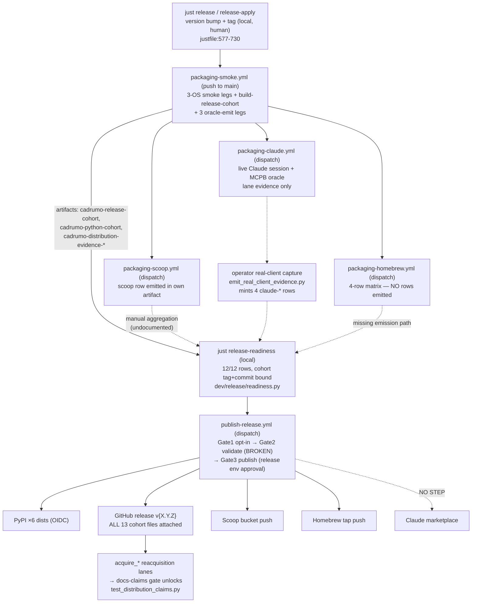

---
tags:
  - '#reference'
  - '#post-release-distribution'
date: '2026-07-19'
modified: '2026-07-19'
related:
  - "[[2026-07-17-post-release-distribution-plan]]"
---

> Persisted from the 2026-07-19 Fable holistic pipeline review. Gaps G2 (marketplace publication), G1(a) (readiness --cohort-dir/--evidence-dir wiring), and G7 (mcpb version surface) were actioned in commit `17abf9c021`. Gaps G3 (RELEASING.md rewrite), G4/G6 (homebrew/scoop row emission), G5 (claude-row aggregation + `just release-collect-evidence`), and G8 (housekeeping) remain open and are tracked below.

# Cadrumo release & orchestration pipeline — holistic review

Reviewed 2026-07-19 on branch `chore/eliminate-shims` (== main), repo `nevenincs/cadrumo`,
worktree `Y:\code\aeat-worktrees\chore-476-restructure-execution`. Read-only review; no
production file was modified. RAG discovery was performed first (`vaultspec-rag` live on
port 8766; probes: "release cohort build and promotion", "publish artifacts to pypi scoop
homebrew", "distribution evidence readiness gate release", vault probe "release publishing
decision github actions"), then every claim below was confirmed by direct file reads.

Operator mandate audited against: **"Every GitHub release MUST contain the generated
cross-platform artefacts that we actually release, AND we must populate/push these to ALL
avenues we support."**

---

## (a) Executive summary

The pipeline is architecturally excellent: one immutable, hash-bound **release cohort** is
built once from a clean clone (`dev/packaging/release_cohort.py`), every distribution row
must present tamper-evident, cohort-bound **DistributionEvidence**
(`dev/packaging/evidence.py`), and the sole publication authority
(`.github/workflows/publish-release.yml`) *promotes stored bytes without rebuilding* to
PyPI (OIDC), a GitHub release carrying **every** cohort file, a public Scoop bucket, and a
public Homebrew tap. The design directly satisfies the mandate's "same bytes on every
avenue" clause.

However, the pipeline **cannot currently complete a publication end-to-end**:

1. **CRITICAL — the publish workflow's own evidence gate is structurally unsatisfiable.**
   `publish-release.yml:154-156` runs `dev.release.readiness` whose blocking
   `distribution-evidence-complete` check reads hard-coded default paths
   `var/release-cohort` and `var/distribution-install-readiness`
   (`dev/release/readiness.py:385-386`), while the workflow downloads the cohort and
   evidence into `var/promotion/*` (`publish-release.yml:91-93,120-128`). Additionally the
   check requires `manifest.source.tag == v{version}` (`readiness.py:402-408`), but the
   CI-built cohort is produced from a plain push-to-main checkout that fetches no tags
   (`packaging-smoke.yml:272-273`; `actions/checkout@v4` default `fetch-tags: false`), so
   `source.tag` is `None`. And of the 12 required rows, the packaging-smoke run holds only
   the 3 `python-*` rows — the other 9 live on other workflows' artifacts or on the
   operator's workstation and are never downloaded. Gate 2 refuses forever.
2. **Mandate gap — the Claude marketplace avenue is never populated.** The publish
   workflow pushes Scoop and Homebrew but has **no marketplace publication step**; the
   marketplace zip is only attached to the GitHub release. The post-publication verifier
   (`dev/packaging/acquire_claude_plugin.py:53`) expects a public marketplace source
   (`nevenincs/cadrumo`), which is a private repo today.
3. **Docs gap — an operator cannot run a release from the docs.** `RELEASING.md` still
   states "No publication authority currently exists" (`RELEASING.md:151-155`) and
   "Publication is blocked" (`RELEASING.md:376-386`), directly contradicting
   `publish-release.yml`, which its own tests call "the sole upload authority"
   (`dev/release/tests/test_publish_release_workflow.py:1-8`). There is no runbook for the
   dispatch, evidence aggregation, or the vars/secrets it needs.
4. **8 of 12 required evidence rows have no CI emission path.** Homebrew's 4 rows are
   emitted by no workflow (only post-publication `acquire_homebrew.py`); the 4 `claude-*`
   rows require an operator-run real-client capture (`emit_real_client_evidence.py`); the
   Scoop row is emitted inside the Scoop workflow's own artifact but never aggregated.

The GitHub-release half of the mandate is **satisfied by construction** (all cohort files
attached, `publish-release.yml:208-223`); the "all avenues populated" half is satisfied
for PyPI/GitHub/Scoop/Homebrew *in design* but blocked by finding 1, and **unsatisfied**
for the Claude marketplace. This matches the known in-flight plan state (post-release
distribution plan P03.S13 publication wiring pending).

---

## (b) The pipeline end-to-end

### Narrative

**Stage 0 — version authoring (local, human).** `just release` (justfile:577-635) runs a
release-please dry-run; `just release-apply` (justfile:639-730) verifies the readiness
gate and prints the 11-step manual checklist: bump `.release-please-manifest.json`,
`pyproject.toml`, both companion `pyproject.toml`s, `src/cadrumo/__init__.py`, companion
pins, CHANGELOG, `uv lock`, commit `chore(release): vX.Y.Z`, tag `vX.Y.Z`, push. Note:
the checklist omits `packaging/mcpb/manifest.json`, which the readiness version-parity
check *does* enforce (`readiness.py:157,178-217`) — see gap G7.

**Stage 1 — build + prove (CI, push to main).** `packaging-smoke.yml` (push-to-main with
vault/docs paths ignored, or dispatch; queueing concurrency, never cancel —
`packaging-smoke.yml:13-34`) runs:

- Three per-OS smoke legs (Linux self-hosted `packaging-smoke-ci`, Windows and macOS
  self-hosted `packaging-smoke`) proving wheel/sdist/extras/split/browser/Docker lanes on
  one transitional Python cohort (`justfile:192-258`), uploading
  `cadrumo-python-cohort[-windows|-macos]` and `cadrumo-packaging-smoke-evidence[-…]`
  (14-day retention).
- `build-release-cohort` (`packaging-smoke.yml:267-298`): builds the **one immutable
  full cross-channel cohort** — `uv run python -m dev.packaging.release_cohort build
  --output var/release-cohort` — on exactly CPython 3.13.11 / uv 0.11.29
  (`release_cohort.py:46-47,252-278`), from a fresh `git clone` of HEAD into a temp dir
  with `SOURCE_DATE_EPOCH`, `PYTHONHASHSEED=0`, hash-pinned build constraints
  (`release_cohort.py:300-311,387-458`). Uploads `cadrumo-release-cohort`.
- Three `oracle-emit-*` legs (`packaging-smoke.yml:303-409`, `needs: build-release-cohort`)
  download that single cohort, install its three wheels into a fresh venv, run the
  grounded installed CLI + MCP tax oracles (Modelo 200 `DP200014:00562 == 23000.00` per
  the readiness ADR), and mint the sanctioned `python-linux-x86-64` /
  `python-windows-x86-64` / `python-macos-arm64` rows
  (`dev/packaging/oracle_emit_cohort.py`), uploaded as
  `cadrumo-distribution-evidence-{linux,windows,macos}`.

**Stage 2 — channel acquisition proof (CI, manual dispatch, keyed to the Stage-1 run).**
Each is `workflow_dispatch(source_run_id, source_commit)` with an identical source-identity
gate (run is packaging-smoke, success, `push` to `main`, same repo, head_sha matches):

- `packaging-scoop.yml` (hosted `windows-2022` Windows container): generates a
  cohort-bound Scoop manifest, installs inside `servercore:ltsc2022`, runs both oracles,
  and **emits the sanctioned `scoop-windows-x86-64` row**
  (`packaging-scoop.yml:202-227`) — but only into its own uploaded artifact.
- `packaging-homebrew.yml` (matrix: macos-15-intel hosted, self-hosted macOS-arm64 +
  Linux-x64, hosted ubuntu-24.04-arm): generates the tap snapshot and runs
  `smoke_homebrew.py` — **no sanctioned row is emitted** (no
  `distribution_evidence_emit` call anywhere in the workflow or `smoke_homebrew.py`).
- `packaging-claude.yml` (self-hosted Windows): installs pinned Claude Code 2.1.211,
  runs a **live headless Claude session** making the real MCP tool call
  (`packaging-claude.yml:161-178`), plus the MCPB runtime oracle — but its outputs
  (`plugin-evidence.json`, `mcpb-assembly-runtime-evidence.json`) are lane evidence,
  **not** `DistributionEvidence` rows. The four `claude-*` rows are real-client claims
  mintable only via the operator hook `dev/packaging/emit_real_client_evidence.py`
  (SDK-driven runs are refused by the honesty guard,
  `dev/packaging/distribution_evidence_emit.py:61-75,270-280`).

**Stage 3 — readiness aggregation (local, human).** `just release-readiness`
(justfile:515-520 → `dev/release/readiness.py`) blocks on: canonical project names,
version parity across 6 surfaces + MCPB manifest + companion pins, changelog sanity, and
`check_distribution_evidence_set` — a local `var/release-cohort` whose commit == checked
out HEAD and tag == `v{version}`, plus a passing, cohort-bound, schema-valid evidence
record for **all 12 rows** in `REQUIRED_DISTRIBUTION_ROWS` (`readiness.py:159-172`),
with real-client identity on the 4 `claude-*` rows (`readiness.py:457-466`). How the
operator is supposed to assemble those 12 row files into
`var/distribution-install-readiness/` is documented nowhere (gap G3/G4).

**Stage 4 — publication (CI, `publish-release.yml`, manual dispatch with
`packaging_run_id`).** Three staged jobs:

- *Gate 1 operator-preflight* (`:36-73`): refuses unless repo var
  `CADRUMO_PUBLISH_ENABLED=true`; enumerates the human-only prerequisites (PyPI Trusted
  Publishing for 3 projects, protected `release` environment with required reviewers,
  public Scoop bucket + Homebrew tap repos with `CADRUMO_SCOOP_BUCKET_TOKEN` /
  `CADRUMO_HOMEBREW_TAP_TOKEN` secrets and `*_REPO` vars).
- *Gate 2 validate* (`:80-156`): re-checks the source run identity, downloads the stored
  python cohort + release cohort + 3 platform evidence artifacts, re-verifies exact
  hashes and every platform's installed evidence via `dev.release.promote_python_cohort`
  (`:130-152`), then requires the complete blocking evidence set (`:154-156`) — **the
  structurally broken step (finding 1)**.
- *Gate 3 publish* (`:164-261`, `environment: release` = human approval click):
  re-downloads (never rebuilds; enforced structurally by
  `test_publish_release_workflow.py:29-37`), then
  **PyPI** — `uv publish --trusted-publishing always` of all 6 dists (`:196-206`);
  **GitHub release** — `gh release create v$VERSION` attaching **every file** found in
  the release-cohort directory (`:208-223`);
  **Scoop** — clone bucket repo, copy `scoop/cadrumo.json` to `bucket/`, commit, push
  (`:225-242`); **Homebrew** — clone tap repo, copy `homebrew/Formula/cadrumo.rb` to
  `Formula/`, commit, push (`:244-261`). No marketplace step, no MCPB-directory step.
  (`publish.yml` is the retained validate-only diagnostic it supersedes.)

**Stage 5 — post-publication reacquisition (tooling built, not yet wired).**
`acquire_pypi.py` (index-only install, digest match, re-run oracles),
`acquire_github_release.py` (`gh release download v<version>`, verify all 12 assets),
`acquire_scoop.ps1` (public bucket in a Windows container), `acquire_homebrew.py`
(public tap), `acquire_claude_plugin.py` (public marketplace), `acquire_mcpb.py`
(GH-release `.mcpb` asset). Each re-emits evidence; docs promotion is gated on these by
the docs-claims gate `dev/docs/tests/test_distribution_claims.py`, which fails any
README/docs page advertising a channel (pip/uvx/scoop/brew/marketplace/mcpb) without a
passing row. README currently makes no positive claims (`README.md:19,46`), so the gate
passes vacuously — correct fail-closed behavior.

### Stage diagram

---

## (c) Artefact catalogue

The cohort directory contains **exactly** these files plus `release-cohort.json` — the
builder refuses undeclared/missing files (`release_cohort.py:377-383`) and the loader
re-verifies size+sha256 of every member on every load (`cohort_manifest.py:267-298`).
`cohort_id` = sha256 of canonical JSON of {schema, version, source{commit,tag},
artifact records(name,kind,path,sha256,size)} (`cohort_manifest.py:183-202`).

| Manifest name | Generator | Path in `var/release-cohort/` | Avenue(s) | Attach/push mechanism |
|---|---|---|---|---|
| `cadrumo-wheel` | `dev/packaging/python_cohort.py` via `release_cohort.py:315` | `python/cadrumo-{v}-py3-none-any.whl` | PyPI + GH release | `uv publish` `publish-release.yml:196-206`; `gh release create` `:208-223` |
| `cadrumo-sdist` | idem | `python/cadrumo-{v}.tar.gz` | PyPI + GH release + Homebrew source | idem; formula references release URL |
| `cadrumo-data-manuals-wheel/-sdist` | idem | `python/cadrumo_data_manuals-{v}*` | PyPI + GH release | idem |
| `cadrumo-data-official-wheel/-sdist` | idem | `python/cadrumo_data_official-{v}*` | PyPI + GH release | idem |
| `python-cohort-manifest` | idem | `python/python-cohort.json` | GH release | attached |
| `claude-plugin` | `cadrumo.agent.materialise_marketplace` → deterministic zip (`release_cohort.py:128-160`, epoch-1980 zip `:94-116`) | `claude/cadrumo-plugin-{v}.zip` | GH release only | attached; **no marketplace push** |
| `claude-marketplace` | idem | `claude/cadrumo-marketplace-{v}.zip` | GH release only | attached; **no marketplace push** |
| `scoop-manifest` | `packaging/scoop/generate.py` (`release_cohort.py:182-198`) | `scoop/cadrumo.json` | Scoop bucket + GH release | pushed to `bucket/cadrumo.json` `:225-242`; URLs point at `https://github.com/nevenincs/cadrumo/releases/download/v{v}` (`release_cohort.py:45,181`) |
| `homebrew-formula` | `packaging/homebrew/generate.py` (`release_cohort.py:199-217`) | `homebrew/Formula/cadrumo.rb` | Homebrew tap + GH release | pushed to `Formula/cadrumo.rb` `:244-261`; same release-URL base |
| `mcpb` | `packaging/mcpb/build.py` (embeds the exact 3 wheels; **unsigned** per accepted ADR `2026-07-18-mcpb-signing-publisher-adr:63-71`) | `mcpb/cadrumo-{v}.mcpb` | GH release only | attached; reacquired by `acquire_mcpb.py` from the release asset |
| manifest | `cohort_manifest.write_manifest` | `release-cohort.json` | GH release | attached |

Evidence records: `var/distribution-install-readiness/{row_id}-{evidence_id}.json`,
write-once (`evidence.py:306-316`), `evidence_id` = sha256 of full content
(`evidence.py:243-246`), each embedding the complete `CohortBinding` (cohort_id, version,
source commit/tag, manifest sha, all artifact digests — `evidence.py:39-56`), the runtime,
isolation proof (checkout imports removed, ambient executables removed, installed-exe
sha256s), acquisition, command transcripts with stream digests, and result assertions.
Passing evidence structurally cannot contain a failed command, missing isolation, or a
version mismatch (`evidence.py:202-216`). CI artifact retention is uniformly **14 days**.

Versioning flow: one version across `.release-please-manifest.json`, 3 pyprojects,
`__init__.py`, CHANGELOG, companion pins, and `packaging/mcpb/manifest.json`, enforced by
`check_version_surfaces_agree` (`readiness.py:187-217`). `source_commit` binding flows:
git HEAD → clean clone assertion (`release_cohort.py:292-294,424-427`) → manifest →
every evidence record → publish-run identity gate (`publish-release.yml:96-108`) →
GH release `--target $SOURCE_COMMIT` (`:221`).

---

## (d) The `just` command map (packaging/release subset)

`set windows-shell := ["pwsh.exe", "-NoLogo", "-Command"]` (justfile:2); dual
`[windows]`/`[unix]` recipe bodies where shell syntax diverges.

| Recipe | What it does | Depends on |
|---|---|---|
| `packaging-smoke-dependencies` (:178) | pyproject/extras/frozen-export preflight | — |
| `packaging-smoke-preflight-tests` (:182) | pytest `dev/packaging/tests` | — |
| `packaging-smoke-source` (:187) | deleted-shipped-data preflight | — |
| `packaging-build-python-cohort` (:192) | transitional python cohort → `var/packaging-smoke-cohort/python` | source preflight |
| `packaging-smoke-core/-pip-core/-sdist-core/-extras/-split/-browser[-linux]` (:197-232) | per-lane installs into fresh venvs + installed oracles | build-python-cohort |
| `packaging-smoke-installed-oracles` (:251) | both public transports vs exact cohort bytes | build-python-cohort |
| `packaging-smoke` (:255) | host-portable aggregate (used by Windows/macOS CI legs) | 8 lanes |
| `packaging-smoke-ci` (:258) | full Linux campaign incl. dev + docker lanes (one invocation = one cohort bytes) | 5 aggregates |
| `packaging-smoke-docker[-core/-browser]` (:239-248) | python:3.13-slim container lanes | build-python-cohort |
| `release-readiness[-json]` (:515-520) | audit-state gate (blocking: names, versions, changelog, 12-row evidence; advisory: gh blockers) | — |
| `release` (:577-635) | release-please dry-run → `var/release/release-please.log` | node, gh auth |
| `release-apply` (:639-730) | readiness gate + printed 11-step manual checklist (no mutation) | readiness pass, main, clean tree, dry-run log |
| `release-rollback version` (:526-573) | printed rollback checklist (revert, rollback tag, PyPI yank ×3) | — |
| `docs-deploy` / `frontend-deploy` (:480-485) | private docs stack / landing page publication | — |

Notably there is **no `just` recipe** for: building the full release cohort
(`python -m dev.packaging.release_cohort build` is invoked raw in CI), emitting a
distribution row, minting the claude-* client rows, or running any `acquire_*`
reacquisition lane — all raw `python -m` invocations, undocumented outside module
docstrings (feeds gap G3).

---

## (e) GitHub workflow map

| Workflow | Trigger | Runner(s) | Purpose / gates | Chain |
|---|---|---|---|---|
| `ci.yml` | push main / PR / dispatch; ignores vault/docs/md paths | self-hosted Linux (single-platform per cost directive 2026-07-19, `ci.yml:44-58`) | lint, type, unit, hooks | — |
| `packaging-smoke.yml` | push main (artifact-relevant paths only) / dispatch; queue-not-cancel concurrency | 3 self-hosted legs (Linux X64, Windows X64, macOS ARM64) | full smoke lanes; **build-release-cohort**; 3 oracle-emit rows | its run id is the identity anchor for every downstream workflow |
| `packaging-scoop.yml` | dispatch(source_run_id, source_commit) | **hosted** windows-2022 (Windows container) | source-identity gate; container install; emits `scoop-windows-x86-64` row | consumes smoke run artifacts |
| `packaging-homebrew.yml` | dispatch(source_run_id, source_commit) | matrix: **hosted** macos-15-intel + ubuntu-24.04-arm; self-hosted macOS-arm64, Linux-x64 (honest hosted fallback comment `:52-55`) | tap-snapshot source install per row; no row emission | consumes smoke run artifacts |
| `packaging-claude.yml` | dispatch(source_run_id, source_commit) | self-hosted Windows | live Claude Code 2.1.211 session gate (subscription-auth fleet posture, `:161-167`); MCPB runtime oracle | consumes smoke run artifacts |
| `publish-release.yml` | dispatch(packaging_run_id) | **hosted** ubuntu-latest ×3 jobs | opt-in var → no-rebuild validate → `release` environment, OIDC `id-token: write` confined to publish job | consumes smoke run artifacts; **sole upload authority** |
| `publish.yml` | dispatch(packaging_run_id) | hosted ubuntu | retained validate-only diagnostic; "Keep publication blocked" (`publish.yml:82-87`) | superseded once publish-release armed |
| `durable-maintenance-gates.yml` | schedule + dispatch | self-hosted Linux | vault structural gate + ledger/storage roundtrip gate (do-not-remove banner) | — |
| `agent-harness-eval.yml` | push (harness paths) / dispatch | self-hosted Linux | harness eval | — |
| `aeat-drift-detector.yml` | schedule / dispatch | self-hosted Linux | live AEAT surface drift | — |
| `code-health-report.yml` | schedule / dispatch | self-hosted Linux | non-blocking health dashboard | — |
| `l1-anchor-drift.yml` | schedule / dispatch | self-hosted Linux | L1 anchor drift | — |

Cost posture is consistent and deliberate: everything runs on the self-hosted fleet
(gw-workstation-win, gw-workstation-wsl, macbook-neo) except where hosting is a
correctness requirement (Windows-container Scoop, macOS-Intel + Linux-arm64 Homebrew
rows) or an isolation/trust requirement (all three publish jobs on hosted ubuntu).
Source-identity gates are byte-identical across the three acquisition workflows and
publish-release (success + `.github/workflows/packaging-smoke.yml` + `push` + `main` +
same repo + head_sha match) — good; but note `publish.yml:36-48` (the old diagnostic)
checks only success+path, **not** event/branch/repo — weaker than its successor.

---

## (f) MANDATE AUDIT

Avenues the project *supports* (claimed by the readiness rows `readiness.py:159-172`, the
docs-claims map `test_distribution_claims.py:56-102`, and `docs/download.md`): PyPI,
GitHub release, Scoop bucket, Homebrew tap, Claude plugin marketplace, Claude Desktop
MCPB.

| Avenue | Artefact attached to GH release? | Pushed to avenue by publish-release? | Automated? | Same cohort guaranteed? | Verdict |
|---|---|---|---|---|---|
| **PyPI** (cadrumo + 2 data dists, wheel+sdist each) | PASS — all 6 under `python/` attached via `find -type f` (`publish-release.yml:212-223`) | PASS — `uv publish --trusted-publishing always` of the 6 stored files (`:196-206`) | Yes (after operator preflight + env approval) | PASS — stored bytes only; hash re-verified in validate (`:130-152`); no-rebuild pinned by tests | **PASS (design)** — blocked in practice by G1 |
| **GitHub release** | PASS — attaches *every* file of the validated cohort (13 files incl. wheels, sdists, plugin zip, marketplace zip, scoop json, formula, mcpb, both manifests); empty-set hard-fails (`:212-218`); cohort inventory closed-world (`cohort_manifest.py:117-121, 274-279`) | PASS — `gh release create v$VERSION --target $SOURCE_COMMIT` (`:219-223`) | Yes | PASS — cohort dir is digest-locked before attach | **PASS (design)** |
| **Scoop bucket** | manifest attached | PASS — commit+push `bucket/cadrumo.json` (`:225-242`); refuses instructively without token/repo | Yes | PASS — manifest generated in-cohort, URLs point at the same release assets (`release_cohort.py:45,181-198`) | **PASS (design)** — bucket repo/creds not yet provisioned (operator item) |
| **Homebrew tap** | formula attached | PASS — commit+push `Formula/cadrumo.rb` (`:244-261`) | Yes | PASS — formula generated in-cohort against the same sdists/release URLs | **PASS (design)** — tap repo/creds not yet provisioned; **evidence rows for its 4 platforms have no emission path (G4)** |
| **Claude plugin marketplace** | plugin + marketplace zips attached | **GAP — no publish step exists** (no `marketplace` string anywhere in `publish-release.yml`); the public marketplace source `acquire_claude_plugin.py:53` expects (`nevenincs/cadrumo`) is a private repo | No — undefined manual step | n/a (nothing published) | **GAP** |
| **MCPB (Claude Desktop)** | `.mcpb` attached — this *is* its distribution point (`acquire_mcpb.py` downloads the `v<version>` release asset) | PASS via the GH release attach | Yes | PASS — bundle embeds the exact cohort wheels (`packaging/mcpb/build.py:1-12`); unsigned by accepted ADR (`2026-07-18-…-adr:63-71`), docs must not imply verified publisher | **PASS (design)** |
| **Evidence gate feeding all of the above** | — | — | — | — | **CRITICAL GAP G1**: `publish-release.yml:154-156` cannot pass (paths, tag, 9 missing rows) |

Cross-avenue consistency: **strong by construction.** One `cohort_id` binds version +
commit + every digest; publication is promotion-only (structural tests forbid any build
verb in the workflow, `test_publish_release_workflow.py:29-37,91`); Scoop and Homebrew
artefacts reference the GitHub-release URLs of the same cohort, so all avenues converge
on identical bytes. Two soft risks: (i) `gh release create` flattens asset paths to
basenames — currently collision-free, but a future cohort member sharing a basename would
silently collide; (ii) 14-day artifact retention means a cohort older than 14 days can no
longer be promoted, forcing a fresh matrix run (fine, but undocumented).

---

## (g) Prioritised gap list

**G1 (CRITICAL) — publish-release's evidence gate is unsatisfiable as wired.**
Evidence: `publish-release.yml:154-156` vs `readiness.py:385-386` (default dirs),
`readiness.py:395-408` (commit+tag binding), `packaging-smoke.yml` (only 3 rows minted;
tags not fetched at cohort build). Fix:
(a) give `dev.release.readiness` CLI flags `--cohort-dir` / `--evidence-dir` (the Python
API already accepts them, `readiness.py:377-383`) and pass
`var/promotion/release-cohort` + a `var/promotion/rows` directory;
(b) in validate, additionally download `cadrumo-distribution-evidence-{linux,windows,macos}`
plus the Scoop workflow's row (needs the scoop run id as a second input, or move row
emission into an artifact the smoke run owns), and accept operator-uploaded
homebrew/claude rows (see G4/G5);
(c) resolve the tag: either `fetch-tags: true` in `build-release-cohort` **and** trigger
the authoritative matrix from the tag push, or relax the readiness tag equality to
"tag matches when present" in the CI promotion context and keep the strict check for the
local operator gate. Also note the commit check compares against the *checked-out* commit
— in publish-release the checkout is at `source_commit`, so that half is fine.

**G2 (HIGH, mandate) — no Claude-marketplace publication.** Fix: add a fourth
credential-guarded push step publishing the materialised marketplace tree (the unzipped
`claude-marketplace` cohort member) to a public marketplace repository (var
`CADRUMO_MARKETPLACE_REPO` + token), mirroring the Scoop/Homebrew steps' refuse-when-
unconfigured shape; update `acquire_claude_plugin.py`'s default source to that repo.
Alternatively, formally decide (ADR) that the marketplace avenue is "GitHub-repo-served
at public launch" and encode that in the publish workflow + docs.

**G3 (HIGH, docs) — RELEASING.md contradicts the implemented authority.** It predates
the cohort/evidence/publish-release architecture (`RELEASING.md:3-6,93-96,151-155,
376-386`) and documents neither the 12-row evidence aggregation, the acquisition
dispatches, `emit_real_client_evidence`, nor the publish dispatch/vars/secrets/approval.
An operator following the docs today would stop at "Publication is blocked". Fix: rewrite
RELEASING.md around the runbook in (h); keep `docs/_release_checklist.yaml` in sync.

**G4 (HIGH) — Homebrew's 4 required rows have no pre-publication emission path.**
`packaging-homebrew.yml` proves installs but mints nothing; `acquire_homebrew.py` is
post-publication by design. Readiness therefore can never reach 12/12. Fix: add a
`distribution_evidence_emit` step per matrix row in `packaging-homebrew.yml` (download
`cadrumo-release-cohort` like the Scoop workflow does at `:193-200`, emit
`homebrew-<os>-<arch>` from the captured tax/mcp oracle JSONs), uploading into a
predictable artifact.

**G5 (MEDIUM) — claude-* rows and row aggregation are entirely manual and undocumented.**
The real-client honesty guard is correct policy, but nothing tells the operator to run
`python -m dev.packaging.emit_real_client_evidence …` per row, nor how the four
artifact-scattered row sources get merged into `var/distribution-install-readiness/`.
Fix: a `just release-collect-evidence RUN_ID` recipe that `gh run download`s every row
artifact into the local evidence dir, plus RELEASING.md coverage of the client captures.

**G6 (MEDIUM) — packaging-scoop's row is stranded in its own artifact**
(`packaging-scoop.yml:202-236`), keyed to the scoop run id which publish-release never
learns. Folded into the G1(b)/G5 fix.

**G7 (LOW) — release-apply checklist omits `packaging/mcpb/manifest.json`** while
`check_version_surfaces_agree` blocks on it (`readiness.py:195,205-206`): the printed
"seven release authorities" (justfile:674-675, RELEASING.md:272-311) would leave
readiness red after a bump. Add it as the eighth surface (or wire it to regenerate).

**G8 (LOW) — housekeeping.** `publish.yml`'s weaker identity gate (no event/branch/repo
check, `publish.yml:36-48`) should be retired or hardened now that publish-release
exists; `cadrumo-python-cohort-windows/-macos` artifacts have no consumer; document the
14-day retention constraint vs the 48-72 h soak window; guard `gh release create`
basename collisions with an assertion in the attach step.

---

## (h) Operate a release in 5 steps (as the pipeline stands, with G1-G5 fixed)

1. **Version + tag.** On a clean `main`: `just release` (review the dry-run log), apply
   the release-apply checklist across all version surfaces **including
   `packaging/mcpb/manifest.json`**, `uv lock && uv lock --check`,
   `just release-readiness` (names/version/changelog PASS), commit
   `chore(release): vX.Y.Z`, tag `vX.Y.Z`, push main + the tag.
2. **Build + prove.** Wait for the push-triggered `Cadrumo Packaging Smoke` run on the
   release commit to go fully green (3 smoke legs, `build-release-cohort`, 3
   `oracle-emit-*` legs). Note its run id — it is the identity anchor for everything
   after.
3. **Channel proofs.** Dispatch `Cadrumo Scoop Acquisition`, `Cadrumo Homebrew
   Acquisition`, and `Cadrumo Claude Acquisition` with that run id + commit; perform the
   real-client captures in Claude Code / Desktop / Cowork and mint the four `claude-*`
   rows via `python -m dev.packaging.emit_real_client_evidence`. Aggregate all 12 row
   records into `var/distribution-install-readiness/` beside a local
   `var/release-cohort` built at the tag; `just release-readiness-json` must report
   `"ok": true` with `distribution-evidence-complete` PASS. Soak 48-72 h
   (docs/_release_checklist.yaml) — the cohort stays frozen.
4. **Arm publication (once per repo, operator-only).** Register PyPI Trusted Publishing
   for `cadrumo`, `cadrumo-data-manuals`, `cadrumo-data-official`
   (workflow `publish-release.yml`, environment `release`); create the protected
   `release` environment with yourself as required reviewer; create the public Scoop
   bucket + Homebrew tap (+ marketplace repo per G2) and set
   `CADRUMO_SCOOP_BUCKET_{REPO,TOKEN}`, `CADRUMO_HOMEBREW_TAP_{REPO,TOKEN}`; set
   `CADRUMO_PUBLISH_ENABLED=true`.
5. **Publish + verify.** Dispatch `Publish Cadrumo release` with the packaging run id;
   after validate goes green, approve the `release` environment. The run then publishes
   PyPI ×6, creates the GitHub release with all 13 cohort files, and pushes the Scoop
   bucket and Homebrew tap (and marketplace per G2). Then run the reacquisition lanes —
   `acquire_pypi`, `acquire_github_release`, `acquire_scoop.ps1`, `acquire_homebrew`,
   `acquire_claude_plugin`, `acquire_mcpb` — and only after they pass, land the docs
   install claims (the `test_distribution_claims.py` gate enforces this ordering).
