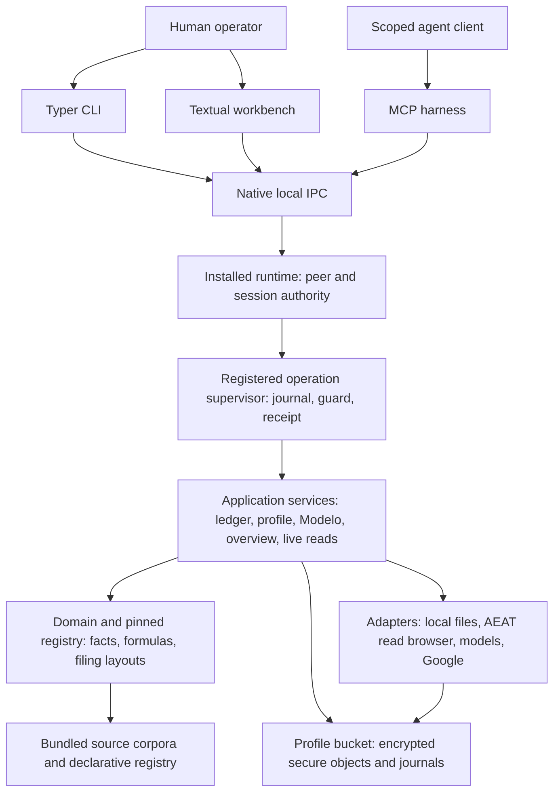

<vaultspec type="config">
## Vaultspec Rules

You MUST respect these rules at all times:

---
name: 00-architecture
trigger: always_on
---

# Cadrumo architecture

## Ownership and dependency boundaries

Cadrumo is organized around a local profile and a pinned tax-authority generation. Keep interfaces responsible for presentation and typed requests, the installed runtime responsible for authenticated admission and operation hosting, application services responsible for orchestration and lifecycle decisions, domain and registry code responsible for typed facts and calculations, and adapters responsible for external effects and persistence. Domain code must remain independent of adapters. Development registry compilation and authoring belong under `dev/registry/`; runtime consumers use the published authority and must not import the development compiler.



The diagram shows execution and data relationships, not permission to import across layer boundaries.

## Authority and execution

CLI, TUI and MCP submit through registered operations. Command declarations, UI state and agent prompts cannot grant authority. Native peer/login evidence anchors admission; client-supplied IDs alone do not. Bind boot, frontend, native client, exact profile, session/lease and authority generation, and recheck current authority at private submission, effects, interaction responses and disclosure.

The supervisor journals execution, guards irreversible effects and correlates review and terminal receipts. Keep response scope, interaction bearers and commit permits distinct. Preserve `UNKNOWN` or `SETTLING` when effects are ambiguous; timeout is not proof that retrying a mutation is safe. Cleanup and worker containment remain owned through settlement.

## Financial sources and filing state

Preserve the flow from imported observations and reviewed evidence to canonical profile, ledger and invoice facts, then typed aggregation, registry-pinned calculation, verification and local export. Keep incomplete inputs unresolved. Model extraction/classification is a proposal; deterministic registry logic owns regulated arithmetic, and grounding and human review have separate roles.

Do not mix authority generations within an operation. Keep local calculation, verification, exported bytes, pending local filing, authenticated remote observation and confirmed receipt as distinct states. A local `PRESENTADO` revision can still have AEAT status pending. Receipt promotion requires digest, CSV, model/period, taxpayer and current-filing-chain checks. The outbound AEAT submission gate refuses live submission; local export and registry-authority publication do not submit a taxpayer return.

Overview, calendar, review and search consume admitted local projections. Preserve unavailable, stale, unknown and genuinely empty states. Read-model access does not authorize remote acquisition, and missing observations do not prove that no obligation exists.

## Storage and external effects

Private state belongs to exact-profile secure storage. Preserve namespace, identity, schema, provenance and revision checks at the write boundary. SQL co-commits, operation journals, atomic filesystem publication and multi-store recovery are distinct durability mechanisms. Claim atomicity only where the actual repository guarantees it; a completed method or journal entry cannot prove every dependent store committed. SQLite WAL with `synchronous=NORMAL` can lose the latest transaction on power failure.

Keep integration authority and evidentiary grade separate: AEAT browser reads capture observations; Google Sheets performs authorized remote workbook writes; local exports write files; hosted-model extraction requires consent bound to the source bytes. Bundled sources, generated layouts and translations are versioned inputs, not proof of current law or publisher authenticity. Trace each guarantee through its callers and adapters before presenting a local control as an end-to-end guarantee.

## Code discipline

This rule uses import linting, Ruff lint and formatting checks, type checking, and strict type checking. Use `just check-import-boundaries`, `just check-style`, `just check-format` and `just check-types` for their configured scopes. The type runner uses `ty` across `src` and `pyrefly`/`basedpyright` for the configured strict production subset; do not weaken those scopes to make a change pass.

Use relative imports within the actual module/package boundaries, importing from the defining module. Relative syntax must not escape configured package roots or bypass dependency contracts. All rules must be respected when working.

## Implementation and verification invariants

- Public symbols have one canonical defining module. Keep package `__init__.py` files inert; do not add re-exports, facade modules, forwarding aliases or cross-package imports from private modules. Put tests under the narrowest owning `tests/` directory. Use canonical Spanish tax terms and semantic module names.
- Move definitions and all consumers atomically. Do not retain displaced internal APIs merely to satisfy old callers. Released compatibility requires an explicit supported window and migration/removal policy; historical registry baselines and evidence are not obsolete APIs.
- Verify behavior through the real owning parser, resolver or serializer. Cover success, refusal and material boundaries; use independent expected results where available. A mocked replacement for the behavior under test is not acceptance evidence. Protective gates must detect representative defects in isolated fixtures.
- Derive completeness and packaging inventories from the current filesystem plus the owning inclusion policy, not Git's tracked-file list. Round trips compare typed meaning, provenance and contract-defined ordering. Report new regressions separately from evidenced pre-existing failures.

## Shared work and governance

- Use the owning worktree and project environment. Preserve unrelated edits, re-read shared files before patching, and coordinate overlapping writers. Do not stash, reset, clean or overwrite concurrent work to obtain a clean baseline. Verify exact resolved paths before destructive filesystem operations.
- Run focused checks before broader gates; obtain final exit status and confirm the intended tests ran. A tool wait timeout is not process failure. Isolate shared outputs when running checks concurrently, and keep source and compiler inputs stable when proving transformations.
- Author governance in `.vaultspec/rules` and `.vaultspec/skills`; provider copies are generated. Preserve installation-owned builtins. Keep rules concise and stable, optional procedures in skill references, and agent workflow metadata out of product code and user documentation. Describe scoped inspection findings as observations requiring current-code verification, not accepted exceptions to an invariant.

---
name: 01-operator-interfaces-part-1
trigger: always_on
---

# Operator interfaces, part 1

The CLI is Cadrumo's primary operator surface. Declarative command fragments expose parameters, secrets, effect policies and output schemas, and demand-load handlers. The composed operation registry binds exact-profile repositories, secure writers and pinned tax authority. Ledger, invoice, evidence, Modelo, live-capture, overview and profile-management commands turn application results into typed text/JSON envelopes. A local calculation, verification, internal filing record, exported file and observed AEAT receipt are distinct states; none alone proves live submission. [graph](../../src/cadrumo/entrypoints/cli/command_graph.py), [composition](../../src/cadrumo/entrypoints/operation_composition.py#L966).

The knowledge displayed to operators comes from profile facts, pinned registries, ledger/evidence records and captured remote observations. Discovery names source categories and legal references without establishing their present legal validity. Off-host document extraction requires explicit consent and digest-bound review; model classification remains a proposal until accepted, with registry logic supplying regulated arithmetic. Live capture reports partial/empty/refused outcomes, and notification-document fetch is guarded by captured read state. [Evidence](../../src/cadrumo/entrypoints/cli/_ledger_evidence_cli.py#L257), [Modelo discovery](../../src/cadrumo/entrypoints/cli/_modelo_discovery_cli.py#L180), [notification guard](../../src/cadrumo/entrypoints/cli/_app_live_notifications_cli.py#L364).

The strongest visible controls are exact-profile preflight, secret channels, request/result correlation, typed envelopes, explicit confirmation and local-versus-official provenance. A confirmed `bucket_id != bucket_id` predicate makes the locked-other-profile calendar collection empty. The IVA capture count validator permits a positive failure count with an empty list. Telemetry flush can conditionally send despite a local-only CLI policy; impact on enforcement remains unresolved. Lower-level IVA composition and consent metadata reads have local profile-scope gaps whose reachability depends on worker and repository paths. [Calendar](../../src/cadrumo/entrypoints/overview_read_composition.py#L447), [telemetry](../../src/cadrumo/entrypoints/cli/_app_diagnostics_command_specs.py#L207).

These scoped interface findings do not establish that a calendar omission changes filing state or that a consent read grants permission for an off-host dispatch.

## Command and documentation invariants

Keep the root families `config` and `app`, stable untranslated protocol tokens, and one canonical spelling per command. Subjects remain positional where the hierarchy establishes them; options express modifiers. Parse and normalize at the boundary, then call the shared application service. Keep notices and diagnostics out of structured result channels. Test live registration, refusal, output shape and promised idempotency.

Generate help and CLI/API references from their owning sources rather than hand-maintaining inventories. Documentation uses Cadrumo and canonical domain terms, states prerequisites and observable outcomes, and keeps examples free of private data and machine-specific paths. Distinguish installed source, validated candidate, published authority and runtime adoption in completion claims.

---
name: 01-operator-interfaces-part-2
trigger: always_on
---

# Operator interfaces, part 2

The registered-operation bridge is the common CLI-to-worker protocol: it validates a typed request against a definition, binds profile/frontend/session identity, observes settlement, checks result/effect/schema, and correlates review replies. Timeout and incomplete observations stay `UNKNOWN`, which matters for mutations that may have committed. Ledger, Modelo, spreadsheet, review-package, live-capture and profile commands reuse this mechanism. A capture receipt proves that the local operation reported evidence; it does not independently authenticate current AEAT state or establish a submitted return. [runner](../../src/cadrumo/entrypoints/cli/runtime_registered_operation.py#L73).

Secret input admits one bounded stdin/descriptor channel, rejects duplicate JSON keys, closes descriptors and wipes mutable byte buffers. Exact-profile runtime admission and invocation-owned client cleanup constrain lifetime; immutable decoded strings and native credential handling are outside the wipe claim. Profile edits carry revision/content-digest preconditions and preserve “committed but readback failed” outcomes. Local file input and provider effects are delegated to workers, so CLI path normalization does not by itself prove filesystem containment. [Secure input](../../src/cadrumo/entrypoints/cli/config/secure_input.py), [profile admission](../../src/cadrumo/entrypoints/cli/runtime_profile_admission.py#L48), [profile patch](../../src/cadrumo/entrypoints/cli/config/runtime_profile_patch.py).

The strongest scoped concerns are an uncorrelated 12-character work-unit selector in one reconciliation import adapter and the shape of Pydantic validation errors sent to logging. The logger has recursive scrubbing filters; a raw validation logging call is not evidence of a disk leak. Check whether generic `input` values retain a sensitive-field hint from `loc`. The command-surface reconciler checks graph/handler metadata correspondence, but actual worker effect and provider correctness remain to be verified. [Reconciliation](../../src/cadrumo/entrypoints/cli/runtime_modelo_reconciliation_import.py#L25), [scrubber](../../src/cadrumo/core/logging.py#L351), [surface](../../src/cadrumo/entrypoints/cli/operator_surface_reconciliation.py).

The worker and profile repository remain the decisive boundaries for cross-profile reads and effects; CLI-side validation alone does not settle those deeper authority questions.

---
name: 02-runtime-tui-and-agent-harness
trigger: always_on
---

# Runtime, TUI and agent harness

The installed runtime is the access and operation host for CLI/TUI/MCP. It binds native connection, frontend, profile, session, login proof, registered operation and pinned authority generation; private submission, effects, reviews and disclosure recheck those coordinates. Secret frames and bounded worker staging keep large or sensitive payloads apart from ordinary documents. Shutdown retains cleanup ownership and can terminate an uncontained process. These are source-level controls requiring OS and race testing. [authority](../../src/cadrumo/entrypoints/runtime/operation_authority.py#L221), [staging](../../src/cadrumo/entrypoints/runtime/worker_submission_staging.py#L54).

The Textual workbench consumes runtime projections for Home, Declarations, Ledger, AEAT Sync, profile management and Modelo forms. It preserves semantic selection, distinguishes local from official filing evidence, and stages typed edits for preflight/review before application operations. Evidence confirmation binds source and draft digests; local export displays a non-official warning. The generic operation modal supports public review interactions with exact operation/revision checks, while `INPUT` and `CHOICE` remain unsupported there. Ledger review/evidence row query navigation is visibly pending despite other Ledger mutation doors. [Modelo review](../../src/cadrumo/entrypoints/tui/modelo/workbench/review.py#L385), [evidence confirmation](../../src/cadrumo/entrypoints/tui/ledger/runtime_evidence.py#L208), [pending routes](../../src/cadrumo/entrypoints/tui/ledger/controller.py#L755), [modal](../../src/cadrumo/entrypoints/tui/operations/modal.py#L101).

Bundled agent personas, rules and workflow skills guide staged tax work, source provenance, independent review and human filing, but are prompt material rather than enforcement. The MCP harness has a typed protocol with public corpus retrieval and relevance-ranked operation discovery and exact-profile runtime adapter; uncertain submissions retain request identity. Skill/casilla prose is versioned orientation, not verified current law. A source-level question is whether import preview/apply detects file changes, since the UI retains a path without content digest. Other bounded concerns include non-atomic generation/profile snapshots, platform containment and logging tracebacks; none is established as a product-wide breach by static reading. [Harness protocol](../../src/cadrumo_harness/mcp/protocol_contract.py#L45), [import flow](../../src/cadrumo/entrypoints/tui/ledger/import_flow.py#L280).

---
name: 03-document-and-financial-imports
trigger: always_on
---

# Document and financial imports

Inbound adapters convert Modelo 100 drafts, filed-declaration PDFs, AEAT receipts, notification acts, structured e-invoices and financial files into typed observations. Borrador extraction supports printed casilla rows; filed-declaration extraction uses registry snapshot profiles; CII/UBL/Facturae parse into a neutral invoice DTO; provider files produce provenance-bearing raw transactions. The censal certificate parser explicitly refuses all documents pending a specimen-backed layout. Recognizing SII or VERI*FACTU shape does not mean that e-invoice parser accepts it. [declaration parser](../../src/cadrumo/adapters/inbound/declaracion/parser.py#L126), [e-invoice dispatch](../../src/cadrumo/adapters/inbound/einvoice/shape.py#L259), [censal refusal](../../src/cadrumo/adapters/inbound/censo/parser.py#L25).

Knowledge comes from printed document values, provider row fields and the bundled extraction/notification registry. Digests and registry references preserve provenance, but a parsed receipt does not authenticate its AEAT CSV or URL; notification reduction fact selection uses the present Madrid date by default, a historical applicability question. XML has hardened parsing and a 32 MiB limit, while PDF attachments are read before that bound. PDF bytes routes can keep decrypted evidence in memory, and a digest-derived `.secure-source` reference is only a name until secure custody stores it. [Notification parser](../../src/cadrumo/adapters/inbound/notificacion/sancion.py#L431), [XML guard](../../src/cadrumo/adapters/inbound/einvoice/xml.py#L88), [provenance](../../src/cadrumo/adapters/inbound/pdf/source_provenance.py#L23).

Scoped quality findings: borrador `OBSERVED` mode still applies a supplied coverage profile despite its description; declaration parser checks an injected snapshot against the template only by model ID and hides tolerated missing targets. The financial 64 MiB guard can run after auto-detection or some parser validation reads, and hash-then-reopen flows risk digest/content mismatch if a path changes. These local facts warrant tests and caller tracing; no runtime accuracy or document authenticity was established. [Borrador mode](../../src/cadrumo/adapters/inbound/borrador/parser.py#L37), [snapshot check](../../src/cadrumo/adapters/inbound/declaracion/parser.py#L587), [financial detection](../../src/cadrumo/adapters/inbound/financial/providers/detection.py#L46).

---
name: 04-external-integrations-and-local-runtime
trigger: always_on
---

# External integrations and local runtime

The local runtime client uses verified native IPC, separate bounded document/secret frames, exact boot/connection/profile/session identity, and worker custody/operation/authorization channels. Clients connect to an explicitly started runtime and report unavailability; running state is distinct from authenticated or settled operations. Linux containment uses pidfds/cgroups; Windows uses a kill-on-close Job Object and token/desktop checks. These source-level controls need platform/race testing. [framing](../../src/cadrumo/adapters/local_runtime/framing.py#L324), [Windows process](../../src/cadrumo/adapters/local_runtime/windows_process.py#L186).

AEAT browser adapters authenticate by certificate or Cl@ve, then read censal facts, filed declarations, IVA wallet, notifications, NIF-IVA/GROI and expedientes through guarded host/path/action routes. Captures carry hashes and registry references. A notification-document fetch requires a prior `leida=True` row, but the adapter depends on its caller for a fresh, same-taxpayer record. Fresh Cl@ve landing acceptance is weaker than later verification; missing persisted landing metadata can make a diagnostic probe start a challenge. Captured 303 compensation assumes `refunded=False`, requiring downstream refund reconciliation. [Notification guard](../../src/cadrumo/adapters/outbound/aeat/sede/notifications.py#L558), [Cl@ve probe](../../src/cadrumo/adapters/outbound/aeat/auth/clave_movil.py#L415), [303 derivation](../../src/cadrumo/adapters/outbound/aeat/sede/declarations_observations.py#L839).

Google Sheets is a remote writer and checked readback surface; offline XLSX is a separate local artifact. OAuth/Drive require scope and ownership markers. Encrypted-byte mirroring verifies object hashes and publishes manifests only for complete namespace pushes. LLM readers distinguish model proposals from deterministic grounding; canonical off-host invoice extraction binds fresh consent to stored source bytes, while generic dispatch relies on callers for that binding. Strong scoped concerns include potentially duplicated Sheets metadata on a replayed structural batch, `USER_ENTERED` literal formula interpretation, stringified missing OAuth refresh tokens and a generic Drive write/read hash-contract mismatch. [Sheets apply](../../src/cadrumo/adapters/outbound/google/calc_sheets_apply.py#L779), [LLM binding](../../src/cadrumo/application/ledger/invoice_evidence_extract_operation.py#L152), [mirror](../../src/cadrumo/adapters/outbound/storage/mirror_push.py#L404).

## Runtime lifecycle policy

Do not create, register or start scheduled tasks or persistent OS services for runtime operation, development, tests or desktop-session recovery. Manual testing uses an explicitly started runtime whose lifetime and cleanup belong to the developer session. Clients must not install, autostart, repair or supervise it. If the execution context lacks the required desktop session, report the limitation; do not install a bridge. Platform containment remains required for session-owned workers. Existing service-management code is not authorization to use or extend it.

---
name: 05-persistence-and-secure-storage
trigger: always_on
---

# Persistence and secure storage

Profile facts, transactions, calculations, filings and evidence live primarily in bucket-scoped encrypted SQL secure objects. Registered namespaces define sensitivity, schema and custody policy. AES-GCM binds ciphertext to namespace/key/schema; HMAC keys hide natural identifiers; revision-guarded batches and parent checks keep related records consistent. A plaintext transaction-date routing index exposes date/ID metadata but falls back to encrypted scan if incomplete. [write funnel](../../src/cadrumo/adapters/persistence/storage/sql/_secure_object_writes.py#L200), [date fallback](../../src/cadrumo/adapters/persistence/profile/transactions.py#L573).

Profile DEKs are password/recovery wrapped, sentinel-proven and housed in no-replace published capsules; KDF work runs in a bounded supervised child. Session acceleration splits an OS-keychain random key from an encrypted receipt. Automation credentials use native stores and durable denial intents. Attachments and archives retain encrypted bytes with digest checks. An operation journal validates ordered history and exact lease ownership; consent history appends before off-host evidence dispatch without retaining document bytes. [Capsule](../../src/cadrumo/adapters/persistence/storage/custody/capsule.py#L431), [acceleration](../../src/cadrumo/adapters/persistence/storage/custody/acceleration_receipt.py#L709), [consent ledger](../../src/cadrumo/adapters/persistence/llm/consent_ledger.py#L94).

Scoped risks include direct in-place financial checkpoint writes, a potentially racing attachment manifest read/merge/write, database content omitted from deletion-inventory digests, and outer review-package metadata absent from this adapter's AEAD associated data pending signature tracing. SQL revision hashes are unkeyed and cover a declared subset of fields. SQLite WAL `synchronous=NORMAL` permits last-transaction loss on power failure; no crash test or arbitrary-old-schema migration was established. [Checkpoint](../../src/cadrumo/adapters/persistence/operations/financial_operand_custody.py#L70), [attachment merge](../../src/cadrumo/adapters/persistence/storage/attachment.py#L337), [inventory](../../src/cadrumo/adapters/persistence/storage/custody/_inventory.py#L78), [AEAD context](../../src/cadrumo/adapters/persistence/profile/review_package_recipient_encryption.py#L58).

These are persistence-layer observations. A caller's journal, lock, signature verification or recovery step may narrow the practical impact; each path needs its full composition traced before it is described as an end-to-end failure. The stated confidentiality guarantees also rely on native key-store and filesystem permissions outside these SQL adapters.

## Private-data invariants

Persist private taxpayer, banking, credential, invoice, filing and evidence payloads only through approved encrypted custody. Public official publications, registry definitions and synthetic fixtures may use canonical repository storage; inspect them for embedded private data. A path or URL is not persisted evidence. Use synthetic or irreversibly anonymized test data.

Do not leak private payloads through logs, exceptions, command arguments, caches, scratch files, documentation or agent transcripts. Redact before serialization or transport and use approved secret channels. Explicit operator exports and consented integrations must follow their declared authorization, destination and data-lifetime contracts; ordinary development access grants neither. Bound decrypted material's lifetime and cleanup, and refuse workflows that cannot meet their custody contract. Observed plaintext gaps require remediation, not a new storage exception.

---
name: 06-application-orchestration-and-diagnostics
trigger: always_on
---

# Application orchestration and diagnostics

Evidence bundles still require recipient review for authenticity and legal relevance.

Application orchestration covers profile-bound state, health, reset, local model provisioning, flows, inventory and asset operations, offline retrieval, evidence bundles, and supervised exports. The application generally distinguishes availability, stale facts, proposed calculations, and attempted external effects. Workbench generation joins secure readers only after source revision checks; Modelo readiness preserves distinct profile, registry, binding, and ledger axes. AEAT Sync's local projection reports remote data as never captured rather than reading the network. [State projection](../../src/cadrumo/application/state_projection.py#L543) [Workbench assembly](../../src/cadrumo/application/workbench_generation.py#L502) [Local AEAT Sync](../../src/cadrumo/application/aeat_sync/workspace_reader.py#L432).

Enforced controls include exact-profile operation binding, typed health and result projections, confirmation and retention checks for journaled all-profile reset, memory admission for model load, stale-answer review in interactive flows, revision-guarded inventory and amortization writes, digest verification before evidence-bundle export, and consent/tier gates before telemetry sends. Remote Google workbook export records an uncertain effect before mutation; the code here cannot confirm remote delivery. Offline exact citations use pinned registry evidence, while phrase search uses a content-keyed local index of extracted HTML. [Reset recovery](../../src/cadrumo/application/config_reset.py#L516) [Model admission](../../src/cadrumo/application/provisioning_runtime.py#L256) [Bundle checks](../../src/cadrumo/application/evidence/service.py#L247) [Telemetry gate](../../src/cadrumo/application/diagnostics_telemetry.py#L171).

Scoped follow-ups: failed secure-object probing can look like an empty OK integrity row; deadline errors can look like no pending obligations; a readiness probe may cold-load a model outside normal admission; legal-hold snapshots have no established post-registration refresh; spreadsheet text lacks explicit formula neutralization. These are distinct local behaviors and conditional integration risks, not verified production failures. [Integrity probe](../../src/cadrumo/application/diagnostics.py#L262) [Readiness probe](../../src/cadrumo/application/provisioning_runtime.py#L1031) [Legal-hold producer](../../src/cadrumo/application/evidence/profile_legal_hold.py#L202).

---
name: 07-aggregation-and-calculation-services
trigger: always_on
---

# Aggregation and calculation services

Aggregation and calculation services provide source resolvers that turn profile facts, transactions, invoices, registers and prior filings into values for a selected Modelo revision. A typed source mesh keeps scalar amounts, rows, relations, diagnostics and provenance distinct; exclusive merge rejects duplicate ownership. IVA uses dated admission, EUR and payment evidence, prorrata and invoice cross-checks. Renta has distinct annual, cumulative quarterly and agrarian routes; withholding recognition feeds periodic captures and annual views. OSS/IOSS, M720, inventory and counterpart previews are narrower capabilities with their own source and provenance limits. An aggregate or parser-supported input alone does not establish a filing-grade calculation. [Source mesh](../../src/cadrumo/application/aggregation/source_mesh.py#L865) [IVA admission](../../src/cadrumo/application/aggregation/_iva_transaction.py#L197) [Renta source](../../src/cadrumo/application/aggregation/renta_income_ledger.py#L292).

Cross-period prefill requires source observations stamped for the caller's pinned authority; a separate clean-state gate checks filing revision, member coverage, verification, and official evidence. M303 IVA carry uses a canonical disposition envelope and atomic observation/history co-commit contract; an unknown opening balance stays unresolved for annual M390. Withholding mutation uses baseline-guarded replacement and exact-command replay. These are strong local controls, while storage atomicity and authority accuracy depend on adapters and bundled data. [Clean-state gate](../../src/cadrumo/application/calculations/cross_period_clean_state.py#L639) [M303 co-commit](../../src/cadrumo/application/calculations/iva_compensation_history.py#L276) [Withholding mutation](../../src/cadrumo/application/aggregation/withholding_observation_service.py#L374).

The highest-priority scoped findings are a raw foreign-currency versus EUR comparison in an invoice silence-guard branch and filing-snapshot fingerprints that omit calculation-relevant IVA fields. Authority-generation reopening in M303 transition and withholding helpers matters if historical generations are reachable; fractional integer/date coercion in detail-row assembly needs upstream admission checks. These are code-level findings and conditional impacts, not confirmed production filing errors. [Currency comparison](../../src/cadrumo/application/aggregation/_modelo_bindings_invoice_iva_refusal.py#L36) [Snapshot fields](../../src/cadrumo/application/aggregation/ledger_filing_snapshot.py#L94) [Generation reopening](../../src/cadrumo/application/aggregation/m303_arrivals.py#L121).

## Aggregation and completeness invariants

Use one canonical typed aggregation mechanism across pull, preview, calculation and filing. Enroll source families and validators in the shared dispatch; do not add modelo-name branches or private summation paths. Eligibility, sign, rounding, currency and period come from the governing relationship and typed contract, never labels.

Keep absent, unknown, unsupported, deferred, advisory, not-applicable and proven-zero states distinct. Resolve inherited/projected declarations before declaring registry data missing. Required gaps and independent-source disagreements must reach the user as structured findings; suppression is narrowly keyed, justified and reviewable. No downstream consumer may promote advisory inputs to filing grade. Verify multi-source inclusion/exclusion, missing inputs, diagnostic propagation and parity through the real resolver.

---
name: 08-authentication-and-storage-management
trigger: always_on
---

# Authentication and storage management

The inspected local readiness and storage contracts do not establish a successful remote login, an effective representation grant, or delivery of a cloud workbook. Those outcomes need separate remote and application evidence.

Authentication and storage management services cover profile-bound provider configuration, session reuse/acquisition, named certificate sources and secrets, local status, redacted diagnostics, logout/reset, storage inventory/reclaim, and calculation workbook plans. Local apoderado configuration exists; the advertised live check explicitly refuses. Auth status/test are local readiness probes, distinct from remote authentication. [Auth operator](../../src/cadrumo/application/auth/operator.py#L135) [Apoderado refusal](../../src/cadrumo/application/auth/apoderado_service.py#L119).

Session lifecycle checks active profile and identity, probes persisted state on both sides of acquisition locking, and stages encrypted browser-state publication until provider verification succeeds. Certificate passphrases use profile-scoped secret storage and a durable secret-free intent. Diagnostic projections suppress raw HTML/screenshots and URL query values. Bucket deletion assessment refuses unreadable/linked roots and absent retention knowledge; storage reclaim derives allowed targets from taxonomy, checks containment and protected descendants, and requires explicit confirmation. Registry-stamped workbook plans support offline bytes and an injected Google apply path; parity with caller-supplied expected values cannot itself prove AEAT or legal correctness. [Session lifecycle](../../src/cadrumo/application/auth/sessions.py#L338) [Secret intent](../../src/cadrumo/application/auth/certificate_source_operations.py#L451) [Reclaim](../../src/cadrumo/application/storage_management/service.py#L300) [Workbook plan](../../src/cadrumo/application/storage/calc_sheets/engine.py#L1003).

The clearest local defect is an acquisition-lock recovery interleaving: after an unreadable first inspection, a replaced live lock can be deleted without a byte comparison. Other questions depend on upstream guarantees: normalized blank session identity, held-lock reset coordination, and concurrent filesystem replacement during reclaim. An unreadable storage inventory can also appear empty. [Lock comparison](../../src/cadrumo/application/auth/acquisition_lock.py#L431) [Identity comparison](../../src/cadrumo/application/auth/sessions.py#L1125) [Inventory measurement](../../src/cadrumo/application/storage_management/service.py#L487).

---
name: 09-filing-and-live-state
trigger: always_on
---

# Filing and live state

Filing and live-state services separate local filing work from authenticated remote observation. A registry-pinned draft takes typed casilla inputs, calculates and validates them, then approval hashes relevant draft/source state. Export renders a selected fixed-width or XML layout to a local artifact and verifies bytes; it does not submit to AEAT. M200 repeated rows remain operator supplied, M210/M296 require caller fact sourcing, and M202 explicitly refuses unsupported producer fields. [Draft](../../src/cadrumo/application/filing/draft_construction.py#L80) [Export](../../src/cadrumo/application/filing/export.py#L435) [M202 refusal](../../src/cadrumo/application/filing/producer_snapshot.py#L1151).

Live read paths capture censo, Borrador 100 PDFs, declaration registers, filed history, IVA wallet/history, notifications, notification documents and identity-verification observations into profile-bound local custody. Bulk capture reports failed pairs separately from genuine empty results; its dry run reads remotely but avoids local evidence writes. Justificante bytes become confirmed filing-chain evidence only after digest, CSV, model/period, taxpayer and current-record checks. A cotejo attempt can remain unavailable, distinct from denial. Notification document custody stores encrypted bytes and requires either a parsed reading or explicit parse refusal. [Filed capture](../../src/cadrumo/application/live/filed_data_capture.py#L665) [Receipt gate](../../src/cadrumo/application/live/filed_observation_persistence.py#L486) [Document custody](../../src/cadrumo/application/live/notification_documents.py#L240).

The strongest controls are exact-profile admission, guarded local writes, typed effect accounting, and gradual evidence promotion. Scoped concerns are stale approval refresh at the upper export caller, XML non-casilla values that ignore a documented header fallback, a discovery-to-bulk Cartesian expansion for ragged model/year pairs, and several result projectors that do not locally compare terminal receipts. The operation host may supply the missing receipt guarantee; this static pass did not verify it. [Approval refresh](../../src/cadrumo/application/filing/draft_review.py#L529) [Pair reduction](../../src/cadrumo/application/live/filed_data_capture.py#L2329) [Receipt projector](../../src/cadrumo/application/live/filed_bulk_capture_operation.py#L137).

## Export invariants

Derive record order, field positions, widths, encoding, repetitions and conditions from the selected official design through the hydrated registry layout. Preview and emitted bytes share the canonical builder and formula results. Distinguish missing, required blank, permitted blank and zero; padding cannot supply a required fact. Refuse overflow, truncation, illegal characters, invalid cardinalities and inconsistent totals. Validate official examples where available and semantic parse/serialize round trips. Generated fixtures and references are regenerated from their owners, not hand-edited.

---
name: 10-ledger-invoices-and-registers
trigger: always_on
---

# Ledger, invoices, and registers

Ledger, invoice and register services cover bank/manual ledger entries, classification and readiness, invoice catalogue intake and reciprocal linking, document evidence and reviewed confirmation, LLM proposals, and the local IVA prorrata register. A parser-supported document first becomes lower-confidence evidence/draft; re-extraction and per-finding human review precede canonical invoice creation. Calculation readiness screens classified rows and links, while finalized calculation references block fact changes. These are local financial source capabilities, not official exports or remote filings. [Ledger guards](../../src/cadrumo/application/ledger/actions_common.py#L218) [Invoice intake](../../src/cadrumo/application/invoices/bulk_import.py#L748) [Confirmation](../../src/cadrumo/application/ledger/invoice_confirmation.py#L554).

Enforced controls include exact-profile operation access, revision-guarded ledger/event and invoice/transaction writes, content-derived evidence identity, explicit missing/ambiguous document facts, and canonical consent for off-host extraction: the registered path requires stored evidence, per-call acknowledgement, a minted source-hash proof and a loaded-byte digest check. Model classification remains a proposal; registry rules derive tax amounts and a captured reviewed baseline gates application. The prorrata seed rechecks prior M303 revision and commits against source plus register revisions. [Consent path](../../src/cadrumo/application/ledger/invoice_evidence_extract_operation.py#L152) [Reviewed LLM apply](../../src/cadrumo/application/ledger/llm_review_execution.py#L143) [Prorrata seed](../../src/cadrumo/application/prorrata_register/service.py#L271).

The key cross-layer question is whether a draft tax ID without its own accepted anchor can be promoted by separate role text and later accepted; model output, deterministic grounding and human confirmation must remain distinct. Confirmation's catalogue, attachment, evidence-summary and audit writes are sequential, so crash recovery needs verification. Ratio override and event writes are explicitly non-atomic; importer original-file hashing is separately timed. An IRPF-residency proxy can over-report issuer IVA establishment in non-TAI territories. [Identity seam](../../src/cadrumo/application/ledger/grounded_reading.py#L303) [Confirmation writes](../../src/cadrumo/application/ledger/invoice_confirmation.py#L758) [Ratio ordering](../../src/cadrumo/application/ledger/ratios.py#L550).

## Ledger invariants

Preserve the owning amount/direction contract: where an amount is a magnitude, carry economic direction in its typed field rather than encoding it again in the sign. Keep currency, rounding, period and counterparty explicit. Corrections preserve revision or reversal evidence rather than erase history. Map imported IVA categories to the canonical vocabulary and refuse ambiguity. Derive participation and allocation through the typed relationship owner; do not duplicate percentages or silently normalize inconsistent totals. Verify encrypted evidence round trips and ledger-to-filing parity.

---
name: 11-modelo-work-and-revision-lifecycle-part-1
trigger: always_on
---

# Modelo work and revision lifecycle, part 1

The Modelo work lifecycle includes work-unit calculation, edit, verification, local export, local filing, external-evidence reconciliation and amendment. A registry-pinned source mesh combines profile, ledger, invoices, withholding and prior declarations into a content-addressed BORRADOR revision. Verification checks filing-grade authority, source completeness, ledger drift and model-specific evidence. Local export writes an artifact; local filing creates a PRESENTADO revision whose AEAT status remains pending. External receipt/register matching is the separate promotion path; an amendment again starts as a pending local correction. [Calculation](../../src/cadrumo/application/modelo/calculation_actions.py#L401) [Verification](../../src/cadrumo/application/modelo/verification_actions.py#L837) [Local filing](../../src/cadrumo/application/modelo/revision_persistence.py#L1208) [Reconciliation](../../src/cadrumo/application/modelo/filing_chain_reconciliation.py#L283).

The stage gates preserve source/override precedence, typed provenance, registry revision identity and exact profile/period authority. An edit baseline is short-lived and value-free; active execution supports scalar/binding edits while refusing row intents. M123 with captured withholding refuses calculation through export pending a settled count rule; M193 prior-accrual settlement has a later filing/export refusal. M036 records and operator observations are local assertions; M145 is a payer communication, with filing/submission links explicitly refused. Report PDF signatures are pinned to a profile key only when store verification succeeds, and expressly do not claim AEAT status. [Edit admission](../../src/cadrumo/application/modelo/edit_admission.py#L268) [M123 gate](../../src/cadrumo/application/modelo/m123_count_authority_gate.py#L57) [M145 ownership](../../src/cadrumo/application/modelo/m145_communication.py#L88) [Report verification](../../src/cadrumo/application/modelo/calculation_report_verification.py#L727).

Scoped concerns include calculation advisories running after revision persistence, export event recording before file publication, verification report and revision writes in separate steps, sticky wallet overrides, helpers that reopen default authority rather than reuse a pin, and feedback import without visible replay-nonce consumption. The accountant package uses member hashes, signatures and recipient encryption, but trust in a recipient key still needs out-of-band checking. Quickfile ends at local export; M100-from-M130 projection is explicitly an estimate. [Post-persist work](../../src/cadrumo/application/modelo/calculation_actions.py#L1712) [Export sequence](../../src/cadrumo/application/modelo/export.py#L1187) [Feedback route](../../src/cadrumo/application/modelo/review_package_exchange_operation.py#L295).

---
name: 11-modelo-work-and-revision-lifecycle-part-2
trigger: always_on
---

# Modelo work and revision lifecycle, part 2

Work addressing binds a model/year/period or exact ID to one law-selected registry revision and rechecks work-catalogue/profile-pointer freshness. Creation applies profile readiness and applicability gates, co-commits work with its event, and distinguishes reuse, update and unknown prepublication effect. The canonical form combines registry layout, saved calculation, operator-entry provenance, verification, source records and deadlines; local filing state is explicitly separate from AEAT submission. [addressing](../../src/cadrumo/application/modelo/work_addressing.py#L921), [form](../../src/cadrumo/application/modelo/work_form.py#L105).

Verification reads registry-authored predicates and prior filing/ledger/wallet evidence. Uncertain applicability keeps a cross-period blocker; a 303 carry needs a matching unblocked wallet decision. Empty annual withholding detail needs attested absence not contradicted by liability evidence, but that gate does not test a sparse nonempty store. Workbench reads are human-only and baseline-bound; wizard missing-input prompts are typed, and workflow gate results are persisted before later verify/file transitions. [Cross-period](../../src/cadrumo/application/modelo/verification_cross_period.py#L311), [withholding](../../src/cadrumo/application/modelo/withholding_detail_gate.py#L280), [workflow](../../src/cadrumo/application/modelo/workflow_gate.py#L392).

Workspace static mode measures schema only; graded mode requires matching calculation, review and readiness contributors. Schema stamps, owner-scoped epochs and cursor baselines detect drift without claiming one atomic transaction across all stores. A stale module header wrongly says assembly is unfinished. Unknown blocking-predicate syntax locally passes, making registry-build validation essential; the normal route may provide it, but alternate loaders and direct helper calls need checking. No calculation, legal or runtime correctness was established. [Workspace](../../src/cadrumo/application/modelo/workspace.py#L2158), [producer epochs](../../src/cadrumo/application/modelo/workspace_producers.py#L202), [predicate dispatch](../../src/cadrumo/application/modelo/verification_predicates.py#L787).

The workbench is a currentness-aware projection, not a second calculation authority. The source producers must honor their epoch promises, and the registry loader must reject malformed predicates before a verification run consumes them.

---
name: 12-operations-profiles-and-workflows
trigger: always_on
---

# Operations, profiles and workflows

Operations, profiles and workflows connect the registered operation owner, operator/read projections, profile custody, setup and local filing workflow. The supervisor journals `CREATED` and `RUNNING`, rechecks authority at execution, guards irreversible effects and retains `UNKNOWN` or `SETTLING` rather than inventing completion after an ambiguous interruption. Definitions constrain replay, secrets, storage and effects; digest-bound reviews and process-local response bearers keep interaction authority separate from a visible request ID. [Supervisor](../../src/cadrumo/application/operations/_supervisor_execution.py#L116), [contracts](../../src/cadrumo/application/operations/capabilities.py#L65).

Operator remedies resolve catalogue actions against the reconciled live command tree. Overview calendar and coverage distinguish positively applicable obligations from unknown or out-of-scope ones; filing readiness, observed submission and verified justificante remain separate. Review gathers ledger, invoice and draft findings, while search ranks only an ephemeral, already-admitted workspace snapshot. Read operations release exact-profile, successful no-effect receipts. [Surface manifest](../../src/cadrumo/application/operator_surface/manifest.py#L621), [calendar coverage](../../src/cadrumo/application/overview/coverage.py#L221), [review](../../src/cadrumo/application/review/read_operation.py#L283), [search](../../src/cadrumo/application/search/installed_workbench.py#L41).

Profile access binds human or automation leases to current custody, runtime boot, native connection/client and narrowed scope. Automation approval withholds authority until protected delivery and possession acknowledgement. Profile deletion, login handover, record updates and portable export use explicit journals, compare-and-swap or event-linked writes. Wizard edits are revision-bound and preserve omitted answers; the workflow engine builds and validates a local draft but does not submit it. [Lease policy](../../src/cadrumo/application/user_profile/session_authority_policy.py#L38), [approval](../../src/cadrumo/application/user_profile/automation_approval_session.py#L216), [custody deletion](../../src/cadrumo/application/user_profile/custody_service.py#L607), [workflow](../../src/cadrumo/application/workflow/engine.py#L239).

The strongest scoped checks are crash recovery around custody publication/passphrase rewrap, caller validation before CLI argv construction, source-unavailable versus empty review, and the descendant relationship/date validator path. One confirmed documentation defect says workflow reset fingerprints include a content hash although only metadata is recorded. Static inspection did not execute the app, prove adapter atomicity or validate legal schedules. [Reset](../../src/cadrumo/application/workflow/persistence.py#L374), [descendant validator](../../src/cadrumo/application/wizard/descendant_group.py#L462).

---
name: 13-core-authority-and-shared-controls
trigger: always_on
---

# Core authority and shared controls

Core authority provides typed contracts used across settings, custody, calculations, imports, output and diagnostics. Active-profile selection comes from a durable pointer rather than an environment variable, and settings route database paths from that selected bucket. Hardened atomic writes, pointer revisions, storage-location taxonomy and distinct lock protocols give callers tools for recoverable local state; caller-held locks, safe bucket IDs and adapter permissions remain integration requirements. [Settings](../../src/cadrumo/core/config.py#L1069), [pointer](../../src/cadrumo/core/bucket_pointer.py#L131), [writer](../../src/cadrumo/core/atomic_write.py#L191).

Knowledge contracts keep shape, provenance and authority separate. A syntactically valid Modelo/casilla is not necessarily in the pinned registry. Financial and document inputs distinguish structured, inferred, operator-entered and independently grounded values; ambiguous European number text is refused rather than guessed. Filing references retain model-specific row and party shapes. The producer-key inventory itself documents many keys without runtime suppliers, so form coverage must be checked against each revision. Bundled corpus manifests prove internal consistency, not publisher authenticity. The AEAT access gate unconditionally refuses live submission, leaving local filing artefacts for operator upload. [Provenance](../../src/cadrumo/core/field_grounding.py#L28), [decimal](../../src/cadrumo/core/decimal/coercion.py#L129), [producer inventory](../../src/cadrumo/core/filing_producer_key.py#L402), [gate](../../src/cadrumo/core/access_gate/gate.py#L46).

Strict JSON results and a registered error catalogue provide stable action and refusal shapes. Redaction covers output, logs and structured data, but pseudonymous tax-ID prefixes and a plaintext process cache are not anonymity. Run traces may contain tax amounts and are not encrypted by the core observability module. Telemetry defaults to a no-op and requires consent; the `CRASH_ONLY` tier currently has no timing filter at the payload boundary, and its free-text-like `error_kind` is not a closed code. Declared retention ages are not implemented cleanup. [Errors](../../src/cadrumo/core/errors/error_codes.py#L176), [redaction](../../src/cadrumo/core/redaction/rules.py#L940), [trace](../../src/cadrumo/core/observability/store.py#L164), [telemetry](../../src/cadrumo/core/telemetry/schema.py#L136).

Priority scoped follow-up is message interpolation before error-context redaction, run-event ID binding, third-party DEBUG handling on run sinks, ASCII enforcement in ISO token helpers, and whether packaged locale mutation is supported. No application tests, live portal probes or external legal verification were performed. [Message path](../../src/cadrumo/core/errors/error_codes.py#L510), [event append](../../src/cadrumo/core/observability/store.py#L338), [ISO helper](../../src/cadrumo/core/parsing/codes.py#L28).

---
name: 14-tax-calculation-domain
trigger: always_on
---

# Tax calculation domain

The domain turns a versioned tax registry into dated, typed calculation snapshots, bindings, formulas, filing rows and export-layout projections. A filing-grade snapshot passes support-year, revision, authority-grade, source-window and cross-domain gates; a separate historical inspection path has a narrower claim. Published authority is a digest-checked, read-only SQLite generation pinned for each operation, although descriptor publisher trust remains a deployment question. These boundaries are implemented here ([snapshot](../../src/cadrumo/domain/calculations/registry/snapshot.py#L245), [authority](../../src/cadrumo/domain/calculations/registry/authority_store.py#L186)).

Governed facts and catalogues select dated rates, regimes, entity categories and source references. Closed binding registration distinguishes filing-grade, manual/design-constant and deferred producers. Formula evaluation uses Decimal arithmetic, dependency order and provenance, preserving unresolved inputs rather than substituting zero. Applicability likewise separates positive yes/no, pass-through and incomplete results. These are calculation mechanisms, not validation of today's law or a taxpayer's upstream ledger facts ([fact resolution](../../src/cadrumo/domain/calculations/registry/facts/resolution.py#L344), [bindings](../../src/cadrumo/domain/calculations/registry/binding_provider_registration.py#L167), [formula](../../src/cadrumo/domain/calculations/registry/formula_runtime.py#L580)).

Export layouts and a fixed-width/XML parser check record geometry, field sources, encodings and canonical values. A valid official-format payload is separate from a remote read, an attempted submission and an AEAT-confirmed filing. The remote-state guard only preflights allowed hosts, methods, paths and browser actions; it does not execute or inspect request bodies ([layout](../../src/cadrumo/domain/calculations/registry/schema_exports.py#L446), [codec](../../src/cadrumo/domain/calculations/registry/fixed_width_codec.py#L227), [guard](../../src/cadrumo/domain/calculations/registry/remote_state_guard.py#L424)).

Strong controls include generation pins, legal/source traces, closed selectors, exact previous-filing folds and independent IVA quantity screens. Scoped concerns remain: an external Decimal check is a no-op; a Gasto193 nonnegative method is not an active validator; corpus-path and Unicode-code checks are locally wider than their stated contracts. Their reachability and mitigation require consumer review, not an assumed filing defect. No tests, live requests or law checks were performed during static inspection ([Decimal guard](../../src/cadrumo/domain/calculations/registry/formula_runtime_ops.py#L445), [Gasto193](../../src/cadrumo/domain/calculations/registry/gasto193_bindings.py#L52), [source path](../../src/cadrumo/domain/calculations/registry/schema_references.py#L638)).

## Grounding, bindings and authority invariants

Ground filing-affecting formulas, rates, classifications and relationships in specific official provisions, instructions or designs for the exact revision, period, territory and taxpayer conditions. Preserve that scope and provenance through results. Search snippets and generic landing pages are insufficient; independent official examples or separately implemented oracles provide stronger calculation checks. Ambiguous evidence keeps capability advisory or unsupported.

Each binding family has one typed declaration, enrolled validator and owning resolver. Reject unknown families, ambiguous selectors, incompatible applicability and missing required provenance after hydration. Preserve capability grades and authority precedence in resolved results; imported values must not silently override governed bindings.

Authoring inspection exposes candidate data and findings; validation does not install source or publish authority. Runtime must not fall back to mutable TOML or compile development source. Use canonical hydration and temporal selection, never a second loader or lexical newest-year fallback. The registry owns the support envelope.

Store baselines plus genuine deltas: omission inherits, explicit removal deletes, and false/zero/empty/order remain meaningful. Storage ancestry grants no legal continuity or new review claim. Prove representation changes with typed equivalence, independent minimality, complete assessment, idempotence and stable receipts; intentional semantic changes require separate evidence. Separate unchanged publication defects from source-rewrite regressions. Publish only fully validated final inputs, verify the generation actually consumed, and report source installation, publication and runtime adoption separately.

---
name: 15-business-and-taxpayer-domain
trigger: always_on
---

# Business and taxpayer domain

The domain holds taxpayer/profile facts, family and business records, invoices, bank transactions, IVA classifications, deadlines, filing revisions and evidence. Pinned registry facts supply dated vocabularies and parameters; strict records preserve provenance, canonical identity and incomplete states. This is the substrate for local calculations and draft construction, not a live tax authority.

Family rules retain dates, relationship, income, work months and nursery spend rather than reducing eligibility to age. Inventory supports evidence-backed FIFO/weighted-average valuation and an explicit closing decision. IVA classification separates establishment, VAT identification and operation date, and refuses ambiguous rate or missing agricultural code authority. Expense and asset modules keep deduction and depreciation claims tied to declared evidence and selected methods ([family](../../src/cadrumo/domain/contribuyente/family_profile.py#L414), [inventory](../../src/cadrumo/domain/contribuyente/inventory/valuation.py#L133), [IVA](../../src/cadrumo/domain/iva/classification.py#L789)).

Security/integrity controls include immutable content digests, typed evidence, pinned authority, checksum-validated account identifiers, distinct local versus confirmed filing records, and optional LLM outputs constrained to classification suggestions. Privacy permission for sending transaction or invoice text to a model is caller-owned. An attachment blob can be written before its manifest; actor strings do not authenticate; the portable profile bundle holds decrypted payload bytes pending archive protection. Portal metadata and submission preflight do not execute or establish AEAT filing ([attachment](../../src/cadrumo/domain/attachments/service.py#L72), [LLM](../../src/cadrumo/domain/transactions/llm.py#L501), [filing event](../../src/cadrumo/domain/modelos/filing_record.py#L480)).

The most consequential scoped quality findings are permissive stored family booleans/incomplete-row hydration, unverified transaction FX multiplication, a missing expense-result identity/year join, and IVA compensation lots that omit unused opening credit. Their end-to-end effect depends on upstream validation and downstream consumers. A parsed justificante carries a CSV and digest but cannot itself prove AEAT confirmation; receipt verification remains separate. No tests or external legal checks were performed ([stored family facts](../../src/cadrumo/domain/contribuyente/descendant_facts.py#L502), [FX](../../src/cadrumo/domain/transactions/models.py#L938), [expense join](../../src/cadrumo/domain/renta/ledger_expenses.py#L654), [opening credit](../../src/cadrumo/domain/iva_compensation/carry_forward.py#L206)).

---
name: 16-bundled-knowledge-and-localization
trigger: always_on
---

# Bundled knowledge and localization

The offline bundle supplies source material and declarative knowledge for search, explanations, model selection, calculations and layouts. It contains official AEAT artifacts, EU VAT references, Facturae vocabulary, worked examples, manuals, normative sources, normalized texts and declarative registry files. Discover current coverage through canonical manifests rather than frozen counts. Presence and syntax are strong inventory evidence; the large-document semantic reviews were representative and did not check current law.

The registry links legal-source keys to form revisions, formulas, filing windows and generated placements. Read the current support envelope and selected revision claims from their canonical declarations; do not freeze year limits in consumers. Inherited live references require their own grounding, and missing render reproduction or legal attestation must remain explicit. A generated design is separate from an official export, a remote read or a confirmed filing ([year policy](../../src/cadrumo/_data/registry/aeat/legal/supported-filing-years.toml#L1), [303 revision](../../src/cadrumo/_data/registry/aeat/modelos/303/revisions/2026-y-siguientes/revision.toml#L1)).

The profile schema declares sensitive taxpayer facts, derived-selector ownership, effective dates and provenance, plus snapshot and cloud-upload policies. Its capability defaults are prose descriptions, so runtime consent enforcement cannot be inferred from the schema alone; an operator-provided census artifact is expressly not AEAT verification ([profile capability fields](../../src/cadrumo/_data/registry/cadrumo/user_profile/schema.toml#L146), [profile provenance](../../src/cadrumo/_data/registry/cadrumo/user_profile/schema.toml#L2179)).

Knowledge quality is bounded by edition and extraction. Flat normalized text can lose page/table boundaries and contains U+FFFE artifacts; a sampled normative record has apparently unrelated text. Locale catalogs mirror four languages, but sampled 2020 Modelo 100 key sets differ, while terminology contains draft/retired entries and placeholders. Consumers need revision-aware citations, lifecycle filtering and checked fallbacks before presenting these strings as reliable guidance.

## Localization invariants

Author locale changes through the canonical `dev.locales` workflow; do not edit generated catalogues or add parallel translation paths. Required keys need real translations in every supported locale. Reuse canonical keys when legal continuity is established; changed meaning needs a distinct key. Keep transport tokens and stored identifiers untranslated.

Application-authored Spanish, Catalan and Hungarian address the operator informally in the singular. Preserve official quotations and grammatical third-person references. Verify key coverage, fallback/refusal behavior and actual CLI rendering. Do not restore retired aliases or locale families to satisfy stale tests.

---
name: firmware-reference-parity.builtin
trigger: always_on
---

# Firmware reference parity: named artifacts must resolve

A worked example of codification applied to an audit finding. Promoted from the firmware
wording review audit following the discipline described in the `vaultspec-codify` rule.

## Rule

Every skill, persona, template, or CLI verb named in firmware prose - the bundled rules,
system fragments, skills, personas, and templates under `src/vaultspec_core/builtins/` -
must resolve to a shipped artifact of exactly that name, and a rename must update every
referencing surface in the same change.

## Why

The firmware is consumed by agents at session load, so a dangling name in an always-on
mandate degrades every downstream session. The
`2026-06-10-firmware-wording-review-audit` documented two such breakages: a phantom
`vaultspec-write-plan` skill name routing the Plan phase across the pipeline table,
intent table, and catalog (the shipped directory is `vaultspec-write`), and an orphaned
`ref-audit.md` template left behind by a rename. Both were renames that updated one
surface and left the old name standing in the others, contradicting the firmware's own
consistency mandate.

## How

- Before naming a skill, persona, template, or verb in firmware prose, confirm it ships:
  `vaultspec-core spec <resource> list` (one of `rules`, `skills`, `agents`) enumerates
  the shipped artifacts to check names against, and the template files live under
  `src/vaultspec_core/builtins/templates/`.

- **Good:** renaming a skill updates the pipeline table, the intent table, the catalog,
  and every cross-reference atomically in one change, so no surface names the old slug.

- **Bad:** renaming the skill directory (or template file) and leaving the old name in
  the system prompt, a discipline rule, or another skill's prose; the next agent loads a
  reference to an artifact that no longer exists.

## Status

Active. Until a structured firmware-name linter lands, the cross-surface sweep is the
author's discipline; `vaultspec-core spec <resource> list` is the check.

## Source

Audit `2026-06-10-firmware-wording-review-audit`, findings REVIEW-001 and REVIEW-002 and
the campaign's renamed-artifact root cause. Sibling decision ADR
`2026-06-09-firmware-wording-review-adr` (decisions D1 and D7).

---
name: generated-reference-is-cli-owned.builtin
trigger: always_on
---

# Generated reference is CLI-owned: regenerate, never hand-edit the managed zones

A worked example of codification applied to an audit finding. Promoted from the CLI
reference automation audit following the discipline described in the `vaultspec-codify`
rule.

## Rule

The bundled CLI references' generator-managed regions - delimited by the
`vaultspec:generated:begin` and `vaultspec:generated:end` markers in
`src/vaultspec_core/builtins/reference/cli.md` and `docs/CLI.md` - are updated only by
running `vaultspec-core spec reference generate`, never by hand-editing inside the
markers; the `--check` mode gates pre-commit and CI and fails until both references
match fresh output.

## Why

The bundled reference is hand-authored prose wrapped around generator-owned zones, and
the hand-authored content drifted from the live Typer surface every time a flag or
enumeration changed. The `2026-06-10-cli-reference-automation-audit` documented that
drift (the prior reference omitted live signatures, D6) and that the two surfaces
drifted in ordering against each other (`GENREVIEW-003`, first divergence at index 7).
The generator plus `--check` is the durable guarantee: drift is mechanically corrected
and CI fails deterministically until the managed regions equal fresh output.

## How

- **Good:** a new flag lands on a verb; run `vaultspec-core spec reference generate`,
  review the regenerated managed region, and commit it. Both `cli.md` and `docs/CLI.md`
  inventories regenerate from one Typer walk and cannot diverge.

- **Bad:** hand-edit a signature or option table inside the
  `vaultspec:generated:begin/end` markers; the edit is overwritten on the next generate
  and `--check` fails CI in the meantime.

- Hand-written prose **outside** the markers (the entry-point table, global-options
  narrative, sync-vocabulary section, environment-variable table) is still
  hand-maintained normally; the generator reads but never rewrites those zones.

## Status

Active. The generator and its `--check` gate have shipped across both managed files. The
rule's intent (the managed zones are CLI-owned) is now structurally enforced; the
author's remaining duty is to regenerate rather than hand-edit inside the markers.

## Source

Audit `2026-06-10-cli-reference-automation-audit`, the generator design plus findings
`GENREVIEW-002` and `GENREVIEW-003`. Sibling decision ADR
`2026-06-10-cli-reference-automation-adr`.

---
name: vaultspec-archive-discipline.builtin
trigger: always_on
---

# Archive discipline: audit incoming references before retiring a feature

A working example of codification applied to a real audit finding. This rule was
promoted from the rolling CLI UX audit (finding B9) following the discipline described
in the `vaultspec-codify` rule.

## Rule

Before invoking `vaultspec-core vault feature archive <feature-tag>`, run the same verb
with `--dry-run` as the canonical discovery pass and audit the preview for incoming
references: documents outside the feature whose `related:` frontmatter points at
documents inside it. Decide whether each incoming reference should be rewritten,
acknowledged as dangling, or block the archive entirely before applying the real run.

## Why

The rolling CLI UX audit's B9 finding documented compounding gaps in the archive verb:
no preview, no reversal verb, silent breakage of cross-feature `related:` links, and a
destructive auto-fix path. The CLI has since closed the verb-level gaps: the archive
verb carries `--dry-run`, a paired `vaultspec-core vault feature unarchive` verb
restores a mistaken archive, and archiving a nonexistent tag exits 1 with an error
(re-verified against the live CLI on 2026-06-10, `vaultspec-core --version` 0.1.26).
What the CLI cannot decide is whether an incoming cross-feature reference is provenance
to preserve, a stale link to drop, or a dependency that should block retirement. That
judgment is this rule.

## How

- Run `vaultspec-core vault feature archive <feature-tag> --dry-run` and read the
  previewed changes; classify every incoming reference before the real run.
- After the real run, verify `vaultspec-core vault check all` stays green. If the
  archive was a mistake, `vaultspec-core vault feature unarchive <feature-tag>` reverses
  it.

## Status

Active. The CLI improvements this rule anticipated (`cli-memory-lifecycle`
`W02.P04.S14`) have landed: `--dry-run` is the canonical discovery pass, `unarchive` is
the reversal verb, and typo'd tags fail loudly. The rule's intent (audit incoming
references before retirement) survives the verb improvement; the discovery procedure now
lives in the CLI preview.

## Source

Audit `2026-05-17-cli-simplification-ux-audit` (rolling), finding B9 critical. Sibling
decision ADR `2026-05-17-cli-memory-lifecycle-adr`. Umbrella plan step `W02.P04.S14` in
`2026-05-17-cli-simplification-ux-plan`.

---
name: vaultspec-cli.builtin
trigger: always_on
---

# Vaultspec tools

Every `.vault/` mutation, listing, and repair goes through the owning verbs: MCP tools
when connected, else the `vaultspec-core` CLI. Bypassing them produces drift that
`check` flags. A record's body is read as a file.

## Tools

The MCP server exposes `status` (in-flight plans and next open Step), `find` (documents
and features), `search` (vault questions, answered with the passage), `crossref` (ADRs a
decision should link, judged within fixed bounds; CLI:
`vaultspec-core vault adr crossref`), `create` (scaffold, batchable), `edit` (body
prose, batchable), `plan_progress` (check or uncheck Steps), `plan_edit` (author and
restructure Step rows), `log` (append a Step's ledger rows), `check` (validate and
repair), and the `discover`/`invoke` gateway to every other verb. `invoke` asks for host
confirmation on every call, so the above-Step plan verbs (`tier`, `wave`, `phase`,
`epic intent`) and `vaultspec-core sync` are better run through the CLI even when
connected. `vaultspec-core vault feature index`, `vaultspec-core spec mcps`, and
`uninstall` are CLI-only.

The bundled CLI reference, `.vaultspec/reference/cli.md`, catalogues every command,
flag, and exit code. Run `vaultspec-core <cmd>`, or
`uv run --no-sync vaultspec-core <cmd>` in uv environments; `--dry-run`, `--json`, and
`<cmd> --help` preview and explain. Sync-shaped commands report created, updated,
unchanged, removed, restored, skipped, or failed; only `failed` stops.

## Manual edits

Permitted: body prose of a scaffolded record, including the `proposed`, `accepted`,
`rejected`, or `deprecated` token in an ADR's heading (`superseded` is set by
`vaultspec-core vault adr supersede`). Policy sources under `.vaultspec/rules/`,
`skills/`, `agents/`, `hooks/`, `triggers/`, and `mcps/` are the user's: propose
changes, apply them only on request, then run `vaultspec-core sync`. Forbidden:
frontmatter, filenames, plan structure, Step checkboxes, new `.vault/` files, and
anything inside generated provider directories.

---
name: vaultspec-discovery.builtin
trigger: always_on
---

# Discovery

Discover before changing: at each phase start, and before a session's first edit to
source or vault, at any horizon. Run the steps in order.

1. **Locate by meaning.**
   - Code: `vaultspec-rag search "<concept and domain nouns>" --type code`.
   - Search decisions and vault facts with `vaultspec-core vault search "<question>"`
     (MCP: `search`); when it declines or fails, run the next step its reply names.
   - Orientation: `vaultspec-core status [target]` and
     `vaultspec-core vault list [type]` (MCP: `status`, `find`), and
     `vaultspec-core vault graph` (CLI only).
   - A small, well-named module is listed directly.
1. **Read** the epicenter file, or the nearest existing analogue when extending a
   feature, in full.
1. **Confirm** exact symbols and insertion points with a targeted grep.
1. **List decisions.** Run `vaultspec-core vault list adr` (MCP: `find`) across all
   features; add `--feature` only to cut noise. Search can miss a record, so this step
   runs before a plan or ADR is written and for work outside a plan. Read each covering
   accepted decision in full, and follow its evidence links.

Under an approved plan, its linked decisions replace the decision search and step 4 for
Steps inside their scope. Code search still runs.

## Reading a search reply

MCP and `--json` replies carry the verdict as a value; the CLI prints it as a sentence.

- An excerpt is triage. Read the record whole before you rely on it.
- A premise conflict means the record contradicts something the question assumed.
  Re-check that assumption before any listing or grep.
- "nothing in the vault answers this" (`nothing_answers`) is evidence that no record
  covers the question. Step 4 still runs.
- "no record that was read answers this" (`none_read_answers`) is not evidence of
  absence. Run step 4 and grep `.vault/` for the types asked about.
- A reply that declines or fails names a next step. Run it. A listing of all types or
  `adr`, with no `--feature` or `--date`, is also step 4; any other is not.

## Without semantic search

Do not lead with broad glob or grep sweeps on a large tree; grep is the confirmation
step. Where `vaultspec-rag` is unavailable, locate code with a targeted grep, and say in
your report that discovery ran without semantic search. When
`vaultspec-core vault search` cannot run (CLI missing, MCP down), or its reply names a
`vaultspec-rag` search that cannot run (not installed, down, or not indexed), run
`vaultspec-core vault list` (MCP: `find`) and grep `.vault/` instead, and say the same.
That listing is also step 4.

---
name: vaultspec-dry-run-discipline.builtin
trigger: always_on
---

# Dry-run discipline: preview destructive verbs before applying

A worked example of codification. Promoted from the rolling CLI UX audit's findings S4,
S14, and the gating dimension of B9.

## Rule

Before invoking any vaultspec CLI verb that writes or removes state, run the same verb
with `--dry-run` first, read the previewed change list carefully, and apply the real run
only after the preview matches your intent. `--dry-run` is the canonical preview path on
every destructive verb.

## Why

The rolling CLI UX audit's findings S4, S14, and B9 documented asymmetric gating of
destructive verbs: some lacked a preview entirely, and others previewed nothing. Those
gaps have closed: `install`, `uninstall`, `sync`,
`vaultspec-core vault feature archive`, and every plan mutator accept `--dry-run`, and
`vaultspec-core install --upgrade --dry-run` prints a populated per-file preview
(re-verified against the live CLI on 2026-06-10, `vaultspec-core --version` 0.1.26). The
discipline survives the fix: a preview only protects the operator who reads it.

## How

- **Good:** `vaultspec-core install --dry-run` against an empty directory, read the file
  list, confirm provider selection, then run `vaultspec-core install`.

- **Good:**
  `vaultspec-core vault add plan --feature my-feature --title "..." --tier L1 --related <stem> --dry-run`
  to preview the scaffolded path, frontmatter, and tier value before the file is
  created.

- **Bad:** `vaultspec-core install` in a busy repository without a preview. About
  seventy files appear, `.gitignore` is rewritten, `CLAUDE.md` is created; the cleanup
  is manual.

- If a preview is empty on a verb that should produce side effects, escalate: an empty
  preview is a finding worth logging, not a green light.

## Status

Active. The universal preview discipline this rule anticipated
(`cli-blast-radius-gating` `W04.P11`) has landed: `--dry-run` is the canonical preview
path on every destructive verb. The rule's intent (preview before apply) is now
structurally supported; the operator's remaining duty is to read the preview before
applying.

## Source

Audit `2026-05-17-cli-simplification-ux-audit` (rolling), findings S4 (round 1), S14
(round 3a), and the gating dimension of B9 (round 3b). Sibling decision ADR
`2026-05-17-cli-blast-radius-gating-adr`. Umbrella plan steps `W04.P11.S39`, `S40`,
`S41`, `S42` in `2026-05-17-cli-simplification-ux-plan`.

---
name: vaultspec-plan-editing-discipline.builtin
trigger: always_on
---

# Plan editing discipline: structure first, prose last

A worked example of codification applied to an audit finding. Promoted from the rolling
CLI UX audit (finding B6) following the discipline described in the `vaultspec-codify`
rule.

## Rule

Treat the plan as one cohesive document: route every Wave, Phase, and Step structural
mutation through the `vaultspec-core vault plan {wave,phase,step}` CLI verbs, and author
the Description, Parallelization, and Verification prose sections by direct file edit.
Prose and structure may interleave freely: the serializer preserves authored prose
blocks verbatim across structural mutations.

## Why

The rolling CLI UX audit's B6 finding documented that plan structural verbs once
silently discarded author-written prose sections, forcing a structure-first, prose-last
ordering. The fix proposed in the sibling ADR `cli-plan-body-preservation` has landed:
every structural mutation now reports "Preserved N unknown blocks", and a live
confirmation against a prose-bearing scratch plan (sentinel sentences carried through
`phase add`, `step add`, and `step check`) showed every authored sentence surviving
byte-for-byte (verified against the live CLI on 2026-06-10, `vaultspec-core --version`
0.1.26).

## How

- Prose content is preserved verbatim; prose position may reflow, because the serializer
  re-anchors blocks around the canonical structure on write. Review the diff after a
  structural verb when section ordering matters.
- Every plan mutator accepts `--dry-run` to preview the rewritten document without
  writing it.
- `--canonicalise` is the explicit opt-in that strips unknown prose blocks; never pass
  it on a plan whose prose you mean to keep.

## Status

Active. The serializer fix this rule anticipated (`cli-plan-body-preservation`
`W03.P07`) has landed and was live-confirmed on 2026-06-10: the ordering constraint is
retired, and preservation is the default with stripping behind the `--canonicalise`
opt-in. The rule's intent (treat the plan as one cohesive document; mutate structure
only through the CLI verbs) survives the fix; only the procedure changed.

## Source

Audit `2026-05-17-cli-simplification-ux-audit` (rolling), finding B6 sharp (three
reproductions). Sibling decision ADR `2026-05-17-cli-plan-body-preservation-adr`.
Umbrella plan steps `W03.P07.S23`, `S24`, `S25`, `S26` in
`2026-05-17-cli-simplification-ux-plan`.

---
name: vaultspec-rag.builtin
trigger: always_on
---

# vaultspec-rag — semantic search for code and decisions

Discover by MEANING when you do not know the exact name, instead of grepping keywords or
guessing identifiers. vaultspec-rag does two jobs: find the CODE, and find the DECISIONS -
the ADRs (architecture decision records) that govern it.

Server mode is the default backend. If a search reports the service is down, start it with
`uvx vaultspec-rag server start` (small or offline projects opt into the on-disk local
backend with `--local-only`). The running service auto-reindexes on file changes.
DO NOT manually reindex during normal work.

## Discover code by meaning

`--type code` searches source by meaning. Phrase the query as a short behaviour plus the
concrete domain nouns the target code would use: the behaviour drives semantic matching, the
nouns drive exact matching, so a bare keyword or pure prose finds less than both together.

```
uvx vaultspec-rag search "retry backoff around failed webhook delivery" --type code
```

## Discover architecture decisions

When you need the WHY - the rationale, constraints, or decision behind code - search the
vault's ADRs, not the source. `--type vault --doc-type adr` returns the governing records.

```
uvx vaultspec-rag search "decision on gpu lock scope around the forward pass" --type vault --doc-type adr
```

`--doc-type` also accepts `audit`, `plan`, `reference`, `research`, and `exec` (comma-separate
to union several).

## Cut noise with filters

Semantic search competes production code against its own noise - overlapping tests, parallel
locale files, generated and vendored trees, worktree clones. Code search is production-biased
by default: it hides duplicate/derivative domains (`generated`, `worktree`) and demotes
`tests`, `docs`, `locale`, and `vendored` beneath production. When noise still crowds a page,
narrow by DOMAIN rather than raising `--max-results`. The domains are `prod`, `tests`, `docs`,
`locale`, `generated`, `vendored`, `worktree`.

Steer with inline query tokens (comma-separated, repeatable):

```
uvx vaultspec-rag search "fixture setup helpers exclude:tests" --type code
uvx vaultspec-rag search "auth token validation only:prod" --type code
uvx vaultspec-rag search "translation table lookup include:locale" --type code
```

`exclude:` hides a domain, `only:` keeps just the named domains, and `include:` re-admits a
domain the default profile hides or demotes. Compose with path and category filters:

```
uvx vaultspec-rag search "request handler" --type code --include-path "src/**" --exclude-path "**/legacy/**"
uvx vaultspec-rag search "encode batch" --type code --prefer production
```

The full option set is `uvx vaultspec-rag search --help`. The same search is available through
MCP as the `search_codebase` and `search_vault` tools.

---
name: vaultspec.builtin
trigger: always_on
---

# Vault records

Every `.vault/` record belongs to one feature and is scaffolded by its owning verb: the
`create` tool where the MCP server is connected, otherwise
`vaultspec-core vault add <type> --feature <feature>`. The verb owns the filename and
the frontmatter; the author writes body prose only. The frontmatter schema, tag pair,
placeholders, and filename patterns are catalogued in
`.vaultspec/reference/vault-schema.md`; never hand-write them.
`vaultspec-core vault check all --fix` repairs drift and strips leftover template hints.

## Record types

- **Research** (`.vault/research/`) grounds a decision: claim-first findings, each with
  a re-fetchable locator, and a `## Sources` list. It frames options; it never records
  the decision. Requires nothing.
- **Reference** (`.vault/reference/`) grounds work in code: how this or another codebase
  implements the thing, as patterns with `file:line` locators, not copied code. Requires
  nothing.
- **ADR** (`.vault/adr/`) records one decision, with the context needed to understand
  its scope and rationale. Cite detailed evidence by stem instead of duplicating it.
  Requires sufficient Research, Reference, or Audit evidence. Its heading starts
  `proposed`; approval, unchanged reuse, amendments, and supersession follow the
  vaultspec system section. `vaultspec-core vault adr supersede OLD --by NEW` owns
  supersession after the successor is accepted. Pending amendment text never replaces
  accepted content.
- **Plan** (`.vault/plan/`) sequences authorized work with decision coverage assessed
  under the vaultspec system section. When no costly decision is involved and no ADR
  governs, its Description records that assessment. Otherwise, `related:` lists every
  governing ADR (`--related`, repeatable, at scaffold; `vaultspec-core vault link add`
  later). Scaffold with `--tier L1..L4`; build and change structure only through the
  `plan_progress` and `plan_edit` tools or the `vaultspec-core vault plan` verbs.
  Conventions are in the hint blocks of `.vaultspec/templates/plan.md`.
- **Ledger** (`.vault/exec/`) is the mechanical log of a plan's execution, one per plan,
  append-only.
  `vaultspec-core vault exec log --feature <feature> --step S## --related <plan-stem> --row A:path`
  (the `log` tool when connected) creates it on first use and appends one
  `S## A|M|D|R path` row per path touched; `--verify` adds a check line, `--by` the
  persona, `--note` an exception (data loss, skipped work, a scaffold left in code, a
  persistent failure). Rows are written only by the verb. No narrative.
- **Audit** (`.vault/audit/`) holds findings from review or curation, one
  `### {topic} | {level} | {summary}` entry each, appended as a rolling log, with
  recommendations that name a decision for a follow-on ADR rather than making it.
  Requires the artifacts it reviews.
- **Feature index** (`.vault/index/`) is generated: the `create` and `edit` tools
  regenerate it; after CLI scaffolds run `vaultspec-core vault feature index`.

A feature that needs a second ADR, audit, reference, or research record disambiguates it
with the owning verb's `--topic` flag, never a hand-picked filename.

## Links and boundaries

- `related:` carries quoted Obsidian wiki-links (`- '[[stem]]'`), set by the owning
  verbs. Bodies carry no wiki-links and no markdown links; a source file is named in
  backticks, a code fact is cited as `path:line`.
- Vault records cite code; code never cites the vault. The `Vaultspec-Step` and
  `Vaultspec-Feature` commit trailers (`vaultspec-core vault plan trailer emit`) are the
  only link from git history to a record; emit them when the project's recent commits
  already carry them.
- Each fact has one home: research grounds, the ADR decides, the plan sequences, the
  ledger logs, the audit finds. A fact needed elsewhere is cited by stem, not restated.
</vaultspec>
