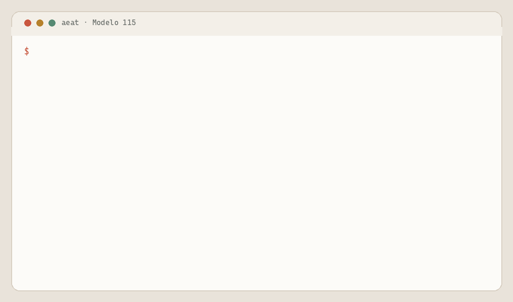

<p align="center">
  
</p>

# Cadrumo

**Cadrumo is a Claude plugin, command-line interface (CLI), and deterministic calculation engine for preparing Spanish tax filings.**

[](https://pypi.org/project/cadrumo/)
[](https://pypi.org/project/cadrumo/)
[](https://github.com/nevenincs/neve-marketplace)
[](LICENSE)


`Cadrumo` turns local financial records into calculated, checked, and exportable Spanish tax modelos (forms). The Claude plugin and CLI use the same calculation path.

Use Cadrumo if you're self-employed, run a small business, file under a supported regime, or prepare filings for others. Each profile keeps one taxpayer's work separate.

> [!IMPORTANT]
> Cadrumo never submits a filing. Review every result, then file through official Agencia Estatal de Administración Tributaria (AEAT) channels. This independent project isn't affiliated with or endorsed by AEAT. It doesn't provide tax, legal, accounting, or financial advice.

Alpha releases may introduce breaking changes before 1.0.

## See the CLI flow



This recording uses fictional data and the production calculation path. It writes a verified Modelo 115 export file locally without contacting or submitting to AEAT.

<details>
<summary>Read the terminal transcript</summary>

```text
aeat app quickfile --modelo=115 --year=2026 --period=1T --casilla=04=0 --output=var/readme-demo/m115.boe
operation  quickfile
modelo  115
filing_year  2026
period  1T
registry_revision_id  2019-y-siguientes
stage  readiness  warning  profile is not yet source-ready; caller-supplied inputs may still satisfy calculate
stage  create  ok  created
stage  calculate  ok
stage  verify  ok
stage  export  ok
completed  true
output_path  var/readme-demo/m115.boe
file_sha256  45cd24be65bd39783b5e9e87a30b64441192d7360a49e601aea9d98ed6ed1fef
```

</details>

## One engine, three ways to work

| Use | Best for | Role |
| --- | --- | --- |
| **Claude plugin** | Guided preparation in Claude Code, Claude Desktop, or Cowork | Loads the operating rules, skills, personas, and local Model Context Protocol (MCP) console. The assistant guides and explains; it doesn't calculate tax values. |
| **CLI** | Direct terminal work and automation | Exposes human-readable commands and versioned JavaScript Object Notation (JSON) results through `aeat`. It also provides the `cadrumo-mcp` console for other MCP clients. |
| **Calculation engine** | Registry-backed figures beneath both interfaces | Selects the filing-year rules, resolves declared inputs, evaluates formulas, and returns form-field (`casilla`) values with legal and source references. |

Both interfaces use the same application services and calculation path.

## Prepare a filing from records

Use Cadrumo to:

- Create a taxpayer profile whose sensitive facts and app-managed records are encrypted at rest
- Classify business, personal, and mixed-use ledger entries with operator review
- Calculate supported modelos from profile facts, records, prior filings, relations, and explicit inputs
- Verify required values, provenance, internal consistency, and known blocking conditions
- Export supported fixed-width or structured filing files to a local path
- Reconcile local work with the justificante (filing receipt) or read-only AEAT evidence obtained after filing

Coverage varies by modelo. `aeat app modelo list` shows catalogue and local-work eligibility. `aeat app modelo describe 115` shows its registered fields and formulas.

At runtime, Cadrumo may refuse a calculation or export when the selected modelo lacks the required support.

## Start with Claude

In Claude Code, you need `uv` on `PATH`. Installing the plugin for the first time requires access to GitHub and PyPI.

1. Add the marketplace:

   ```console
   claude plugin marketplace add nevenincs/neve-marketplace
   ```

2. Install and enable Cadrumo:

   ```console
   claude plugin install cadrumo@neve
   claude plugin enable cadrumo@neve
   ```

Start a fresh workspace and ask:

> Set up my taxpayer profile.

The public [neve marketplace](https://github.com/nevenincs/neve-marketplace) carries the plugin. Continue with the [workflow overview](docs/how-to/onboarding.md) or the [full quickstart](docs/how-to/quickstart.md).

In Claude Desktop or Cowork, use the plugin browser and follow the [marketplace installation instructions](https://github.com/nevenincs/neve-marketplace).

## Start with the CLI

`cadrumo` requires Python 3.13 or later. `uv` installs the tool in an isolated environment and can obtain a compatible Python interpreter.

```console
uv tool install cadrumo
aeat --language en --help
```

Omit `--language en` to use the default Spanish interface. Follow the [quickstart](docs/how-to/quickstart.md) to create a profile, add records, calculate, verify, and export.

For scripts, inspect the live capability and schema contract:

```console
aeat --language en --format json app contract
```

Every successful JSON command returns a versioned envelope with a command key, status, typed result, and notices. Expose the same command set through a local MCP server:

```console
uvx --from "cadrumo[agent]" cadrumo-mcp
```

Before integrating with Python, read the [architecture overview](docs/architecture/index.md) and [application programming interface (API) entry point](docs/api/cadrumo.rst). Import `cadrumo`; the package provides documented module entry points, but no stable top-level software development kit (SDK) before 1.0.

## Follow one calculation path

```text
records → encrypted local storage → resolved inputs → selected filing rules
        → calculated form fields with sources → checks → local export
```

The assistant guides this path and relays its results. Application logic gathers profile, ledger, invoice, relation, and prior-filing inputs. The deterministic engine owns formulas and legal grounding.

Each calculated field keeps its value, the inputs used when a formula produced it, and legal and official-source references. The verification step records both blockers and warnings.

See [how records become figures](docs/explanation/from-records-to-figures.md) for the full explanation.

## Know the data boundary

- App-managed financial records and evidence are encrypted at rest in the active profile's local storage.
- Original imported files remain where you placed them. A local export is cleartext at the path you choose.
- Authenticated AEAT retrieval commands run only when you invoke them. They can download information but cannot write or submit anything to AEAT.
- If you choose an assistant or cloud classifier, that service's provider receives the words, figures, and transaction fields you send.
- A cloud classifier receives text from supporting evidence only when the profile permits cloud upload and you confirm that invocation. Image evidence is processed locally with Ollama.

Review the [filing boundary](docs/explanation/recording-a-filing-and-the-boundary.md), [data-to-figure explanation](docs/explanation/from-records-to-figures.md), and [full disclaimer](docs/disclaimer.md) before relying on the tool.

## Find the right documentation

| Goal | Read |
| --- | --- |
| Complete one example | [Quickstart](docs/how-to/quickstart.md) |
| Find a task recipe | [How-to guides](docs/how-to/index.md) |
| Understand calculations | [From records to figures](docs/explanation/from-records-to-figures.md) |
| Understand the codebase | [Architecture](docs/architecture/index.md) |
| Inspect Python modules | [API reference entry point](docs/api/cadrumo.rst) |
| Diagnose a problem | [Troubleshooting](docs/how-to/troubleshooting.md) |
| Review shipped changes | [Changelog](CHANGELOG.md) |

The generated CLI reference and glossary are part of the Sphinx documentation build. Until the public documentation site is deployed, use `aeat --help`, `aeat app contract`, and the tracked guides.

## Get help or contribute

This source repository is currently private. Authorized collaborators can open an [issue](https://github.com/cadrumo/cadrumo/issues) and follow [`SECURITY.md`](SECURITY.md). A public support channel and guaranteed confidential contact aren't available yet. Never publish vulnerability details in an issue.

Start development with the [workstation setup guide](docs/workstation-setup.md). The main local gates are:

```console
just check-all
uv run pytest
just docs-check
```

Tests must exercise real behavior. The project doesn't accept fakes, mocks, monkeypatching, skipped tests, or tautological calculation assertions as shortcuts.

## License and disclaimer

`Cadrumo` is available under the [Apache License 2.0](LICENSE). It is provided as-is, without warranties or guarantees. Read the [full disclaimer](docs/disclaimer.md) for the responsibility, affiliation, advice, and liability boundaries.
