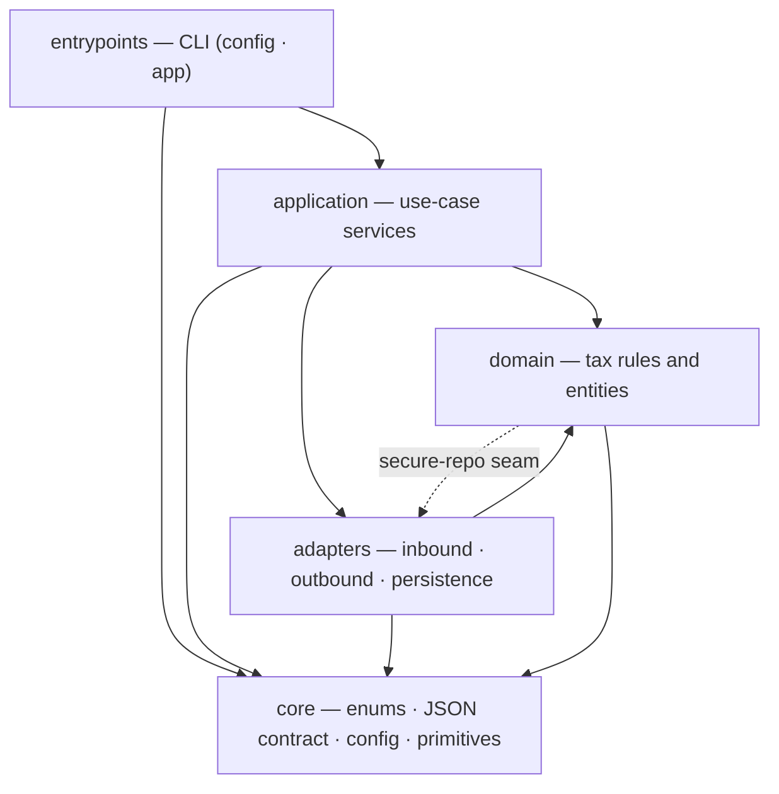
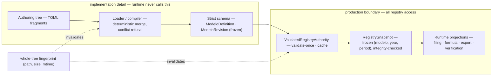
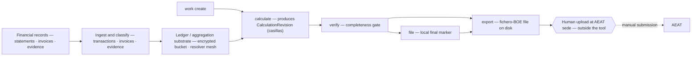
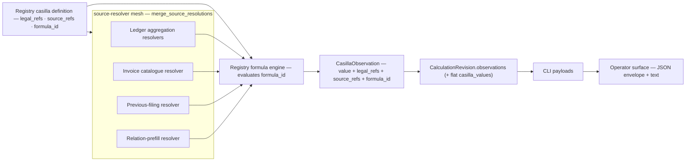
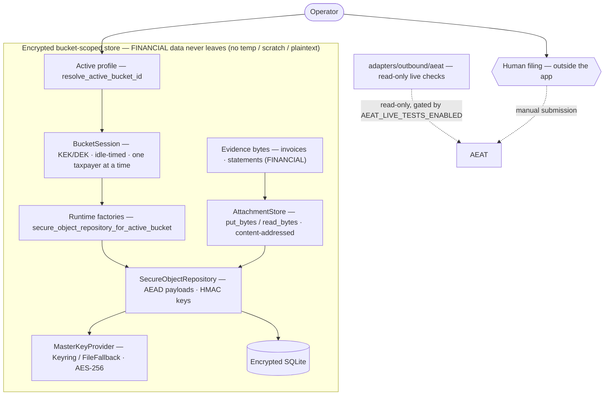

# Architecture overview

`aeat` is a local-first command-line application that prepares Spanish tax
filings. It models the tax authority's regulatory registry, ingests and
classifies your financial records, and computes the numbered boxes of each tax
form. Then it checks the draft and exports a file you submit yourself. AEAT is the Agencia
Estatal de Administración Tributaria, Spain's tax agency.

This page is the entry point for a developer reading the codebase for the first
time. It's a map, not a directory: it names the layers, the load-bearing
concepts, and the canonical types you'll navigate to, and it stops there. For
exact signatures and commands, follow the links in
[Crossing into the code](#crossing-into-the-code).

## Why the system is shaped this way

Preparing a Spanish tax return by hand is error-prone and hard to audit. A
figure on a form has to trace back to a bank movement, a regulation, and a
published rule. A later annual form has to stay consistent with the quarterly
ones that fed it. Three design choices answer that problem, and they shape
everything else:

- **Local-first.** Your financial records never leave your machine. The tool
  runs offline and stores everything in an encrypted database on disk.
- **The registry is the authority.** Tax rules - rates, brackets, deadlines, and
  the legal basis of each box - aren't hard-coded. They're authored as data,
  compiled, validated, and read through a single authority. A figure can always
  trace back to the rule that produced it.
- **The human files, not the tool.** The pipeline ends at an export file.
  Submitting it to the agency is a deliberate human step. The tool has no
  submission path at all, so live filing is absent rather than guarded.

The structure that follows is hexagonal: business rules sit at the center, and
the parsers, browsers, and storage that touch the outside world sit at the edge.
Dependencies point inward. That keeps tax logic testable on its own and lets an
adapter change without touching a rule.

## How to read this page

Four views cover the system at the highest level. Each pairs a diagram with a
short explanation:

- [The layers](#the-layers) - the five hexagonal layers and what each owns.
- [The registry authority pipeline](#the-registry-authority-pipeline) - how
  tax-rule data becomes the snapshots runtime code reads.
- [The modelo lifecycle](#the-modelo-lifecycle) - the journey from records to an
  export file, and how each figure is grounded.
- [Persistence and the safety boundary](#persistence-and-the-safety-boundary) -
  where state lives, and why nothing leaves.

## The layers

`aeat` separates responsibilities into five layers under `src/aeat/`. Each layer
depends only on the layers inside it.

- **`core`** is the innermost layer. It owns the cross-cutting primitives every
  other layer shares: the typed enums for closed value sets (period codes, tax
  domains, modelo identifiers, and binding source kinds), the JSON envelope
  contract, configuration, the money and time types, and the error taxonomy.
- **`domain`** holds pure tax rules and records: the modelo registry, casilla
  definitions (a casilla is one numbered box on a form), filing observations,
  and the calculations over them. It depends only on `core`.
- **`application`** orchestrates use cases. It joins domain rules with adapters
  to build filing drafts, aggregate the ledger, run diagnostics, and project
  state. It performs no input or output of its own.
- **`adapters`** connects the application to the outside world in three parts.
  `inbound` parses incoming files (PDF, CSV, Open Financial Exchange (OFX), and
  XLSX statements). `outbound` reaches external services (AEAT browser sessions,
  calculation oracles, and authentication providers). `persistence` stores
  records in the local encrypted database.
- **`entrypoints`** exposes the application to operators. The command line lives
  here, and its root surface is limited to two command families, `config` and
  `app`.

Two boundary rules keep the layers honest. Boundary data crosses as validated
pydantic v2 models, never loose dictionaries. Closed value sets are declared as
typed enums in `core` and flow as enum members, so an invalid value is rejected
at the boundary.

The dependency arrows point inward with one annotated exception. Three domain
repositories - filing, justificante, and submission - sit directly on the
encrypted-storage base class in `adapters.persistence`. The diagram draws that
seam as a dashed edge rather than hiding it.

Inside `domain` and `application`, the subpackages cluster into five conceptual
groups. Some subpackages are omitted for clarity; the API reference lists them
all.

| Cluster | `domain` subpackages | `application` subpackages |
| --- | --- | --- |
| Registry and calculations | `calculations`, `modelos`, `normatives`, `manuals` | `calculations`, `modelo`, `registry`, `aggregation`, `verification` |
| Ledger and transactions | `transactions`, `invoices`, `categories`, `iva`, `currency`, `attachments` | `ledger`, `transactions`, `invoices`, `evidence`, `inventory` |
| Filing and export | `filing`, `justificante`, `submission` | `filing`, `export`, `review` |
| Live, portals, and auth | `portals`, `auth`, `fincas` | `live`, `portals`, `auth`, `workflow` |
| Profile and storage | `buckets`, `user_profile`, `contribuyente`, `deadlines` | `profile`, `storage`, `bucket_maintenance`, `setup`, `wizard` |

## The registry authority pipeline

The authoritative tax-model definitions aren't hard-coded. They move through a
deterministic pipeline, from hand-authored source to the immutable snapshots
runtime code reads. TOML is Tom's Obvious Minimal Language, a layout meant for
editing.

Each modelo and revision is authored as fragments of TOML under
`src/aeat/_data/registry/`. The loader and compiler (`_loader.py`) merge those
fragments in a deterministic order, reject ambiguous conflicts, and compile them
into strict, frozen `ModeloDefinition` and `ModeloRevision` objects. The loader
keys its cache on a fingerprint of the whole tree - every file's path, size, and
modification time. Any edit invalidates the cache, so the loader never serves
stale data.

`ValidatedRegistryAuthority` is the production boundary. It validates a modelo
once, caches the result, and builds a `RegistrySnapshot` for a given modelo,
year, and period. The snapshot is frozen and context-bound: its legal and source
references are indexed, and its referential integrity is checked at build time.
Runtime consumers - filing schema providers, formula execution, export parsing,
and verification - read from snapshots, never from the raw loader.

The split matters. Everything left of the authority is an implementation detail.
Production code requests validated modelos, deadline windows, and snapshots
through the authority, so the loader stays behind that line.

## The modelo lifecycle

A modelo is a numbered AEAT tax form. Its data flows one way, from your records
to a file you upload yourself.

The tool ingests and classifies financial records - bank statements, invoices,
and their evidence - into the encrypted ledger. From there the journey follows a
fixed sequence of command-line verbs:

- `aeat app modelo work create` pins a filing to a modelo, year, and period.
- `calculate` resolves every casilla and saves a `CalculationRevision`.
- `verify` runs a completeness and consistency gate over the draft.
- `file` marks a verified revision as internally filed.
- `aeat app modelo export` writes the official upload file (a fixed-layout
  fichero-BOE artifact) to disk.

The boundary is structural. `file` is a local marker, not a submission, and
`export` writes a file to your disk. No command transmits anything to the
agency: the upload is a human action at the AEAT portal, modeled as a step
beyond the tool's boundary. Read-only live checks against the agency are gated
behind an explicit opt-in (`AEAT_LIVE_TESTS_ENABLED`) and never write.

### How a figure is grounded

A casilla value isn't a bare number. It carries its provenance - the legal
references, source references, and formula identifier that produced it - from
the registry definition through to the operator-facing output.

Each binding on a casilla declares a typed source. A mesh of resolvers - ledger
aggregation, invoice catalogue, previous-filing carry, and cross-modelo relation
prefill - turns those sources into binding values, merged through
`merge_source_resolutions`. The registry formula engine evaluates the casilla's
formula over the resolved inputs and stamps the result as a `CasillaObservation`
carrying its `legal_refs`, `source_refs`, and `formula_id`. That observation
rides inside the persisted `CalculationRevision`, then into the CLI payloads,
then to the operator. The provenance never drops on the way out.

## Persistence and the safety boundary

All sensitive financial data lives in one place: an encrypted, per-profile
store. The structure, not a convention, keeps it there.

You work one taxpayer at a time. Selecting a profile opens a bucket session,
which scopes a `SecureObjectRepository` to that taxpayer's encrypted store. The
repository encrypts every payload at the column boundary with a key from the
`MasterKeyProvider` - the operating system keychain, or a passphrase-derived
fallback. It persists the ciphertext to a local encrypted SQLite database.
Evidence bytes - invoices, statements, and decrypted documents - go through the
content-addressed `AttachmentStore`, which stores the bytes themselves, never a
link.

Nothing in this store crosses outward to the agency as a write. The read-only
live checks reach the agency only to read, gated by the same opt-in. The single
path that reaches the agency as a write is the human upload, which sits beyond
the tool's boundary. A structural test enforces the absence of any write verb in
the AEAT sede adapter, so the safety posture can't erode by accident.

## How the documentation stays true to the code

The discipline that governs the layers governs the documentation too: nothing a
reader relies on is maintained by hand where the code can supply it. `aeat` keeps
three English documentation surfaces, and each is generated or verified from the
codebase.

The repository markdown - this guide and the others under `docs/` - is
hand-written for people orienting to the project. Every technical claim in it is
checked against the code before it lands. In-source docstrings are the single
source for the API reference, so a signature is never copied into prose. The
generated reference, both the source-code interface and the command-line tree, is
scaffolded from the code itself.

Because these surfaces are generated, they can't silently drift. A strict build,
with warnings treated as errors, fails on a broken cross-reference, a missing
stub, or a command reference that no longer matches the commands.

## Crossing into the code

Use this overview to orient, then drop into the detail:

- **The layer tree** - browse `src/aeat/core`, `src/aeat/domain`,
  `src/aeat/application`, `src/aeat/adapters`, and `src/aeat/entrypoints` to see
  the subpackages each cluster names.
- **The command-line reference** - {doc}`/cli/index` for exact verbs, options,
  and output.
- **The API reference** - {doc}`/api/aeat` for module signatures and the full
  subpackage list.
- **The registry authoring guide** - {doc}`/authoring-guide` for how to author
  the TOML that the pipeline compiles.
- **The pipeline explanation** - {doc}`/explanation/index` for the same journey
  told for the taxpayer.
- **The glossary** - {doc}`/_generated/glossary` for any term (casilla, modelo,
  fichero-BOE, or justificante) you want defined.
- **Getting it running** - {doc}`/how-to/quickstart` to install and prepare a
  first filing.
- **Contributing** - the project source and issue tracker live on
  [GitHub](https://github.com/wgergely/aeat).
