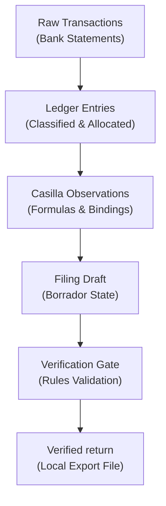

# Understanding the AEAT pipeline

This page explains the conceptual design of the `aeat` application and the mental model behind its operation. Read it to understand how the system manages tax data and why it is structured this way. For a short guided path, see the [Quickstart](../how-to/quickstart.md) or the [Tutorial](../tutorials/index.md). For task-focused recipes, refer to the [how-to guides](../how-to/index.md).

`aeat` is a local-first helper for self-employed individuals (*autónomos*) who file their own taxes in Spain. It runs entirely on your local machine to help you prepare your declarations before you submit them to Spain's tax agency, the *Agencia Estatal de Administración Tributaria* (AEAT). The application does not connect to the AEAT to file on your behalf; live submission is permanently excluded from the system by design. You prepare and verify your files locally, and then you upload the completed file yourself.

---

## Conceptual Vocabulary

Spanish tax administration uses specific terms that define how data is structured and filed. The application reflects these terms directly:

- **Modelo**: An official Spanish tax form or declaration sheet, identified by a specific number. For example, *Modelo 130* is the quarterly income tax installment, and *Modelo 303* is the quarterly VAT declaration.
- **Casilla**: An individual numbered box or field on the official tax form (for example, box `01` or box `02`). Each box represents a specific type of income, expense, base, or tax rate.
- **Autónomo**: A self-employed worker, sole proprietor, or freelancer registered in Spain who is subject to quarterly and annual tax declarations.
- **AEAT**: The *Agencia Estatal de Administración Tributaria* (often called *Hacienda*), the public agency responsible for tax collection in Spain.
- **BOE / Fichero-BOE**: The *Boletín Oficial del Estado* (Official State Gazette) publishes the official technical layouts for electronic tax filings. A *fichero-BOE* is a formatted text file that conforms strictly to these official layout rules, which is the only format the AEAT portal accepts for direct file uploads.

---

## The Two-Surface Mental Model: Config and App

The application divides operations into two distinct surfaces to keep your workspace clear and separate your setup from your day-to-day tax work. There is no third surface.

### Configuration Surface (`config`)

The configuration surface covers one-time or infrequent setup tasks. It answers the question: *Is this machine and environment ready?*
It manages:
- **Taxpayer Profiles**: Creating and switching between saved identities, which
  hold the taxpayer's NIF, CIF, DNI, or NIE, plus their name and tax region.
- **Authentication**: Managing the digital certificates used to download tax facts.
- **Data Buckets**: Configuring the secure local directories where your data is stored.
- **Diagnostics and Repair**: Checking setup integrity and restoring storage when needed.

### Application Surface (`app`)

The application surface is your daily workspace. It answers the question: *What is my tax situation?*
It is organized into six functional areas:
- **Overview**: Summarizing the active workspace status and the upcoming filing calendar.
- **Ledger**: Managing imported bank statements, manual transactions, and classifications.
- **Modelo**: Inspecting the catalogue of supported tax forms and managing individual work units.
- **Live**: Inspecting your registered tax facts on the AEAT portal in a strictly read-only way.
- **Registry**: Browsing local legal references, tax formulas, and official manuals.
- **Review**: Listing entries, status markers, or warnings that need your manual attention.

---

## The Data Pipeline: From Transactions to Export

Your financial records move through a one-way pipeline where data is gradually validated, combined, and structured into an official return format.



### Transactions Become Classified Ledger Entries

The ledger is the repository for your financial transactions. Importing raw bank records or entering transactions manually is the first step. By itself, a bank transaction is just an amount and a date; it has no tax meaning.

To make these records ready for tax calculations, they must be:
- **Classified**: Assigned to a specific tax category (such as business income or specific expense types).
- **Allocated**: Adjusted for business proportion when a transaction is partially personal (such as home internet or telephone bills).

The ledger includes readiness checks (such as preflights) that verify whether your records are complete and categorized for a given tax period. This ensures that the raw material is sound before calculation begins.

### Ledger Entries Become Casilla Values

Calculations are anchored to a **work unit**, which represents a specific tax return identified by its form type (*modelo*), filing year, period, and rules revision.

The calculation process is governed by the **registry**, which is the compiled database of official tax rules. The registry contains:
- **Casilla Definitions**: The properties and numbering of each form box.
- **Bindings**: Rules that specify how profile facts (like your tax region) and ledger aggregates (like total quarterly business expenses) map to specific boxes.
- **Formulas**: Mathematical relationships that compute totals, bases, and final tax results.

When you run a calculation, the engine pulls your classified ledger entries and profile settings through these bindings, applies the formulas, and produces a value for each box (*casilla*). The resulting return is saved in the draft (`borrador`) state, identified by a unique content hash. You can recalculate as often as needed; each calculation creates a new draft without modifying previous ones.

### A Draft Becomes a Verified Modelo

Before a draft can leave the system, it must pass a strict verification gate. The verification process checks the return against all completeness rules defined in the registry. It ensures that:
- Every required input is present.
- Calculations are mathematically consistent.
- No blocking conditions (such as missing profile facts or invalid taxpayer combinations) are violated.

If the draft is complete and passes all checks, it is promoted to the verified-complete (`VERIFICADO_COMPLETO`) state, and a detailed verification report is saved. If any check fails, the return remains a draft, the report lists the specific issues, and the validation utility exits with an error code to prevent any automated system from using an incomplete draft.

### A Verified Modelo Becomes a Local File

Once a return is verified, you can perform two final actions:
- **Internal Filing**: You can optionally mark the return as filed (`PRESENTADO`) in your local history. This is a local bookkeeping marker to record that you have completed this return. It does not contact the tax agency or submit the return.
- **Exporting**: The final step is exporting the return to a local *fichero-BOE* file. The export utility formats the verified or filed return into the official fixed-width text format required by the AEAT.

At this point, the application's role is complete. You take the exported file and upload it to the official AEAT electronic filing portal yourself.

---

## Why the Application Never Files for You

The local-first design of the application establishes a clear safety boundary: it helps you organize, calculate, and verify your taxes on your machine, but the final submission is entirely in your hands.

### Permanent safety gates

The application enforces this boundary through two separate access levels:

1. **Writes are permanently blocked**: There is no code path or configuration option that allows the application to submit returns, register files, or modify data on the AEAT portal. The write boundary is an absolute, code-enforced gate that cannot be bypassed.
2. **Reads require authentication**: The application can read tax facts from the AEAT portal, such as downloading your registered census data, for display and comparison. These operations require configured AEAT authentication and remain strictly read-only.

### Meaning of "Verify" and "File"

Because the system operates locally, these verbs have specific local meanings:
- **Verify**: Confirms that the return is internally consistent and complete according to the rules compiled in the registry. It does not test the return against the AEAT portal or guarantee that the tax agency will accept the file.
- **File**: A local status change that marks the return as final in your history, ensuring it cannot be accidentally modified or recalculated. It is a local archival label, not an external submission.

---

## Tracing Numbers Back to the Law

Tax compliance requires absolute auditability. You must be able to explain exactly where every number on your tax return comes from.

To achieve this, the calculation engine attaches a three-part provenance record to every box (*casilla*) value:
- **Legal References (`legal_refs`)**: The specific articles of the Spanish law (such as the *Ley del IRPF* or *Ley del IVA*) or ministerial orders that establish the tax rule.
- **Source References (`source_refs`)**: The sections in the official AEAT manuals or publications that explain the box's purpose.
- **Formula ID (`formula_id`)**: The identifier of the specific registry formula that calculated the value.

When you run a calculation, the application returns these details alongside the values. This provenance is preserved through every step of the pipeline. It is saved in the draft revision, written to the verification report, and included in the machine-readable output. This ensures that the legal and logical explanation for every figure stays bound to the data from the registry to the exported file.

```{toctree}
:hidden:

ledger-to-calculation
```

