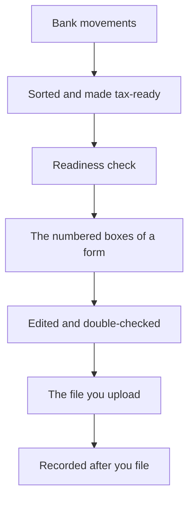

# Understanding the AEAT pipeline

This cluster explains how the tool moves your data from your bank records to a finished tax file, and why each step exists. It's written for the everyday self-employed taxpayer in Spain - the *autónomo* who prepares their own filings. AEAT is the *Agencia Estatal de Administración Tributaria*, Spain's tax agency.

Read this to understand how the pieces fit together. To actually perform a task, follow the [how-to guides](../how-to/index.md) or the step-by-step [Quickstart](../how-to/quickstart.md) and [Tutorial](../tutorials/index.md).

---

## The one promise

The tool runs entirely on your own computer. It prepares your filing for you, but it never sends anything to the agency. When the file is ready, you upload it yourself through the agency's portal. The depth on this boundary lives in [Recording a filing, after you upload it yourself](recording-a-filing-and-the-boundary.md).

---

## The plain words you'll meet

A few Spanish tax words appear throughout this cluster. Here's what each one means:

- **Modelo** - an official tax form, named by a number (for example, *Modelo 130* or *Modelo 303*).
- **Casilla** - a numbered box on the form. Each box holds one figure, such as an income total or a tax rate.
- **IVA** - value-added tax, the sales tax you charge and pay on goods and services.
- **IRPF** - personal income tax.
- **RENTA** - the annual income-tax return.
- **Justificante** - the receipt the agency gives you after you file, as proof of submission.
- **The official upload file** - the exact text-file layout the agency's portal accepts. The tool produces this file for you; you upload it.

For a fuller list, see the [glossary](../glossary.md).

---

## The journey at a glance

Your data moves one way through the tool. Bank movements come in, get sorted and made tax-ready, pass a readiness check, become the numbered boxes of a form, get edited and double-checked, turn into a file you can upload, and finally get recorded once you've filed it yourself.



Each stop on this journey is owned in depth by one member of this cluster. The five sections that follow introduce them in order.

---

## From your records to the figures on the form

Your bank movements start as plain amounts and dates with no tax meaning. Before the tool can fill in a form, each movement is sorted into a tax category and, where a cost is partly personal, adjusted to the business share. A readiness check then confirms the records are complete for the period. From there the tool fills in each numbered box of the form, following the rules the agency publishes, and saves the result as a draft. See [From your records to the figures on the form](from-records-to-figures.md).

---

## Editing and double-checking a calculation

A first draft is rarely the last word. You can adjust figures, re-run the calculation, and keep a saved version of each pass without losing the earlier ones. When you're ready, a completeness check looks over the whole form for missing inputs and inconsistent figures. See [Editing and double-checking a calculation](editing-and-verifying.md).

---

## When a form builds on earlier ones

Some forms depend on figures you already filed - an annual summary that draws on the quarters, for example. The tool carries those earlier numbers forward so a later form stays consistent with what came before, and it tells you when an earlier filing isn't ready yet. See [When a form builds on earlier ones](building-on-earlier-filings.md).

---

## Reviewing your numbers and producing the upload file

Before you commit to a form, you can review every figure and trace it back to the input that produced it. Once you're satisfied, the tool produces the official upload file - the exact layout the agency's portal accepts. See [Reviewing your numbers and producing the upload file](reviewing-and-exporting.md).

---

## Recording a filing, after you upload it yourself

The tool stops at the file. You upload it through the agency's portal, and the agency hands you a *justificante* - the receipt that proves you filed. Back in the tool, you record that the filing is done, so your own history stays accurate. See [Recording a filing, after you upload it yourself](recording-a-filing-and-the-boundary.md).

---

## What "verify" and "file" mean here

Two everyday words have narrow, local meanings in this tool:

- **Verify** is a completeness and consistency check that runs on your own computer. It confirms the form holds together and nothing required is missing. It does not test the form against the agency's portal, and it's not a promise the agency will accept it.
- **File** is a local "final" note in your own records. It marks a form as done so you don't change it by accident. It is not a submission - the tool never sends anything to the agency.

The depth on these two ideas lives in [Editing and double-checking a calculation](editing-and-verifying.md) and [Recording a filing, after you upload it yourself](recording-a-filing-and-the-boundary.md).

---

## How to use this cluster

Read straight through for the whole picture, or jump to the stage you're working on. Every member links to the how-to guide that performs its task and back to the [glossary](../glossary.md) for any word you're unsure of.

When something goes wrong, see [Troubleshooting](../how-to/troubleshooting.md). For a step-by-step walkthrough of a full filing, follow the [Quickstart](../how-to/quickstart.md) or the [Tutorial](../tutorials/index.md).

```{toctree}
:hidden:

from-records-to-figures
editing-and-verifying
building-on-earlier-filings
reviewing-and-exporting
recording-a-filing-and-the-boundary
```
