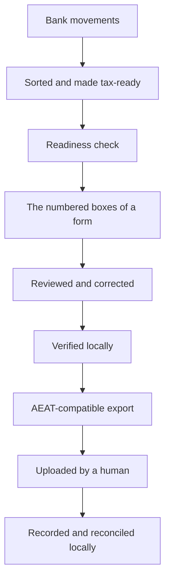

# How Cadrumo turns records into a filing-ready tax file

This collection explains how Cadrumo turns local records into a filing-ready
Spanish tax file and why each stage exists. Cadrumo is the product. AEAT is the
*Agencia Estatal de Administración Tributaria*, the external Spanish tax
authority. Authority names remain visible where they identify official forms,
rules, evidence, credentials, or portals; they never name the application.

Read this to understand how the pieces fit together. To install from source,
use [source setup](../workstation-setup.md). To perform a task, follow the
[how-to guides](../how-to/index.md), [Quickstart](../how-to/quickstart.md), or
[Tutorial](../tutorials/index.md). Use the [Cadrumo
reference](../reference/index.md) for exact names and lookup facts.

---

## The permanent boundary

Cadrumo calculates, verifies, exports, and records filing history locally. It
never submits a return, makes a payment, acknowledges a notification, or acts
as AEAT. Optional live AEAT retrieval is separately invoked, authenticated, and
read-only. When an export is ready, a human uploads it through an official AEAT
channel. [Recording a filing, and why Cadrumo never files for
you](recording-a-filing-and-the-boundary.md) covers this boundary in full.

---

## The journey at a glance

Your data moves one way through the tool. Bank movements come in, get sorted and made tax-ready, pass a readiness check, become the numbered boxes of a form, get edited and double-checked, turn into a file you can upload, and finally get recorded once you've filed it yourself.



The stages are related but not interchangeable. Calculation derives a saved
revision; review inspects its values and provenance; verification applies
completeness and consistency gates; export produces a local artifact; a human
uploads it; local recording and reconciliation preserve what happened. Exact
command definitions belong to the [generated CLI
reference](../cli/index.rst), not this explanation.

---

## From your records to the figures on the form

Your bank movements start as plain amounts and dates with no tax meaning. Before the tool can fill in a form, each movement is sorted into a tax category and, where a cost is partly personal, adjusted to the business share. A readiness check then confirms the records are complete for the period. From there the tool fills in each numbered box of the form, following the rules the agency publishes, and saves the result as a draft. See [How your records become tax figures](from-records-to-figures.md).

---

## Editing and double-checking a calculation

A first draft is rarely the last word. You can adjust figures, re-run the calculation, and keep a saved version of each pass without losing the earlier ones. When you're ready, a completeness check looks over the whole form for missing inputs and inconsistent figures. See [Editing and verifying a calculation](editing-and-verifying.md).

---

## When a form builds on earlier ones

Some forms depend on figures you already filed - an annual summary that draws on the quarters, for example. The tool carries those earlier numbers forward so a later form stays consistent with what came before, and it tells you when an earlier filing isn't ready yet. See [How filings build on earlier ones](building-on-earlier-filings.md).

---

## Reviewing your numbers and producing the upload file

After calculation, you review every figure and trace it back to its inputs.
Corrections create a new revision, which you verify before export. Export still
depends on its evidence gates and produces an AEAT-compatible file; it cannot
guarantee portal acceptance. See [Reviewing your numbers and producing the
upload file](reviewing-and-exporting.md).

---

## Recording a filing, after you upload it yourself

Cadrumo stops at the file. You upload it through an official AEAT channel, and
AEAT hands you a {term}`justificante`. Back in Cadrumo, you record and reconcile
the filing so local history stays accurate. See [Recording a filing, and why
Cadrumo never files for you](recording-a-filing-and-the-boundary.md).

---

## What the workflow stages mean

The workflow verbs have narrow meanings inside Cadrumo:

- **Calculate** creates a saved revision from the currently grounded inputs.
- **Review** inspects values, sources, and unresolved items without claiming
  official acceptance.
- **Verify** applies local completeness and consistency rules and saves the
  report.
- **Export** writes a local artifact from an eligible revision.
- **Record as filed** adds a local history marker after the human filing. It is
  not submission.
- **Reconcile** compares local filing identity with retained or read-only AEAT
  evidence; it does not recompute the return.

For exact command paths and options, use the [command and stage
lookup](../reference/commands-and-configuration.md).

---

## How to use this cluster

Read straight through for the whole picture, or jump to the stage you're working on. Every member links to the how-to guide that performs its task and back to the {doc}`glossary </_generated/glossary>` for any word you're unsure of.

When something goes wrong, see [Troubleshooting](../how-to/troubleshooting.md).
Use the {doc}`glossary </_generated/glossary>` for terms, the [generated CLI
reference](../cli/index.rst) for commands, the [generated Python
API](../api/cadrumo.rst) for public facades, and the [Cadrumo
reference](../reference/index.md) for identity and scope. Ordinary problems go
to the [public issue tracker](https://github.com/cadrumo/cadrumo/issues) with
redacted output. Vulnerabilities and credentials must follow the
[security policy](../../SECURITY.md), never a public issue.

```{toctree}
:hidden:

from-records-to-figures
editing-and-verifying
building-on-earlier-filings
reviewing-and-exporting
recording-a-filing-and-the-boundary
../reference/index
```
