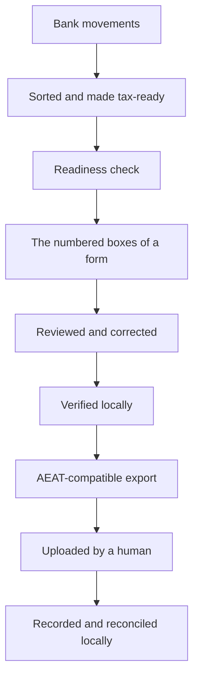

# How Cadrumo turns records into a filing-ready tax file

This collection explains how Cadrumo turns local records into a filing-ready
Spanish tax file and why each stage exists. Cadrumo is the product. AEAT is the
*Agencia Estatal de Administración Tributaria*, the external Spanish tax
authority. Authority names remain visible where they identify official forms,
rules, evidence, credentials, or portals; they never name the application.

Read this to understand how the pieces fit together. To install from source,
use [source setup](../workstation-setup.md). To perform a task, follow the
[how-to guides](../how-to/index.md), [Quickstart](../how-to/quickstart.md), or
[Tutorial](../tutorials/index.md). Use the [Cadrumo
reference](../reference/index.md) for exact names and lookup facts.

---

## The permanent boundary

Cadrumo calculates, verifies, exports, and records filing history locally. It
never submits a return, makes a payment, acknowledges a notification, or acts
as AEAT. Optional live AEAT retrieval is separately invoked, authenticated, and
read-only. When an export is ready, a human uploads it through an official AEAT
channel. [Recording a filing, and why Cadrumo never files for
you](recording-a-filing-and-the-boundary.md) covers this boundary in full.

---

## The journey at a glance

Records gain tax meaning before calculation. You review and verify each saved
revision before export. After human upload, local recording and reconciliation
preserve the filing history.



The stages are related but not interchangeable. Calculation derives a saved
revision. Review inspects values and provenance. Verification applies local
gates, and export produces an artifact. Human upload precedes local recording
and reconciliation. Live command-line interface (CLI) help defines commands;
the [CLI map](../cli/index.rst) organizes them.

---

## From your records to the figures on the form

Records need classifications, evidence, and applicable business shares before
calculation. Registry rules then derive the modelo values. See [How your records
become tax figures](from-records-to-figures.md).

---

## Editing and double-checking a calculation

Corrections create another saved calculation revision. Verification checks the
selected revision for completeness and consistency. See [Editing and verifying
a calculation](editing-and-verifying.md).

---

## When a form builds on earlier ones

Some forms depend on earlier filed periods. Cadrumo carries recorded figures
with their evidence and exposes missing dependencies. See [How filings build on
earlier ones](building-on-earlier-filings.md).

---

## Reviewing your numbers and producing the upload file

After calculation, you review every figure and trace it back to its inputs.
Corrections create a new revision, which you verify before export. Export still
depends on its evidence gates and produces an AEAT-compatible file; it cannot
guarantee portal acceptance. See [Reviewing your numbers and producing the
upload file](reviewing-and-exporting.md).

---

## Recording a filing, after you upload it yourself

Cadrumo stops at the file. You upload it through an official AEAT channel, and
AEAT hands you a {term}`justificante`. Back in Cadrumo, you record and reconcile
the filing so local history stays accurate. See [Recording a filing, and why
Cadrumo never files for you](recording-a-filing-and-the-boundary.md).

---

## What the workflow stages mean

The workflow verbs have narrow meanings inside Cadrumo:

- **Calculate** creates a saved revision from the currently grounded inputs.
- **Review** inspects values, sources, and unresolved items without claiming
  official acceptance.
- **Verify** applies local completeness and consistency rules and saves the
  report.
- **Export** writes a local artifact from an eligible revision.
- **Record as filed** adds a local history marker after the human filing. It is
  not submission.
- **Reconcile** compares local filing identity with retained or read-only AEAT
  evidence; it does not recompute the return.

For exact command paths and options, use the [command and stage
lookup](../reference/commands-and-configuration.md).

---

## Related documentation

Use the {doc}`glossary </_generated/glossary>` for terms and the [Cadrumo
reference](../reference/index.md) for identity and scope. The generated Python
application programming interface ([API](../api/cadrumo.rst)) lists public
facades. [Troubleshooting](../how-to/troubleshooting.md) covers failures.

Report ordinary problems through the [public issue
tracker](https://github.com/cadrumo/cadrumo/issues) with redacted output. Follow
the [security policy](../../SECURITY.md) for credentials or vulnerabilities.

```{toctree}
:hidden:

from-records-to-figures
editing-and-verifying
building-on-earlier-filings
reviewing-and-exporting
recording-a-filing-and-the-boundary
../reference/index
```
