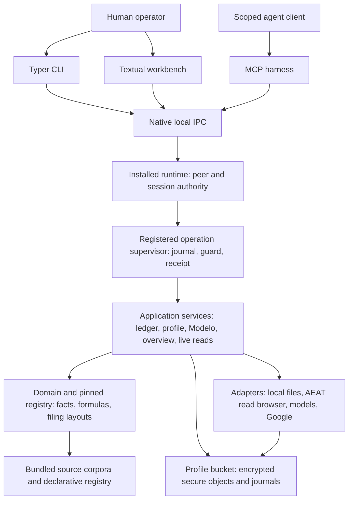

# Cadrumo technical documentation

Cadrumo prepares Spanish tax calculations and local filing files from financial records, taxpayer facts, and a versioned tax registry. This collection explains its internals for developers and technical evaluators: the runtime, interfaces, data flows, calculation rules, storage, and trust boundaries.

Start with the architecture on this page, choose a topic for a subsystem overview, or follow its detailed articles for the supporting analysis. Cross-cutting assessments connect findings across subsystems.

**Scope:** these reports describe an analyzed source snapshot, not a continuously verified account of the current branch. They preserve the original findings, qualifications, and review limits. See the [snapshot and reading guide](reading-guide.md).

[Architecture](#architecture) · [Topics](#topics) · [Cross-cutting assessments](#cross-cutting-assessments) · [All detailed articles](articles/catalogue.md)

::::{dropdown} Terms used in this overview

| Term | Meaning |
| --- | --- |
| AEAT | Agencia Estatal de Administración Tributaria, Spain's tax agency |
| Modelo / casilla | A Spanish tax form / a field in that form |
| IVA | Impuesto sobre el Valor Añadido, value-added tax |
| CLI / TUI | Command-line interface / terminal user interface |
| MCP | Model Context Protocol |
| IPC | Interprocess communication |
| LLM | Large language model |

::::

## Architecture

<!-- preserved:architecture -->
Cadrumo is organized around a local profile and a pinned tax-authority generation. Its CLI, terminal workbench and MCP harness present workflows; a native installed runtime admits identity and hosts registered operations; application services assemble sources and lifecycle decisions; domain and registry code calculate or validate typed tax facts; adapters handle encrypted local storage, browsers, files, models and Google. The architecture is deliberately asymmetric: local calculation/export and authenticated AEAT observation are present, while an outbound AEAT submission path is refused. A source module's declared contract is not automatically an end-to-end guarantee; the important question at each boundary is who supplies the authority, bytes and revision that the next layer trusts. [CLI composition](topics/operator-interfaces-part-1.md), [runtime](topics/runtime-tui-and-agent-harness.md), no-submit gate (`src/cadrumo/core/access_gate/gate.py`), [analyses](articles/154-entrypoint-adapter-composition.md), [118](articles/118-live-access-policy-corpus-integrity-and-decimal-contracts.md).



### Entry and authority route

The Typer graph is authored as command specifications: canonical identity, arguments, secret fields, effect policy, output schema and deferred handler. Help/schema discovery can inspect those declarations without opening a profile or browser. At dispatch, the composition root resolves exact-profile repositories, pinned authority, registered definitions and adapter lifetimes; command policy can refuse a live write before materializing a handler. The CLI-to-worker bridge validates a typed request, observes operation settlement under a deadline, checks result identity/schema/effect and correlates reviews. A timeout remains `UNKNOWN` rather than becoming a safe-to-retry error. Command metadata is reconciled against live leaves, but it cannot prove what a worker actually does. Command graph (`src/cadrumo/entrypoints/cli/command_graph.py`), composition (`src/cadrumo/entrypoints/operation_composition.py`), registered bridge (`src/cadrumo/entrypoints/cli/runtime_registered_operation.py`), surface reconciliation (`src/cadrumo/application/operator_surface/manifest.py`), [full topics](topics/operator-interfaces-part-1.md), [part 2](topics/operator-interfaces-part-2.md), [analysis](articles/170-cli-error-handling-ledger-actions-and-modelo-work.md).

The Textual app reads authenticated runtime projections for Home, Declarations, Ledger, AEAT Sync, profiles and Modelo work. It stages typed edits and reviews, leaving final validation and mutation with registered services. Its general operation modal renders public paged events and supports digest/revision-bound `REVIEW`; `INPUT` and `CHOICE` are explicitly unsupported there. The agent harness offers a typed 15-tool MCP catalogue and exact-profile runtime adapter; its persona and skill prose directs a human-facing workflow but cannot grant a permission. This keeps interface convenience separate from the owner of profile access, financial arithmetic and durable effects. TUI projection (`src/cadrumo/entrypoints/tui/runtime_workbench.py`), modal (`src/cadrumo/entrypoints/tui/operations/modal.py`), MCP (`src/cadrumo_harness/mcp/protocol_contract.py`), [full topic](topics/runtime-tui-and-agent-harness.md), [analysis](articles/182-supervised-operation-modal-and-profile-manager.md).

The installed runtime starts an isolated interpreter, verifies its package cohort and storage endpoint, then hosts profile workers behind native IPC. Transport-proven peer/login evidence, rather than client-supplied profile, session or worker IDs, anchors admission. A connection binds boot, frontend, native client, exact profile and lease; the worker checks current custody and published policy before private submission, effect, response and disclosure. Human password/receipt access is distinct from API-key grants, and delegation intersects parent/grant/recipient scopes with bounded time. A response-scope decision is not the one-shot interaction bearer or commit permit. Large documents and secrets use separate bounded channels; staged uploads become canonical requests only after length, digest and UTF-8 checks. OS transport and process containment are implemented in platform adapters, but this static map did not execute them. Bootstrap (`src/cadrumo/entrypoints/runtime/bootstrap.py`), authority (`src/cadrumo/entrypoints/runtime/operation_authority.py`), lease policy (`src/cadrumo/application/user_profile/session_authority_policy.py`), payload staging (`src/cadrumo/application/runtime/submission_payload.py`), [full topics](topics/runtime-tui-and-agent-harness.md), [12](topics/operations-profiles-and-workflows.md), [analysis](articles/096-unified-review-queue-and-local-runtime-contracts.md).

The operation supervisor is a durable execution protocol, not a queue that assumes success when a callback returns. Submission writes `CREATED` and stores sensitive operands by secure reference; start writes `RUNNING` before the executor. Definitions declare durability, replay, secrets, storage, conflicts, effect and deadline semantics. The executor enters an irreversible section under a commit guard, while cancellation is deferred and cleanup remains owned through settling. A terminal receipt records subject, effect, refusal and result identity. Lease takeover and checkpoint reconciliation leave ambiguous prior effects `UNKNOWN`; an observation cursor and process-local bearer bind later review to the same operation, interaction and revision. Shutdown can stop admission and drain, but a host must also contain worker and callback owners. Submission (`src/cadrumo/application/operations/_supervisor_submission.py`), execution (`src/cadrumo/application/operations/_supervisor_execution.py`), settlement (`src/cadrumo/application/operations/_supervisor_settlement.py`), [full topic](topics/operations-profiles-and-workflows.md), [analysis](articles/089-durable-operation-execution-access-and-public-projections.md).

### Tax work and data flow

Application services are organized by lifecycle rather than one monolithic tax engine. Profile setup validates a complete fact record; ledger and invoice services turn imported or reviewed evidence into canonical financial sources; aggregation composes typed scalar, row and relationship values; Modelo work selects a law-applicable registry revision, calculates a BORRADOR, verifies a separate report, exports a local file and may record a pending local filing. The domain registry supplies dated facts, bindings, formulas, applicable periods, source/legal references and export layouts. It is pinned for an operation so an in-flight calculation does not silently mix authority generations. Incomplete source values remain unresolved; model suggestions do not calculate regulated amounts. Profile fact writer (`src/cadrumo/application/user_profile/fact_write.py`), [ledger path](topics/ledger-invoices-and-registers.md), source mesh (`src/cadrumo/application/aggregation/source_mesh.py`), calculation (`src/cadrumo/application/modelo/calculation_actions.py`), [full topics](topics/modelo-work-and-revision-lifecycle-part-1.md), [14](topics/tax-calculation-domain.md), [analyses](articles/067-modelo-calculation-preparation-edits-and-evidence-gates.md), [137](articles/137-revision-selection-withholding-aggregation-and-row-provenance.md).

The filing boundary branches. Local export maps a verified snapshot to a fixed-width or XML record design, checks parity, writes and re-reads bytes. Local `work file` co-records a `PRESENTADO` revision with AEAT status pending. Separately, authenticated browser adapters read AEAT census, filed registers, receipts, wallet and notifications into profile-bound custody. A captured row or PDF is an observation; receipt promotion requires digest, CSV, model/period, taxpayer and current-filing-chain checks. Reconciliation may confirm, flag a discrepancy or retain uncertainty; an amendment starts a new pending local correction. The workflow engine itself creates/validates local drafts with `submission_id=None`, and the core live-write gate refuses outbound submission. Export (`src/cadrumo/application/filing/export.py`), local filing (`src/cadrumo/application/modelo/revision_persistence.py`), receipt (`src/cadrumo/application/live/filed_observation_persistence.py`), workflow (`src/cadrumo/application/workflow/engine.py`), [full topics](topics/filing-and-live-state.md), [11](topics/modelo-work-and-revision-lifecycle-part-1.md), [analyses](articles/045-filing-draft-approval-and-local-export-pipeline.md), [064](articles/064-filed-declaration-capture-evidence-enrollment-and-history-sweep.md).

Read models form another branch. Calendar and coverage combine registry deadlines, positive taxpayer applicability, local work and already-loaded observations without fetching AEAT. Home, review queue, pipeline and search project availability, attention and next actions from captured state. Registered read operations bind exact profile and period/whole-profile scope and release only successful no-effect receipts. Search is intentionally an in-memory snapshot over admitted workbench projections, with process-keyed result IDs and destination access rechecked on opening. This design prevents a read UI from silently becoming a remote acquisition service or using absence as proof that no obligation exists. Calendar (`src/cadrumo/application/overview/calendar.py`), coverage (`src/cadrumo/application/overview/coverage.py`), read result (`src/cadrumo/application/overview/read_result.py`), search (`src/cadrumo/application/search/installed_workbench.py`), [full topic](topics/operations-profiles-and-workflows.md), [analysis](articles/093-overview-calendar-filing-evidence-and-readiness-views.md).

### Storage and cross-cutting controls

Private state is primarily profile-bucket encrypted secure objects in SQLite. A live `BucketSession` holds a DEK and bucket-routed engine. Object names are HMAC-addressed; AES-GCM binds ciphertext to namespace, identity and schema. The secure-object funnel checks namespace/classification, expected revisions and read assertions before batched SQL commits, allowing related record and event writes to share one transaction where the repository supports it. Separate filesystem custody holds key capsules, attachments, archives and operation journals. Password/recovery wrappers prove a DEK through a profile-bound sentinel; human acceleration splits a random key into the OS keychain and encrypted receipt. Native automation credentials, durable denial and enrollment possession acknowledgement remain separate from ordinary profile record values. A plaintext transaction-date routing index contains metadata and falls back to encrypted scan when incomplete. [Storage](topics/persistence-and-secure-storage.md), bucket session (`src/cadrumo/adapters/persistence/storage/master_key/bucket_session.py`), secure writes (`src/cadrumo/adapters/persistence/storage/sql/_secure_object_writes.py`), capsule (`src/cadrumo/adapters/persistence/storage/custody/capsule.py`), [analysis](articles/019-profile-persistence-for-transactions-review-exchange-and-workflows.md).

There are several distinct durability domains. SQL transactions support secure-object co-commit, while an operation journal and lease govern supervisor replay. Hardened atomic files are used for pointers and capsule/publication metadata; portable export has its own prepared/completed journal and target lock; some multi-store attachment/evidence sequences remain separately recoverable or uncertain. SQLite uses WAL with `synchronous=NORMAL`, so the latest transaction can be lost on power failure even if database integrity survives. A committed application result should therefore be assessed against its actual storage and receipt boundary, not inferred from a high-level method name. Operation journal (`src/cadrumo/adapters/persistence/operations/_journal_validation.py`), atomic writer (`src/cadrumo/core/atomic_write.py`), export journal (`src/cadrumo/application/user_profile/bundle_export.py`), engine (`src/cadrumo/adapters/persistence/storage/sql/engine.py`), [full topics](topics/persistence-and-secure-storage.md), [12](topics/operations-profiles-and-workflows.md), [analysis](articles/025-encrypted-sql-repository-revision-writes-and-workflow-storage.md).

Core contracts keep authorization and explanation legible: syntax-only IDs are not registry membership; provenance and grounding distinguish source bytes, model transcription, operator assertion and independent check; strict JSON/error envelopes and output redaction constrain public results. Default-off off-host evidence/telemetry settings require caller-enforced consent gates. The bundles and translations are versioned inputs, not legal certification. Scoped integration checks remain: caller-held locks and bucket ID grammar around storage paths, native peer/process containment, operation cleanup on callback failure, exact receipt projection, and multi-store crash recovery. This map is based on static source review, not executed application tests, a live AEAT probe or an independent assessment of current tax law. [Core contracts](topics/core-authority-and-shared-controls.md), classification (`src/cadrumo/core/classification/policies.py`), redaction (`src/cadrumo/core/redaction/rules.py`), [knowledge](topics/bundled-knowledge-and-localization.md), [analysis](articles/122-redaction-bundled-resources-telemetry-and-time-contracts.md).

External integrations preserve the same separation of policy and transport. AEAT browser adapters authenticate a session, preflight remote host/path/action classes and capture read observations; the application then validates taxpayer coordinates and persists them under the profile. Google Sheets is a distinct authorized remote writer for calculation workbooks, while offline XLSX and local filing files are filesystem outputs. An LLM adapter can use a local or consented hosted model to propose extracted invoice fields or classifications; the canonical application path binds consent to stored source bytes, and later grounding/human review precede canonical invoice or ledger mutation. These integrations share neither authority nor evidentiary grade: a Drive write does not file a return, a model proposal does not calculate tax, and a remote AEAT page is not a verified receipt. AEAT adapter (`src/cadrumo/adapters/outbound/aeat/sede/declarations_capture.py`), Sheets (`src/cadrumo/adapters/outbound/google/calc_sheets_apply.py`), LLM consent (`src/cadrumo/application/ledger/invoice_evidence_extract_operation.py`), [full topic](topics/external-integrations-and-local-runtime.md), [analysis](articles/014-llm-dispatch-consent-and-invoice-reading-pipeline.md).
<!-- /preserved:architecture -->

## Topics

These previews describe each topic's scope. Open a topic for its full report, the complete corresponding synthesis brief, and supporting articles. A topic draws on several detailed articles; the overview and detailed collections do not correspond one-to-one.

::::{grid} 1 1 2 2
:gutter: 3

:::{grid-item-card} Operator interfaces, part 1: command graph and principal workflows
:link: topics/operator-interfaces-part-1
:link-type: doc

Command declarations, dispatch, and principal operator workflows.

15 detailed articles.
:::

:::{grid-item-card} Operator interfaces, part 2: secure transport and operation bridges
:link: topics/operator-interfaces-part-2
:link-type: doc

Typed requests, session identity, result validation, and review replies across the CLI-to-worker bridge.

5 detailed articles.
:::

:::{grid-item-card} Installed runtime, terminal workbench, and agent harness
:link: topics/runtime-tui-and-agent-harness
:link-type: doc

Runtime admission, terminal screens, agent permissions, and the limits of interface-level controls.

14 detailed articles.
:::

:::{grid-item-card} Document and financial imports
:link: topics/document-and-financial-imports
:link-type: doc

Financial-file and document parsing, typed observations, provenance, and parser limits.

4 detailed articles.
:::

:::{grid-item-card} External integrations and local runtime
:link: topics/external-integrations-and-local-runtime
:link-type: doc

Native runtime transport, AEAT reads, Google workbooks, and model-provider boundaries.

12 detailed articles.
:::

:::{grid-item-card} Persistence and secure storage
:link: topics/persistence-and-secure-storage
:link-type: doc

Encrypted profile records, evidence storage, custody, journals, and durability boundaries.

9 detailed articles.
:::

:::{grid-item-card} Application orchestration and diagnostics
:link: topics/application-orchestration-and-diagnostics
:link-type: doc

Profile state, health checks, model provisioning, workbench projections, evidence bundles, and supervised exports.

7 detailed articles.
:::

:::{grid-item-card} Aggregation and calculation services
:link: topics/aggregation-and-calculation-services
:link-type: doc

How source resolvers turn records and prior filings into inputs for a selected Modelo revision.

9 detailed articles.
:::

:::{grid-item-card} Authentication and storage management
:link: topics/authentication-and-storage-management
:link-type: doc

Provider configuration, certificate secrets, session lifecycle, storage reclamation, and workbook plans.

7 detailed articles.
:::

:::{grid-item-card} Filing exports and live state
:link: topics/filing-and-live-state
:link-type: doc

Local filing artifacts, authenticated remote observations, and the evidence needed to distinguish them.

7 detailed articles.
:::

:::{grid-item-card} Ledger, invoices, evidence, and registers
:link: topics/ledger-invoices-and-registers
:link-type: doc

Ledger classification, invoice intake, evidence confirmation, model proposals, and the IVA prorrata register.

15 detailed articles.
:::

:::{grid-item-card} Modelo work and revision lifecycle, part 1
:link: topics/modelo-work-and-revision-lifecycle-part-1
:link-type: doc

Calculation, editing, verification, export, local filing records, reconciliation, and amendment.

17 detailed articles.
:::

:::{grid-item-card} Modelo work and revision lifecycle, part 2: verification, workbench and workspace
:link: topics/modelo-work-and-revision-lifecycle-part-2
:link-type: doc

Work identity, verification gates, workbench projections, and workspace freshness.

5 detailed articles.
:::

:::{grid-item-card} Operations, profiles and workflows
:link: topics/operations-profiles-and-workflows
:link-type: doc

Registered operations, operator projections, profile custody, setup, and local filing workflows.

18 detailed articles.
:::

:::{grid-item-card} Core authority and shared controls
:link: topics/core-authority-and-shared-controls
:link-type: doc

Shared contracts for settings, custody, calculations, imports, output, and diagnostics.

12 detailed articles.
:::

:::{grid-item-card} Tax calculation domain
:link: topics/tax-calculation-domain
:link-type: doc

Versioned rules, dated snapshots, bindings, formulas, filing rows, and export layouts.

14 detailed articles.
:::

:::{grid-item-card} Business and taxpayer domain
:link: topics/business-and-taxpayer-domain
:link-type: doc

Taxpayer facts, family and business records, transactions, deadlines, filing revisions, and evidence.

17 detailed articles.
:::

:::{grid-item-card} Bundled knowledge and localization
:link: topics/bundled-knowledge-and-localization
:link-type: doc

Source corpora, declarative knowledge, terminology, translations, and their review limits.

19 detailed articles.
:::

::::

## Cross-cutting assessments

These pages combine evidence from the topic reports and detailed articles. Their links lead to the supporting documentation.

| Assessment | Focus |
| --- | --- |
| [Cadrumo product capability map](assessments/product-capability-map.md) | Capabilities, actors, inputs, outputs, and explicit limits. |
| [Knowledge and provenance in Cadrumo](assessments/knowledge-and-provenance.md) | How sources, rules, taxpayer evidence, and results relate. |
| [Security and trust boundaries](assessments/security-and-trust-boundaries.md) | Enforced controls, trust boundaries, and conditional risks. |
| [Implementation assessment](assessments/implementation-assessment.md) | Implementation strengths, findings, and unresolved verification work. |


```{toctree}
:hidden:
:maxdepth: 1

reading-guide
assessments/implementation-assessment
assessments/knowledge-and-provenance
assessments/product-capability-map
assessments/security-and-trust-boundaries
topics/aggregation-and-calculation-services
topics/application-orchestration-and-diagnostics
topics/authentication-and-storage-management
topics/bundled-knowledge-and-localization
topics/business-and-taxpayer-domain
topics/core-authority-and-shared-controls
topics/document-and-financial-imports
topics/external-integrations-and-local-runtime
topics/filing-and-live-state
topics/ledger-invoices-and-registers
topics/modelo-work-and-revision-lifecycle-part-1
topics/modelo-work-and-revision-lifecycle-part-2
topics/operations-profiles-and-workflows
topics/operator-interfaces-part-1
topics/operator-interfaces-part-2
topics/persistence-and-secure-storage
topics/runtime-tui-and-agent-harness
topics/tax-calculation-domain
articles/catalogue
evidence/review-questions
```
