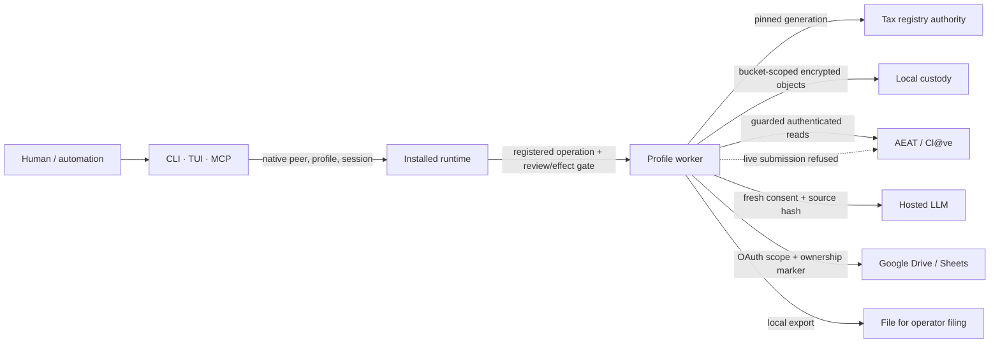

# Security and trust boundaries

[Technical overview](../README.md) · [Article index](../articles/README.md) · [Snapshot and reading guide](../reading-guide.md)

> This page describes the analyzed source snapshot. Its findings and limitations are not a certification of the current branch.

<!-- preserved:assessment -->
## Overall security model

Cadrumo is a local, profile-scoped tax workbench with guarded remote *reads*, optional third-party services and local filing artifacts. Its strongest security property in the reviewed source is compositional admission: a native frontend connection is bound to a profile, session, login and runtime generation; an operation is checked against a registered definition and rechecked as it executes; sensitive state is kept in profile-scoped encrypted custody; regulated calculations read one pinned tax-authority generation. The core AEAT access gate unconditionally refuses live submission, so an export or local `PRESENTADO` state is not evidence that Cadrumo transmitted a return. Static review established these source-level mechanisms, not their deployed OS, provider or legal correctness (runtime authority (`src/cadrumo/entrypoints/runtime/operation_authority.py`), operation execution (`src/cadrumo/application/operations/_supervisor_execution.py`), secure-object writer (`src/cadrumo/adapters/persistence/storage/sql/_secure_object_writes.py`), live-write gate (`src/cadrumo/core/access_gate/gate.py`), [runtime synthesis](../topics/runtime-tui-and-agent-harness.md), [core synthesis](../topics/core-authority-and-shared-controls.md)).

| Boundary | Enforced source behavior | Remaining trust condition |
| --- | --- | --- |
| Frontend to runtime | Native peer/endpoint checks, separate bounded document and secret frames, exact boot/connection/profile/session binding and worker admission (frontend (`src/cadrumo/adapters/local_runtime/frontend_client.py`), framing (`src/cadrumo/adapters/local_runtime/framing.py`)). | OS peer, desktop, process and containment behavior require platform/race testing; CLI path normalization is not a filesystem sandbox ([external synthesis](../topics/external-integrations-and-local-runtime.md)). |
| Runtime to private operation | Live lease/scope intersection, registered schema/effect checks, digest-bound review and rechecks around side effects; uncertain effects remain `UNKNOWN` or `SETTLING` (lease policy (`src/cadrumo/application/user_profile/session_authority_policy.py`), supervisor (`src/cadrumo/application/operations/_supervisor_settlement.py`)). | A declared effect must match worker behavior and a host-owned callback must actually be contained; the telemetry effect mismatch is a review lead, not a proven escape ([operations synthesis](../topics/operations-profiles-and-workflows.md), [Stage 2](../articles/156-cli-command-contracts-and-operator-surfaces.md)). |
| Worker to local custody | HMAC-addressed identities, AES-GCM with namespace/key/schema associated data, revision-guarded SQL batches and encrypted attachments (SQL custody (`src/cadrumo/adapters/persistence/storage/sql/orm.py`), write funnel (`src/cadrumo/adapters/persistence/storage/sql/_secure_object_writes.py`)). | OS account/keychain and filesystem permissions, crash recovery, caller serialization and cross-file publication remain outside one model or SQL transaction ([storage synthesis](../topics/persistence-and-secure-storage.md)). |
| Worker to remote services | AEAT host/path/action preflight and post-navigation checks; hosted evidence consent and Google ownership/scope gates are different policies (AEAT landing (`src/cadrumo/adapters/outbound/aeat/sede/_adapter_utils.py`), LLM source binding (`src/cadrumo/application/ledger/invoice_evidence_extract_operation.py`), Sheets ownership readback (`src/cadrumo/adapters/outbound/google/calc_sheets_pull.py`)). | Browser actions can have legal effects, cloud writes can be partial, and no reviewed source demonstrates a completed AEAT submission ([integrations synthesis](../topics/external-integrations-and-local-runtime.md)). |

## Credentials, profiles and personal information

Profile creation wraps a data-encryption key under password-derived material and verifies it with an encrypted sentinel; optional recovery independently wraps the same key. KDF work runs in a supervised child and complete capsules publish with a no-replace marker. Human login acceleration splits a random key between the OS keychain and an encrypted receipt. Automation grants are narrower: a reviewed exact-scope proposal remains inactive until protected secret delivery and possession acknowledgement, and denial invalidates sessions before optional cleanup. This protects against many accidental cross-profile uses, but the OS account is an explicit trust boundary, mutable-buffer wiping does not erase every Python/native copy, and the local login throttle fails open if its revocable sidecar is unavailable (capsule publication (`src/cadrumo/adapters/persistence/storage/custody/capsule.py`), acceleration (`src/cadrumo/adapters/persistence/storage/custody/acceleration_receipt.py`), automation approval (`src/cadrumo/application/user_profile/automation_approval_session.py`), [custody synthesis](../topics/persistence-and-secure-storage.md), [profile synthesis](../topics/operations-profiles-and-workflows.md)).

The selected active profile comes from a durable pointer, not an environment variable, and private commands rebind against current custody. Certificate sources and passphrases are named and profile-scoped; browser-state publication is staged until provider verification. Local auth `status`/`test` are readiness probes, and the apoderado live-authority check explicitly refuses, so neither is evidence of a successful AEAT login or representation grant. A concrete acquisition-lock interleaving remains: after an unreadable first inspection, recovery can remove a replaced live lock without comparing expected bytes. The two session probes narrow, but do not repair, that primitive; its actual consequence needs a targeted concurrent test (profile pointer (`src/cadrumo/core/bucket_pointer.py`), session lifecycle (`src/cadrumo/application/auth/sessions.py`), apoderado refusal (`src/cadrumo/application/auth/apoderado_service.py`), lock recovery (`src/cadrumo/application/auth/acquisition_lock.py`), [auth synthesis](../topics/authentication-and-storage-management.md)).

Tax IDs, addresses, invoices, bank narratives, family facts, IBANs and filing amounts flow through domain records and authorized read projections. Schema sensitivity, masked overviews, secret frames, encrypted repositories and redaction narrow exposure; they do not make these data anonymous. In particular, transaction-date routing metadata remains plaintext in SQLite, process-keyed search IDs are pseudonyms, and the short deterministic tax-ID redaction prefix may be guessable. A portable profile bundle deliberately contains decrypted object payload bytes before the selected cleartext-file or passphrase-envelope publication path protects them. Local evidence digests identify content relative to a trusted reference; they do not authenticate who supplied a document or a typed actor label (plaintext index (`src/cadrumo/adapters/persistence/profile/transactions.py`), masked overview (`src/cadrumo/application/user_profile/overview.py`), portable export (`src/cadrumo/domain/user_profile/portable_export.py`), redaction (`src/cadrumo/core/redaction/rules.py`), [storage synthesis](../topics/persistence-and-secure-storage.md)).

## External evidence and model assistance

Hosted LLM evidence is a material outbound privacy boundary. The canonical ledger extraction operation requires stored evidence and a fresh per-call acknowledgement; it checks profile/settings/gestor policy, mints a content-addressed consent token for that source, re-hashes resolved bytes and records the dispatch before calling the provider. The generic client checks token presence and address but does not independently compare arbitrary supplied bytes with the token, which is a caller contract. The reviewed canonical caller supplies the missing binding, so a reachable consent bypass is **not established**. Other direct callers would need their own source-to-token proof. Model field readings remain draft proposals: deterministic source-text grounding and a separate human confirmation path precede canonical invoice evidence (canonical consent (`src/cadrumo/application/ledger/invoice_evidence_extract_operation.py`), consent ledger (`src/cadrumo/adapters/persistence/llm/consent_ledger.py`), generic client (`src/cadrumo/adapters/outbound/llm/client.py`), [ledger synthesis](../topics/ledger-invoices-and-registers.md), [Stage 2 consent](../articles/014-llm-dispatch-consent-and-invoice-reading-pipeline.md)).

Identity grounding deserves a narrower statement than “LLM tax ID accepted.” A draft candidate whose own anchor is missing or refused can retain its value while separate accepted role text contributes to an `ANCHORED` classification in one local path. That is a source-grounding concern, not proof the invoice or ledger accepts the identifier: producer validation, finding blockers, re-extraction and operator confirmation are subsequent boundaries. Likewise a classifier response is constrained to typed category choices and cannot set statutory rates merely by prompt text, but untrusted document text can still influence its suggestion; the domain split-response model is locally more permissive than the prompt and requires downstream review (grounding seam (`src/cadrumo/application/ledger/grounded_reading.py`), confirmation (`src/cadrumo/application/ledger/invoice_confirmation.py`), LLM split parser (`src/cadrumo/domain/transactions/llm.py`), [Stage 2 identity](../articles/056-document-grounding-evidence-routing-history-and-import-export.md), [ledger synthesis](../topics/ledger-invoices-and-registers.md)).

AEAT browser access is mostly a read path, but “read” is not always side-effect free: opening an unread notification can carry legal consequences. The notification-document adapter requires a previously captured row with `leida=True`; the application also checks captured read state before document fetch and stores encrypted bytes with a parse result or explicit refusal. The adapter relies on a fresh same-taxpayer row supplied by its caller rather than re-fetching it. Authenticated session and represented-taxpayer identity require the application and provider contracts together. A fresh Cl@ve landing predicate is weaker than the later canonical-host verification, and a diagnostic probe missing landing metadata can initiate a challenge; neither observation proves protected reads bypass the later guard (notification adapter (`src/cadrumo/adapters/outbound/aeat/sede/notifications.py`), application custody (`src/cadrumo/application/live/notification_documents.py`), Cl@ve probe (`src/cadrumo/adapters/outbound/aeat/auth/clave_movil.py`), [integrations synthesis](../topics/external-integrations-and-local-runtime.md), [filing/live synthesis](../topics/filing-and-live-state.md)).

Google Sheets is an actual remote writer, separate from local XLSX and from AEAT. OAuth scope and Drive ownership markers constrain target access; readback checks workbook model/year/period/revision/registry identity before using edited values. A multi-request apply can leave mixed state after interruption. Replaying a supposedly safe structural batch may duplicate developer metadata, and literal strings sent as `USER_ENTERED` warrant formula interpretation checks for untrusted content. Encrypted Drive mirroring checks content hashes and publishes namespace manifests after complete object writes; lower-level provider methods accepting noncanonical hash strings are not a proven normal-path failure because the mirror producer supplies SHA-256 (Sheets apply (`src/cadrumo/adapters/outbound/google/calc_sheets_apply.py`), Sheets pull (`src/cadrumo/adapters/outbound/google/calc_sheets_pull.py`), mirror push (`src/cadrumo/adapters/outbound/storage/mirror_push.py`), [integrations synthesis](../topics/external-integrations-and-local-runtime.md)).

## Output, logs and evidence promotion

Output trust is deliberately staged. Parsers can recognize PDFs, XML and bank files; calculated values and exportable records then require selected registry authority and input evidence. An official-format local file does not imply submission. Local filing records can be pending, while AEAT-confirmed status requires the receipt/CSV, taxpayer, model/period, digest and current-record join; a parsed justificante alone does not verify its printed URL or CSV. Record-design declarations and bundled corpus digests prove internal consistency, not that their legal interpretation is current or that a publisher authored the bytes. The Stage 2 reference corpus was inventoried fully but semantically sampled (export (`src/cadrumo/application/filing/export.py`), receipt gate (`src/cadrumo/application/live/filed_observation_persistence.py`), [normative inventory](../articles/197-normative-reference-corpus.md), [filing synthesis](../topics/filing-and-live-state.md), [knowledge synthesis](../topics/bundled-knowledge-and-localization.md)).

Diagnostics are a separate confidentiality channel. The logger recursively scrubs arguments/mappings and installs a record filter on configured handlers; therefore a Pydantic exception containing rejected input at a logging call is not evidence that raw taxpayer data reaches disk. The unresolved check is whether arbitrary text under a generic `input` key remains protected when its sensitive field hint lives separately in `loc`. Run JSON/JSONL traces can hold tax amounts and are not encrypted by the core observability module; direct event append lacks an event/run-ID equality check, and third-party DEBUG filtering on the run sink merits review. Telemetry defaults to no-op and has consent gates, but `CRASH_ONLY` currently lacks a payload timing filter and free-text-like fields need caller discipline. Declared retention ages are not an implemented purge (log scrubber (`src/cadrumo/core/logging.py`), record filter (`src/cadrumo/core/logging.py`), handler installation (`src/cadrumo/core/logging.py`), run trace (`src/cadrumo/core/observability/store.py`), telemetry schema (`src/cadrumo/core/telemetry/schema.py`), [Stage 2 logging](../articles/170-cli-error-handling-ledger-actions-and-modelo-work.md), [core synthesis](../topics/core-authority-and-shared-controls.md)).

The security assessment is positive about the explicit profile, operation, custody and evidence gates, while remaining conditional on composition and deployment. Highest-value checks are OS/session race tests, byte-bound consent tests for any additional LLM caller, same-taxpayer/fresh-notification evidence at browser effects, crash recovery across file/SQL/remote publication, and destination-specific log/trace inspection. The repository snapshot was not executed; absent test/build files in this scoped snapshot do not prove the original project lacks them. No current-law or live-provider assurance follows from the static review ([method and snapshot](../evidence/run.json), [operation synthesis](../topics/operations-profiles-and-workflows.md), [persistence synthesis](../topics/persistence-and-secure-storage.md)).
<!-- /preserved:assessment -->
